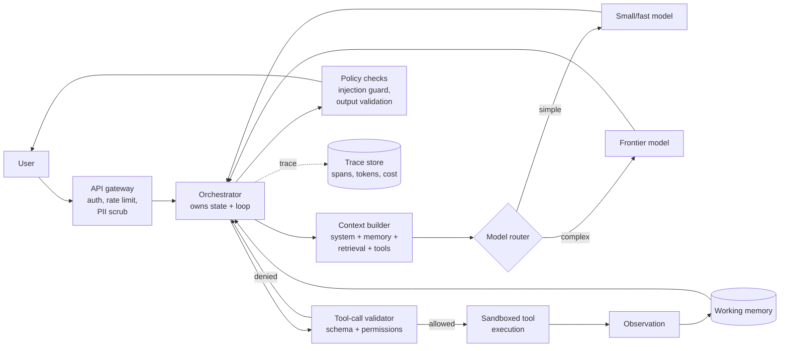
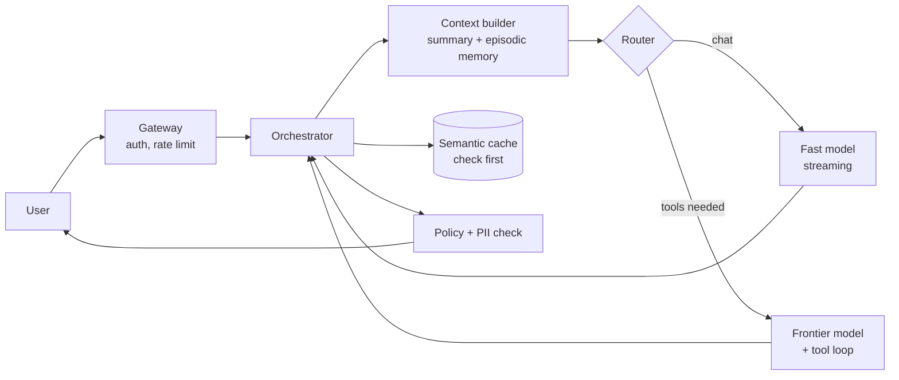
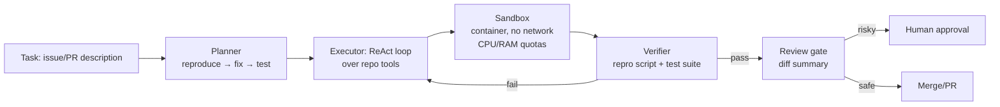
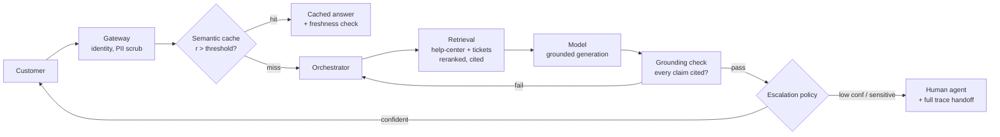
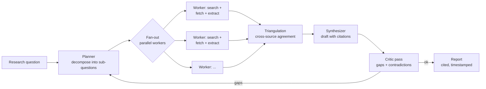
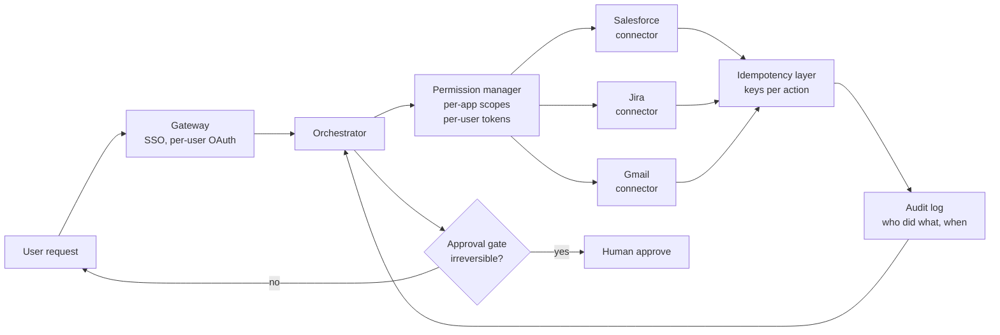

## TL;DR

Every agent design interview is the same loop, drawn once, then zoomed into.
The loop: **user → gateway → orchestrator → (model ↔ tools ↔ retrieval ↔
memory) → validation → response**. Staff bar: every hop gets a decision, a
rejected alternative, and a number — latency, cost, and failure mode.

:::tldr
The agent framework: **1** clarify scope → **2** define the loop (ReAct vs.
plan-and-execute) → **3** tool surface (schemas, validation, permissions) →
**4** context engineering (what goes in the window) → **5** memory (short-term
vs. persistent) → **6** planning depth → **7** retries/fallbacks → **8** model
routing → **9** caching → **10** rate limits → **11** async execution →
**12** sandboxing → **13** prompt-injection defenses → **14** observability →
**15** evals → **16** cost/latency budget.
:::

## Interview answer

Open with the reference loop, then commit to decisions with numbers:

> "I'd build this as a ReAct loop behind an API gateway. The orchestrator owns
> state, the model never touches tools directly — it emits structured tool
> calls that the orchestrator validates against a permissioned schema, executes
> in a sandbox, and returns as observations. Context is engineered, not
> accumulated: system prompt + retrieved docs + working memory capped at ~60%
> of the window, everything else summarized or externalized. Tools are
> idempotent and retryable with exponential backoff and circuit breakers;
> fallback chain is strong model → weak model → cached answer → graceful
> refusal. Observability is a trace per turn with span-level token/cost/latency
> attribution, and evals are task-success on a golden set plus red-team prompts.
> Budget: p95 turn latency under 8s at ~$0.02/turn, enforced by model routing
> and semantic caching."

Then let the interviewer pick the deep dive — usually tooling, memory, or
safety.

## Intuition

An agent is a **control loop**, not a model. The model is the policy: it
observes state and emits actions. The orchestrator is everything else — and
everything else is where production agents fail.

The single most important intuition: **every loop iteration is a compounding
error event**. A 10-step agent where each step is 95% reliable succeeds only
~60% of the time (see [Math](#math)). So the entire design discipline is about
*shrinking the number of model-dependent steps* (tools do the deterministic
work), *making each step independently verifiable* (structured outputs,
validators), and *bounding blast radius* (permissions, sandboxes, budgets).

The second intuition: **context is a budget, not a pile**. Stuffing the window
is the beginner move; the staff move is deciding what earns its tokens —
retrieved evidence, tool schemas for the tools likely to be called, compact
working memory — and what gets summarized, externalized, or dropped.

## Details

### The reference architecture

Draw this in the first 5 minutes. Everything after is a zoom-in.



Key property to state out loud: **the model never calls tools**. It emits a
tool-call *intent*; the orchestrator validates, authorizes, and executes. This
single separation is what makes sandboxing, permissions, and auditing possible.

### Tool calling: ReAct vs. function calling vs. plan-and-execute

| Pattern | How it works | Best for | Failure mode |
|---|---|---|---|
| **ReAct** (interleaved) | Thought → Action → Observation, one step at a time | Open-ended, unknown horizon | Loops forever; compounding error |
| **Function calling** (single-shot) | Model fills args for one declared tool | Deterministic pipelines, classification | Can't recover mid-task |
| **Plan-and-execute** | Planner writes full plan → executors run steps → replanner on failure | Multi-step with known structure | Plan/model mismatch; replanning cost |

:::tldr
Default to **ReAct with guardrails** for interactive agents, **plan-and-execute**
for batch/deep-research workloads. Pure single-shot function calling is a
component, not an agent.
:::

Staff depth: hybrid is the real answer. A coding agent plans at the top level
(plan-and-execute: "reproduce → fix → test") but each step is a ReAct loop
over file tools. Name the loop budget explicitly: max N tool iterations, max
wall-clock per task, max tokens per task — whichever trips first ends the loop.
An agent without a loop budget is a billing incident waiting to happen.

### Tool surface design

- **Schemas are contracts.** JSON Schema with descriptions, enums, required
  fields. Validate *before* execution; reject malformed calls and feed the
  error back as an observation (the model usually self-corrects in one retry).
- **Tools are narrow.** `search_files(query)` beats `shell(anything)`. Every
  tool's description is prompt surface — keep it minimal to reduce injection
  surface and token cost.
- **Idempotency.** Reads are free; writes take an idempotency key. Retries are
  only safe on idempotent tools — this is why you design the tool surface
  *before* the retry policy.
- **Side-effect tiers.** Read-only (search, read) → scoped write (edit one
  file, post one draft) → irreversible (send email, merge, pay). Each tier gets
  its own permission gate; irreversible actions need human approval or a
  policy token.

### Context engineering

The window is ~128K–1M tokens; the *usable* budget is what you decide. A
typical turn budget:

| Component | Share | Notes |
|---|---|---|
| System prompt + persona | 2–5% | Versioned, minimal |
| Tool schemas | 5–15% | Only tools relevant to the task; lazy-load the rest |
| Retrieved evidence | 20–40% | Reranked, cited, deduped |
| Working memory / history | 10–20% | Summarized beyond K turns |
| Headroom | 20–30% | Leave room for the model's own reasoning + output |

Techniques, in order of leverage:

1. **Summarization / compaction** — rolling summary of history beyond N turns.
2. **Lazy tool schemas** — full schemas only for top-K likely tools.
3. **Retrieval, not stuffing** — fetch evidence per step (see
   [RAG patterns](#/rag)).
4. **Structured scratchpad** — the model writes state as JSON the orchestrator
   persists, not as prose it must re-read.
5. **Prompt caching** — static prefixes (system prompt, few-shots) cached by
   the provider; cuts cost and TTFT.

:::warn
"Just use the 1M context window" is a red flag answer. Long context degrades
retrieval quality (lost-in-the-middle), multiplies cost per turn, and hides the
fact that you haven't decided what matters. The window is a ceiling, not a
strategy.
:::

### Memory: short-term vs. persistent

| | Short-term (working) | Persistent (long-term) |
|---|---|---|
| Scope | Current task/session | Across sessions |
| Store | In-context, structured scratchpad | Vector DB + KV store + knowledge graph |
| Write policy | Every turn | Only on explicit signal (user preference, task outcome) |
| Read policy | Always in context | Retrieved, ranked, cited |
| Failure mode | Forgets across turns | Stale/wrong memories poison future tasks |

Staff decisions:

- **Memory write gating.** Never auto-persist model-inferred facts. Persist on:
  explicit user statement ("my team uses Go"), task outcomes, and corrections.
  Each memory carries provenance (source, timestamp, confidence).
- **Memory hygiene.** TTLs, contradiction detection (new memory conflicts with
  old → surface to user or version, never silently overwrite), and a
  user-visible "what I remember" surface.
- **Episodic vs. semantic.** Episodic: "on Oct 1 the user asked for X."
  Semantic: "the user prefers terse answers." Store separately; retrieve
  separately.

### Planning

Three levels, matched to task horizon:

1. **Reactive** (ReAct) — no explicit plan; next action from current state.
2. **Plan-then-execute** — planner emits steps; executor runs them; verifier
   checks each step's postcondition before advancing.
3. **Hierarchical** — high-level plan → sub-plans per subtask → ReAct leaves.

The staff move is the **verifier**: each plan step declares a checkable
postcondition ("tests pass", "file exists with content matching X"). Without
verification, plan-and-execute silently compounds errors. With it, failures
become localized replans instead of full restarts.

### Retries, fallbacks, and failure handling

Design the failure ladder *before* the happy path:

1. **Tool-call validation failure** → return error as observation, model
   retries (1–2x).
2. **Tool execution failure** → exponential backoff + jitter, 3 attempts,
   then circuit-break the tool for the session.
3. **Model failure / timeout** → retry once, then **model fallback**:
   frontier → smaller/cheaper → cached answer → graceful degradation
   ("I couldn't reach X; here's what I can do").
4. **Loop budget exceeded** → summarize partial progress, ask the user.

:::tldr
Fallback chain: **retry → backoff → circuit-break → model fallback → cached
answer → graceful refusal**. Every rung is a decision with a number (attempts,
timeouts, thresholds).
:::

### Model routing

Route by predicted difficulty, not by vibes:

- **Classifier/router model** (tiny, cheap): scores task complexity from the
  prompt → picks small vs. large model. Train on logged outcomes.
- **Escalation**: start small; escalate to the large model if confidence is
  low or the small model requests it ("I need the bigger model for this
  reasoning step").
- **Specialization**: code tasks → code-tuned model; math → reasoning model.

State the trade explicitly: routing saves ~70–90% of cost on the easy tail but
adds a misroute failure mode — monitor escalation rate and task success by
route.

### Caching

| Layer | What | Hit-rate lever |
|---|---|---|
| **Prompt cache** (provider) | Static system prompt prefix | Keep prefix byte-identical |
| **Exact cache** | Identical prompt → identical response | Deterministic tasks, temperature 0 |
| **Semantic cache** | Similar prompt → reuse answer | Embeddings + similarity threshold; best for support agents |
| **Tool-result cache** | `search(q)` results, embeddings | TTL by data freshness |

Cache invalidation is the interviewer's favorite follow-up: semantic caches go
stale when the world changes (docs updated, prices moved). Answer: TTLs +
version tags on the underlying data + a freshness check for high-stakes
answers.

### Rate limits, async execution, sandboxing

- **Rate limits** at three levels: per-user (abuse), per-tool (downstream
  API quotas), per-model (provider TPM/RPM). Queue + shed load with
  user-visible status; never silently drop.
- **Async execution**: independent tool calls fan out in parallel (the model
  emits multiple tool calls per turn); streaming partial results to the user
  (tokens + tool progress) so perceived latency stays low. Long tasks
  (deep research) run as background jobs with progress callbacks.
- **Sandboxing**: code execution in gVisor/Firecracker-style microVMs or
  containers — no network by default, CPU/RAM/time quotas, ephemeral
  filesystem. File tools scoped to a workspace root (path traversal rejected).
  Browser tools in a separate sandbox with domain allowlists.

### Prompt injection defenses

Assume the threat model: **any tool output is attacker-controlled**. Defenses
in layers:

1. **Delimit and label** — tool outputs wrapped in clear boundaries
   (`<tool_output source="web">`); system instruction: treat as data, never
   instructions. (Necessary, not sufficient.)
2. **Least privilege** — the agent can only do what its permission tier
   allows, regardless of what a prompt says.
3. **Human-in-the-loop** for irreversible actions.
4. **Output validation** — response checked against policy before delivery
   (PII, disallowed content).
5. **Dual-LLM pattern** (staff flex): a privileged planner that never sees
   untrusted content + quarantined workers that process tool output and return
   only structured data. The planner never ingests raw third-party text.

:::warn
"Tell the model to ignore malicious instructions" is not a defense — it's a
hope. Interviewers want layered, architectural answers: the strongest designs
make injection *structurally* unable to reach privileged actions.
:::

### Observability and evals

**Observability** — one trace per turn, spans per model call / tool call /
retrieval: latency, tokens in/out, cost, tool name + args hash, success/fail.
Dashboards: task success rate, p50/p95 turn latency, cost per task, tool error
rate, escalation rate, injection-block rate. Alerts on: error-rate spikes,
cost-per-task drift, loop-budget hit rate.

**Evals** — three tiers:

1. **Golden task set**: 50–200 scripted tasks with checkable outcomes
   (tests pass, correct booking made). Run on every prompt/model change.
2. **LLM-as-judge**: rubric-scored open-ended tasks; calibrate the judge
   against human labels (report agreement rate).
3. **Red team**: prompt-injection corpus, jailbreak attempts, PII exfiltration
   probes — must-pass before ship.

The staff answer names the metric that gates deployment: "we ship when golden
task success ≥ X% and red-team block rate = 100% on the critical set."

### Cost and latency optimization

Worked example per turn:

- Tokens: system 2K + tools 3K + retrieval 8K + history 4K in, ~800 out.
- At $3/$15 per 1M tokens: ~$0.029/turn. × 1M turns/day = $29K/day.

Levers in ROI order: **semantic caching** (kills repeat cost) → **model
routing** (small model for the easy 80%) → **prompt caching** (static prefix)
→ **context trimming** (fewer retrieved tokens) → **smaller/fine-tuned
models** for narrow subtasks. Latency: parallel tool fan-out, streaming,
speculative routing (start small model, upgrade mid-stream only if needed).

## Math

**Compounding step error.** If each of $n$ model-dependent steps succeeds with
probability $1-p$ independently, task success is:

$$P(\text{success}) = (1-p)^n$$

$n=10$, $p=0.05$ → $0.60$. This is why you minimize model-dependent steps and
add per-step verification.

**Expected cost with retries.** Tool fails with prob $q$ per attempt, up to
$k$ attempts, cost $c$ per attempt:

$$E[\text{cost}] = c \cdot \frac{1 - q^k}{1 - q}$$

**Backoff with jitter.** Attempt $i$ waits $\text{Uniform}(0, \min(C,
B \cdot 2^i))$ — base $B$, cap $C$. Jitter prevents thundering-herd retries
against a recovering downstream.

**Context budget.** If component $j$ uses $t_j$ tokens and the effective window
is $W$ (leave headroom $h$ for reasoning + output):

$$\sum_j t_j \le W - h$$

**Cache savings.** Hit rate $r$, cached cost $c_c \approx 0$, full cost $c_f$:

$$E[\text{cost/turn}] = (1-r)\,c_f + r\,c_c \approx (1-r)\,c_f$$

A semantic cache at $r=0.4$ on a support agent cuts inference spend ~40%.

**Tail latency of sequential calls.** $n$ sequential model calls each with p99
$L$: turn p99 ≈ $n \cdot L$ (sums, not maxes). Parallel fan-out turns it into
$\max_i L_i$ + orchestration overhead — the quantitative case for parallel
tool calls.
## Code

A minimal ReAct loop with validation, permissions, loop budget, and backoff.
The shape interviewers want to see — not production code, but the right
separation of concerns.

```python
import time, random, json
from dataclasses import dataclass, field

@dataclass
class ToolCall:
    name: str
    args: dict

@dataclass
class AgentConfig:
    max_iterations: int = 12      # loop budget
    max_wallclock_s: float = 120
    max_tokens: int = 200_000     # token budget per task
    max_retries: int = 3
    base_backoff_s: float = 1.0

# --- Tool registry: schemas + permission tiers + idempotency ---
READ, WRITE, IRREVERSIBLE = "read", "write", "irreversible"

TOOLS = {
    "search_docs": {"tier": READ,  "idempotent": True,
                    "schema": {"query": str}},
    "read_file":   {"tier": READ,  "idempotent": True,
                    "schema": {"path": str}},
    "edit_file":   {"tier": WRITE, "idempotent": True,
                    "schema": {"path": str, "diff": str}},
    "send_email":  {"tier": IRREVERSIBLE, "idempotent": False,
                    "schema": {"to": str, "subject": str, "body": str}},
}

def validate(call: ToolCall, granted_tiers: set[str]) -> str | None:
    """Return error string if invalid, else None. Model never executes."""
    spec = TOOLS.get(call.name)
    if spec is None:
        return f"unknown tool: {call.name}"
    if spec["tier"] not in granted_tiers:
        return f"permission denied: {call.name} requires tier {spec['tier']}"
    for k, t in spec["schema"].items():
        if k not in call.args or not isinstance(call.args[k], t):
            return f"schema violation: arg '{k}' must be {t.__name__}"
    if call.name == "read_file" and ".." in call.args["path"]:
        return "path traversal rejected"
    return None

def backoff(attempt: int, base: float, cap: float = 30.0) -> float:
    return random.uniform(0, min(cap, base * 2 ** attempt))

def run_agent(task: str, cfg: AgentConfig, granted_tiers: set[str]):
    state, tokens_used, iters = {"task": task}, 0, 0
    t0 = time.time()
    history: list[dict] = []
    while True:
        # --- loop budget: iterations, wall-clock, tokens ---
        if (iters >= cfg.max_iterations
                or time.time() - t0 > cfg.max_wallclock_s
                or tokens_used >= cfg.max_tokens):
            return {"status": "budget_exceeded",
                    "partial": summarize(history)}
        thought, call_or_answer, toks = model_step(task, history)  # LLM call
        tokens_used += toks
        history.append({"thought": thought})
        if call_or_answer.get("answer"):
            if policy_check(call_or_answer["answer"]):   # output validation
                return {"status": "done", "answer": call_or_answer["answer"]}
            return {"status": "blocked", "reason": "policy"}
        call = ToolCall(**call_or_answer["tool_call"])
        if err := validate(call, granted_tiers):          # never trust the model
            history.append({"observation": f"<tool_error>{err}</tool_error>"})
            iters += 1
            continue
        obs = execute_with_retry(call, cfg)               # orchestrator executes
        # Delimit untrusted content: tool output is DATA, never instructions
        history.append({"observation":
                        f"<tool_output tool='{call.name}'>{obs}</tool_output>"})
        iters += 1

def execute_with_retry(call: ToolCall, cfg: AgentConfig) -> str:
    spec = TOOLS[call.name]
    for attempt in range(cfg.max_retries if spec["idempotent"] else 1):
        try:
            return dispatch(call)          # sandboxed execution
        except TransientError:
            time.sleep(backoff(attempt, cfg.base_backoff_s))
    circuit_break(call.name)               # stop hammering a dead tool
    return f"<tool_error>{call.name} unavailable after retries</tool_error>"
```

What to narrate while writing this: the model proposes, the orchestrator
disposes; validation before execution; retries only on idempotent tools;
loop budget as a billing guardrail; tool output delimited as untrusted data.

## Follow-ups

:::collapse Likely follow-ups and how to handle them
- **"How do you stop infinite loops?"** Loop budget (iterations + wall-clock +
  tokens), progress detection (no new observations in K steps → summarize and
  ask), circuit breakers per tool.
- **"The agent hallucinates tool outputs — how do you catch it?"** The model
  never sees fabricated observations because only the orchestrator appends
  them; add schema validation on observations and a verifier step that
  re-checks key claims against tool results.
- **"Two tools conflict (search says X, DB says Y)?"** Provenance on every
  observation (source + timestamp); conflict policy: freshest wins for
  operational data, user-confirmed wins for preferences; surface the conflict
>  "Design a **coding agent**." Architecture below — emphasize the
  edit→test→verify loop and the sandbox.
- **"Design a **customer-support agent**."** Emphasize semantic caching,
  escalation to humans, grounded answers with citations.
- **"Design a **deep-research agent**."** Emphasize plan-and-execute,
  parallel fan-out, source triangulation, long-running jobs.
- **"Design a **cross-enterprise-app agent** (works across Salesforce, Jira,
  Gmail...)."** Emphasize per-app permission scopes, OAuth token handling,
  idempotency across systems, audit trails.
:::
## Mistakes

- **Letting the model call tools directly.** No validation, no permissions, no
  audit. The #1 architectural red flag.
- **No loop budget.** "The agent runs until done" — done may never come, and
  the invoice will.
- **Context stuffing.** Dumping the whole ticket history / repo into the
  window instead of engineering what earns tokens.
- **Retries on non-idempotent tools.** Retrying `send_email` or `charge_card`
  without idempotency keys = duplicate side effects.
- **Treating tool output as trusted.** Prompt injection lives here. Delimit,
  least-privilege, human-in-the-loop for irreversible actions.
- **Auto-persisting inferred memories.** One wrong inference poisons every
  future session. Gate writes; keep provenance.
- **Evals as an afterthought.** "We'll test it manually" — you need the golden
  task set *before* the first prompt change, or you can't iterate safely.
- **Optimizing the model before the architecture.** A 10% cheaper model saves
  pennies; semantic caching and routing save 40–70%.

## Practice

Five canonical designs. For each: sketch the architecture from memory in under
5 minutes, then defend the key decisions out loud.

### 1. ChatGPT-like assistant



**Key decisions:**
- Semantic cache in front of the model — support-style repeat questions hit
  ~40% and cost ~$0.
- Streaming tokens from the first byte; perceived latency < 300ms even when
  full turn takes 5s.
- Persistent memory write-gated on explicit user facts; contradiction
  detection on conflict.
- Multimodal inputs normalized to a single observation format before the loop.

**Follow-ups:** How do you keep the cache fresh when docs change? (TTLs +
version tags.) How do you handle a user correcting the assistant mid-thread?
(Memory write with provenance, invalidate affected cache entries.)

### 2. Coding agent



**Key decisions:**
- Tools are repo-scoped: `search_code`, `read_file`, `edit_file`,
  `run_tests`, `run_shell(sandboxed)`. No raw shell on the host.
- Plan-and-execute at top level (reproduce → localize → fix → verify), ReAct
  within each phase. Each phase has a checkable postcondition.
- Verifier is non-negotiable: fix is done when the repro script passes *and*
  the existing suite is green — the agent doesn't get to declare victory.
- Risk-tiered merge: docs/tests auto-merge; prod code paths need human
  approval; irreversible actions (deploy) never autonomous.

**Follow-ups:** Test suite takes 40 minutes — what now? (Targeted test
selection: run tests covering changed files first; full suite async.)
Agent edits a file it shouldn't? (Workspace root scoping + path traversal
rejection + permission tiers on write tools.)

### 3. Customer-support agent



**Key decisions:**
- Grounded generation: every factual claim must cite a retrieved chunk;
  grounding-checker rejects uncited answers and forces retry.
- Escalation policy is explicit: low confidence, refunds/account changes, or
  angry-user signals → human with the full trace (no "please repeat yourself").
- PII scrubbed at the gateway, before logging — support transcripts are a
  breach surface.
- Semantic cache keyed on intent embedding; invalidated by KB version bumps.

**Follow-ups:** How do you measure quality? (Resolution rate without
escalation, CSAT, citation precision/recall on the golden set.) User asks for
something against policy? (Policy checker before delivery; graceful refusal
with alternative.)

### 4. Deep-research agent



**Key decisions:**
- Plan-and-execute: the question is decomposed up front; workers are
  quarantined (dual-LLM pattern — workers process untrusted web content,
  planner only sees structured extractions).
- Parallel fan-out with a worker budget; triangulation requires ≥2 independent
  sources for load-bearing claims.
- Long-running: async job with progress callbacks, partial drafts streamed;
  checkpoint state so a crash resumes, not restarts.
- Citations are first-class: every claim links to source + fetch timestamp;
  report includes a "confidence and gaps" section, not just answers.

**Follow-ups:** Sources disagree? (Surface the disagreement with provenance;
  never silently pick one.) Research takes 20 minutes and the user
  disconnects? (Persist job state; deliver async via notification/email.)

### 5. Cross-enterprise-app agent ("do it across Salesforce, Jira, Gmail")



**Key decisions:**
- Auth is per-user OAuth with least-privilege scopes; the agent never holds
  admin tokens. Token refresh and revocation handled by the connector layer.
- Every cross-system write is idempotent (client-generated keys) and lands in
  an immutable audit log — "the agent updated the wrong Salesforce record" must
  be attributable and reversible.
- Approval gate keyed on irreversibility and blast radius, not on app:
  drafting a Jira ticket auto-runs; closing 50 tickets or emailing a customer
  needs approval.
- Schema drift: each connector version-pins the app's API and validates
  payloads; a Salesforce field rename fails closed, not silently wrong.

**Follow-ups:** User revokes Gmail access mid-task? (Fail the Gmail leg
gracefully, complete the rest, report partial completion.) How do you test
without touching prod? (Per-app sandbox tenants; replay fixtures for evals.)

---

### Readiness checklist

- [ ] Draw the reference loop from memory in under 5 minutes
- [ ] Explain ReAct vs. plan-and-execute with a when-to-use-which rule
- [ ] Whiteboard the validate-before-execute tool pattern
- [ ] Derive the compounding-error formula and its design implication
- [ ] Name 3 prompt-injection defenses beyond "tell the model to ignore it"
- [ ] Design any one of the 5 practice agents end-to-end, out loud, in 30 min
- [ ] Answer: "your agent's cost per task tripled overnight — debug it"
- [ ] Answer: "walk me through your eval gate for shipping a prompt change"

Related: [ML System Design](#/ml-system-design) · [RAG](#/rag) ·
[LLM Systems](#/llm-systems)
