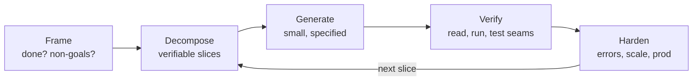

## TL;DR

The AI-coding round isn't a LeetCode round with a chatbot — it's a **build
round**. You're given 60–120 minutes, an AI assistant, and a real engineering
task: a small RAG app, a search service, an eval pipeline, a feature in an
unfamiliar repo, a broken AI-generated codebase, a slow service to fix. The
interviewer watches *how you work with the machine*: do you frame the problem
before prompting, decompose before generating, verify instead of trusting,
test the seams, and communicate tradeoffs out loud? The candidates who fail
treat the AI as an oracle. The candidates who pass treat it as a **fast,
confident, occasionally-wrong junior engineer** — and manage it like one.

:::tldr
The loop that wins: **Frame** (what are we really building, for whom, what
does "done" mean) → **Decompose** (slices small enough to verify) →
**Generate** (tight prompts, one slice at a time) → **Verify** (read every
line, run it, test the edges) → **Harden** (errors, scale, the production
questions). Narrate every transition. Silence is the only true failure mode.
:::

:::warn
REPRESENTATIVE PRACTICE — the exercises below are modeled on the *format* of
AI-native build rounds (reported 2025–2026 across AI labs and AI-platform
companies), not on any company's actual prompt. Never present a practice
prompt as a real interview question.
:::

## Interview answer (the operating system for the round)

Open the round by saying this, in your own words:

> "Here's how I like to work these: I'll spend the first few minutes framing —
> the actual requirement, the slice I'll build first, and what I'd cut. Then
> I'll have the AI generate in small pieces that I can read and test, rather
> than one big dump. I'll verify everything it writes — especially the parts
> that look most confident — and I'll keep a running list of the tradeoffs and
> the things I'd harden for production. Talk me through the constraints as I
> go?"

Then actually do it. The five exercises below are the reps.

## Intuition

Why does this round exist? Because "can you write a transformer from scratch"
stopped predicting job performance the day AI assistants got good. What still
predicts it:

- **Problem framing** — most engineers solve the wrong problem fast. The AI
  makes this worse: it will happily build the wrong thing at 10× speed.
- **Decomposition** — AI output quality collapses past a complexity threshold.
  Seniors keep every generation inside the "I can fully verify this" envelope.
- **Verification discipline** — the AI is wrong with total confidence about
  APIs, edge cases, and security. Reading generated code *critically* is the
  core skill being tested.
- **Judgment under ambiguity** — scope cuts, tradeoff calls, "good enough for
  the demo vs. right for production." The AI can't make these calls; you must,
  out loud.

Think of the round as pair programming where your pair is brilliant, tireless,
and has no judgment. **You supply the judgment.**

## Details — the 12 skills being scored

### 1. Problem framing

Before any prompt: restate the task, name the user, define "done," list
non-goals. "A RAG app" could mean a demo over 50 docs or a service over 50M —
the framing conversation *is* the interview. Ask 2–3 sharp questions, then
commit to a scope. Dithering is worse than a wrong-but-reasoned cut.

### 2. Decomposition

Slice so each AI generation is independently verifiable: ingestion →
chunking → embedding → index → retrieval → generation → eval. Generate and
test slice-by-slice, never the whole system at once. If you can't state a
slice's contract (inputs, outputs, failure modes) in one sentence, it's too
big.

### 3. Scope selection

Explicitly name what you're cutting and why: "I'm skipping auth, persistence
beyond SQLite, and streaming — the interesting decisions are retrieval quality
and eval, so that's where the time goes." Interviewers score the *reasoning
behind the cut*, not the cut itself.

### 4. Tradeoff communication

Every consequential choice gets a 20-second spoken tradeoff: chunk size
(recall vs. precision vs. cost), exact vs. ANN search (quality vs. latency),
rerank or not (quality vs. added latency + complexity). "I chose X because
[constraint]; the price is [Y]; I'd revisit when [Z]."

### 5. Using AI effectively

- **Small, specified prompts beat big vague ones.** "Write a chunker that
  splits markdown on headers, keeps code blocks intact, targets 512 tokens
  with 50 overlap, returns list[Chunk{text, meta}]" beats "write a chunker."
- **Give it the interfaces first.** Define your dataclasses and function
  signatures yourself, then ask the AI to fill implementations. You own the
  architecture; it owns the boilerplate.
- **One slice per generation.** Long outputs drift; short outputs stay
  verifiable.
- **Ask it to argue with itself** on genuinely uncertain choices ("give me
  the case for BM25-hybrid vs. pure dense here"), then *you* decide.

### 6. Verifying generated code

Read every line before running — especially imports, API signatures, and
anything involving money, auth, or data loss. The highest-yield verification
habits:

- Check every external API call against reality (the AI invents parameters).
- Trace one happy path and one failure path by hand.
- Run it immediately; a green run is necessary but not sufficient.
- For anything subtle (ranking math, concurrency, caching), write the
  invariant test first (cf. [the debugging page](#/debugging)).

### 7. Testing

Test the **seams**: chunker → embedder (empty docs, huge docs, weird
unicode), retriever → generator (no results, contradictory results),
eval → code changes (does the metric move when quality *actually* changes?).
Unit-test the 2–3 functions where a silent bug would be catastrophic; don't
boil the ocean.

### 8. Debugging (with AI help)

When something breaks: reproduce minimally, form your own hypothesis *first*,
then use the AI as a second pair of eyes ("here's the symptom and my
hypothesis — poke holes in it" beats "fix this"). Never paste-and-pray: if
you can't explain the AI's fix, you haven't fixed it.

### 9. Reading unfamiliar code

The "feature in an unfamiliar repo" exercise tests this directly. Method:
README → entry points → data flow (follow one request end-to-end) → the
module you'll touch → its tests. Narrate the map as you build it: "so requests
come in here, get routed here, and state lives here — the feature plugs in
*there*." 10 minutes of mapping saves 40 minutes of thrashing.

### 10. Architecture judgment

Where do the seams go? What owns what? What's sync vs. async? What breaks at
10×? The AI will happily generate a monolith; you decide the shape. Draw the
boxes before generating the code — even a 60-second ASCII diagram forces the
decisions into the open.

### 11. Spotting AI-generated mistakes

The classic tells, in rough frequency order:

- **Hallucinated APIs** — parameters that don't exist, methods renamed across
  versions (`ChromaDB` collection API, LangChain's ever-churning interfaces).
- **Silent wrongness** — code that runs but does the wrong math (cf.
  [Bug 1](#/debugging): attention over the wrong axis).
- **Missing failure modes** — no timeouts, no retries, no empty-result
  handling, `except: pass`.
- **Security naivety** — string-interpolated SQL, unvalidated file paths,
  secrets in code.
- **Scale blindness** — loads everything into memory, O(n²) loops, no
  pagination.
- **Dependency sprawl** — imports a framework for a 20-line job.

Your job: catch at least the ones that matter *before* running, and say what
you're checking as you read.

### 12. Prototype → production

End every exercise with the 2-minute "what changes for production" pass:
persistence, auth, observability (what do you log/measure/alert), scaling
(what breaks at 10×), cost (which calls cost money), failure handling, and
the eval gate that blocks bad deploys. This is where staff-level candidates
separate — juniors stop at "it works on my laptop."



## Code — prompt patterns that actually work

```text
# The contract-first prompt (use for every slice):
"Implement `retrieve(query: str, k: int) -> list[ScoredChunk]` against
this interface [paste dataclasses]. Requirements:
1. Hybrid: BM25 over the raw text + cosine over embeddings, RRF fusion.
2. Return [] (not an exception) when the index is empty.
3. No new dependencies — stdlib + numpy only.
Then list the edge cases you did NOT handle."

# The adversarial prompt (use after generation):
"Review this function for bugs. Specifically check: off-by-one errors,
empty-input handling, and whether the math matches the docstring.
Do not rewrite it — list issues with line numbers."

# The scoping prompt (use when stuck between options):
"I'm deciding between A and B for [choice]. My constraints are [latency /
cost / quality]. Give me the strongest argument for each in 3 bullets,
then recommend one. I will make the final call."
```

The trailing "list what you did NOT handle" is the highest-ROI sentence you
can add to any generation prompt — it turns the AI's blind spots into your
checklist.

## The 5 build exercises

Each exercise: the prompt, a strong approach, and the **interviewer rubric** —
what "strong hire" actually looks like. Time-box each practice run and record
yourself narrating.

---

### Exercise 1 — Small RAG app (90 min)

**Prompt.** "Build a working RAG Q&A over this corpus" (interviewer provides
~200 markdown docs, e.g. product documentation). "I should be able to ask
questions and get answers with citations. Use the AI however you like."

**Strong approach.**

1. **Frame (10 min):** "Done = correct answers with source citations on the
   provided corpus, running locally. Non-goals: auth, multi-user, streaming.
   First slice: ingestion + retrieval quality — if retrieval is bad, nothing
   else matters."
2. **Decompose:** ingest → chunk → embed → index → retrieve → generate →
   cite → quick eval.
3. **Generate in slices:** define `Chunk`, `ScoredChunk` dataclasses yourself;
   let the AI write the chunker and the retriever against your interfaces.
4. **Verify:** hand-check 5 queries end-to-end; specifically test "question
   with no answer in the corpus" (must say "I don't know," not hallucinate)
   and contradictory docs.
5. **Harden (last 10 min):** the production pass — what breaks at 1M docs
   (rebuild strategy, incremental indexing), the eval gate (golden Q&A set),
   cost per query.

**Interviewer rubric — strong hire:**

- Frames before prompting: states done/non-goals and *why retrieval first* —
  unprompted.
- Catches at least one AI mistake in review (hallucinated API param, missing
  empty-corpus handling) and fixes it deliberately.
- Tests the "no answer" case without being asked — this is the single
  highest-signal behavior in the exercise.
- Citations actually point at retrieved chunks (not fabricated).
- Tradeoff stated for chunk size and for reranking (or the reasoned decision
  to skip reranking).
- Production pass names a concrete eval gate, not vibes.

**Hire / no-hire tells:** *Strong hire* narrates scope cuts with reasons and
finishes with a tested slice plus a hardening plan. *No hire* generates 400
lines at once, never reads them, demo works on 2 cherry-picked queries, and
"production" means "deploy it."

---

### Exercise 2 — Search service (120 min)

**Prompt.** "Build a product search service over this 100k-item catalog
(title, description, attributes, price). Queries in, ranked results out.
There's a relevance-judged query set for eval. Optimize for relevance under a
p99 latency budget of 150ms."

**Strong approach.**

1. **Frame:** "Done = measured NDCG on the judged set + p99 under budget on
   this machine. The interesting tension is relevance vs. latency — I'll build
   the simplest thing that measures both, then spend remaining time on the
   highest-leverage improvement."
2. **Decompose:** index build → baseline (BM25) → dense (embeddings) →
   hybrid fusion → eval harness → latency profile → one optimization.
3. **Eval harness FIRST** (this is the staff move): before improving anything,
   build the script that prints NDCG@10 and p99. Every later decision is
   measured, not argued.
4. **Generate:** baseline BM25 yourself or via AI (it's short); dense
   retrieval via AI against your interface; RRF fusion.
5. **Verify:** run the eval; check the latency split (where do the 150ms go?);
   look at actual failure queries, not just the aggregate number.
6. **Optimize one thing** based on evidence: quantization, smaller embedding
   model, two-stage retrieve-then-rerank, caching.

**Interviewer rubric — strong hire:**

- Builds the eval harness before optimizing — measures instead of guessing.
- Latency budget treated as a constraint from minute one, not a surprise at
  minute 110 (profiles the split: embed vs. search vs. rerank).
- At least one decision driven by a number ("rerank adds 40ms p99 for +0.02
  NDCG — over budget, so I cut it / quantize it").
- Reads failure queries and names a *pattern* (e.g. "fails on attribute
  filters — needs structured matching, not just dense").
- Can articulate what they'd do with 10× corpus (sharding, IVF tuning) even
  if they didn't build it.

**Hire / no-hire tells:** *Strong hire* has a number for every claim and a
reason for every cut. *No hire* builds an elaborate system with no eval,
discovers the latency budget at the end, and "optimizes" by vibes.

---

### Exercise 3 — Eval pipeline (60 min)

**Prompt.** "Here's an LLM feature" (interviewer provides a summarizer /
classifier with a prompt). "Build the eval pipeline you'd use to decide
whether a prompt change is safe to ship. There's a 500-example labeled set."

**Strong approach.**

1. **Frame:** "Done = a pipeline that takes two prompt versions and returns a
   ship/no-ship recommendation with statistical backing. Non-goal: improving
   the prompt itself — the pipeline is the product."
2. **Decompose:** dataset loader → runner (both versions, same inputs) →
   metric computation → significance test → report.
3. **Generate:** the runner and metrics via AI; the *decision rule* yourself
   (this is judgment, not boilerplate).
4. **Verify:** sanity-test the pipeline by feeding it a deliberately *worse*
   prompt — the pipeline must say no-ship. If it can't detect a known-bad
   change, it can't detect anything.
5. **Harden:** cost per eval run, caching, human spot-check sampling, the
   guardrail metrics (toxicity, PII, latency) alongside quality.

**Interviewer rubric — strong hire:**

- Adversarially validates the eval itself (the known-bad prompt test) —
  unprompted.
- Distinguishes quality metrics from guardrail metrics; both present.
- Statistical seriousness: paired test / confidence interval, not just
  "0.82 vs 0.79, ship it." Knows the sample-size limits of n=500.
- Decision rule is explicit and written down (thresholds + tie-breaking).
- Names what the pipeline *can't* catch (distribution shift in prod,
  adversarial inputs) and the mitigation (shadow eval, human sampling).

**Hire / no-hire tells:** *Strong hire* distrusts their own pipeline until
it's proven on a known-bad input. *No hire* computes accuracy on one version
and declares victory.

---

### Exercise 4 — Feature in an unfamiliar repo (90 min)

**Prompt.** Interviewer shares a repo you've never seen (~3–8k lines, e.g. a
job queue / feature store client / small serving framework). "Add [feature]:
e.g. retry with exponential backoff and jitter on the client." Tests exist.

**Strong approach.**

1. **Map (15 min, no code):** README → entry points → follow one request
   end-to-end → find the module you'll touch → read its tests. Narrate the
   map: "so the client wraps *this*, retries would live *here*, config flows
   from *there*."
2. **Decompose the feature:** retry policy (pure logic, unit-testable) →
   integration into the call path → config surface → tests.
3. **Generate:** let the AI draft the policy against your signature; *you*
   decide where it plugs in (that's the architecture judgment being tested).
4. **Verify:** run the existing test suite before *and* after (no
   regressions); add tests for: max retries respected, backoff timing roughly
   right, jitter present, non-retryable errors not retried, idempotency
   consideration stated.
5. **Harden:** what retry storms look like at 10×, circuit breaker as the
   named next step, observability (retry count metric).

**Interviewer rubric — strong hire:**

- Resists coding for the first 10–15 minutes; builds and narrates the map.
- Identifies the correct integration point with a reason ("here, because this
  is the single choke point for all outbound calls").
- Distinguishes retryable from non-retryable errors explicitly.
- Existing tests stay green; new tests target the policy's contract, not its
  implementation.
- Names the failure mode of their own feature (retry storms) and the
  mitigation — unprompted.

**Hire / no-hire tells:** *Strong hire* orients before acting and the feature
lands at the right seam. *No hire* starts generating in minute 3, bolts the
feature onto the wrong layer, and breaks two existing tests.

---

### Exercise 5 — Debug AI-generated code + optimize a slow service (90 min)

**Prompt (two parts).** *Part A (40 min):* "This service was entirely
AI-generated" (interviewer provides ~300 lines: an embedding-serving API with
a subtle bug). "It's returning wrong results intermittently. Find and fix it."
*Part B (50 min):* "Now it's correct but slow — p99 is 800ms, budget is
200ms. Fix it."

**Strong approach — Part A.**

1. **Read before running:** scan for the classic AI tells — especially silent
   math wrongness and missing failure handling.
2. **Reproduce the intermittency:** the word "intermittent" means state,
   ordering, or concurrency. Write the repro that fails *sometimes*, then
   make it fail *always* (fixed seed, forced ordering).
3. **Hypothesize first, then use the AI** to check your hypothesis — not to
   flail.
4. Typical planted bugs (practice spotting these): embedding cache keyed on
   truncated text (collisions → wrong vectors intermittently); normalization
   applied on one path but not another (cf. [Bug 13](#/debugging)); shared
   mutable batch buffer across requests (race); `random` used where
   deterministic tie-breaking was intended.

**Strong approach — Part B.**

1. **Profile before touching anything.** "The trace says 600 of 800ms is
   tokenizer + detokenizer round-trips per request" beats any guess.
2. **Fix in evidence order:** batching, caching, redundant computation,
   serialization overhead — measure after each.
3. **State what you did NOT do** and why ("I didn't quantize — the profile
   says we're Python-overhead-bound, not FLOPs-bound").

**Interviewer rubric — strong hire:**

- Part A: reproduces the intermittency deterministically *before* fixing;
  explains the mechanism (not just the patch); adds the regression test.
- Part A: uses the AI as a hypothesis-checker, narrating their own theory
  first — doesn't paste-and-pray.
- Part B: profiles first; every optimization references a measured hotspot;
  re-measures after each change.
- Part B: explicitly names an optimization they considered and rejected, with
  the profile as the reason.
- Across both: reads generated code critically at least once out loud
  ("this looks confident but let me check the API signature").

**Hire / no-hire tells:** *Strong hire* makes the flaky deterministic, fixes
the mechanism, and optimizes from the profile. *No hire* "fixes" the bug by
regenerating the file until the symptom disappears, then "optimizes" with
random changes and no measurements.

---

## Follow-ups

After any exercise, expect:

1. **"What would break first at 10× scale?"** — One component, with a number.
   Not "everything."
2. **"What did the AI get wrong, and how did you catch it?"** — Have at least
   one concrete catch ready. "Nothing, it was all correct" is a fail — either
   you didn't read carefully or you're not credible.
3. **"What would you cut if you had 30 minutes instead of 90?"** — Tests
   scope judgment under pressure. Name the slice you'd keep and why.
4. **"How would you productionize this?"** — The 2-minute pass: persistence,
   auth, observability, cost, the eval/deploy gate.
5. **"Convince me this eval actually measures what you claim."** — The
   adversarial validation story (Exercise 3's known-bad test).
6. **"The AI suggested approach X and you overrode it — why?"** — They want
   to hear judgment overriding fluency. Have the tradeoff ready.

## Mistakes

- **Generating before framing.** The AI will build the wrong thing
  brilliantly. Five minutes of framing is never wasted.
- **One giant generation.** Past ~150 lines, AI output quality degrades and
  your ability to verify it degrades faster. Slice it.
- **Trusting confident code.** The most dangerous AI output is correct-looking
  and wrong (hallucinated params, silent math errors). Read the seams.
- **Silent working.** 10 minutes of quiet typing scores zero on communication,
  even if the code is perfect. Narrate: what you're doing, why, what you're
  checking.
- **No tests at the seams.** A demo that works on the happy path is table
  stakes; the hire signal is the empty-corpus / no-answer / timeout test you
  wrote without being asked.
- **Optimizing without profiling.** Especially in Exercise 5B — random
  "optimizations" with no baseline measurement signal junior instincts.
- **Skipping the production pass.** "It works" is the end of the prototype,
  not the end of the interview. Always close with what changes for prod.
- **Letting the AI drive the architecture.** If the AI chose the structure,
  say so honestly — then critique it. Owning the critique is better than
  pretending you drew the boxes.

## Practice

- [ ] Exercise 1: 90-min timed run. Non-negotiable: the "no answer in corpus"
      test and the production pass.
- [ ] Exercise 2: build the eval harness first, even though it feels slow.
      Record whether every later decision referenced a number.
- [ ] Exercise 3: deliberately feed your pipeline a worse prompt — confirm it
      says no-ship.
- [ ] Exercise 4: take any unfamiliar open-source repo; 15-minute map, no
      code, narrated. Then add one small feature.
- [ ] Exercise 5A: plant a bug from [the debugging page](#/debugging) in an
      AI-generated file; practice the deterministic-repro-first flow.
- [ ] Exercise 5B: profile a slow script with `torch.profiler` or `cProfile`;
      fix only what the profile indicts.
- [ ] After each run, write down: one AI mistake you caught, one tradeoff
      you stated, one thing you'd cut with 30 min. Review the list weekly.
- [ ] Do one full run with screen recording; watch it back at 2× and count
      your silent stretches. Drive them to zero.
