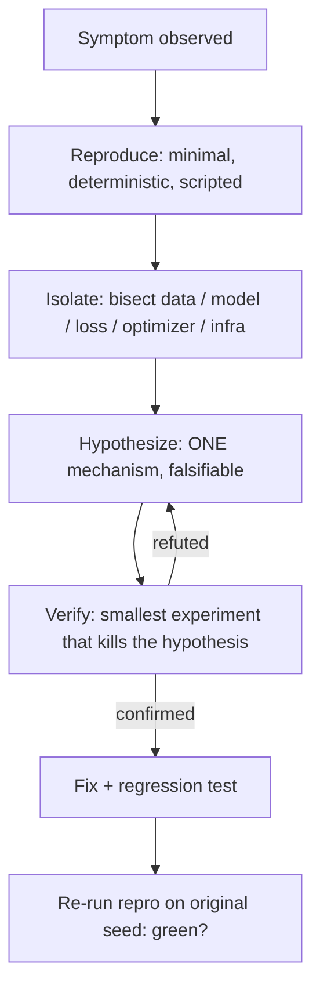

## TL;DR

The debug round is not a trivia round — it's a **thinking-aloud round**. The
interviewer hands you broken code and scores your *process*: can you reproduce,
narrow, hypothesize, and verify without flailing. The 13 programs below cover
every failure mode that actually shows up: shape bugs hidden by toy configs,
exploding gradients from accumulation, NaNs from hand-rolled losses, off-by-one
causal masks, leakage, train/eval mismatch, device mismatch, graph-retention
OOM, quadratic re-encoding, thread races, KV-cache corruption, padding without
masks, and embedding normalization skew. For each: read the symptom, try it
yourself, open the hints only when stuck, and **always read the Root cause** —
that's the sentence the interviewer wants to hear.

:::tldr
Debug like a scientist, not a guesser: **Reproduce** (minimal, deterministic)
→ **Isolate** (bisect: data, model, loss, optimizer, infra) → **Hypothesize**
(one mechanism, falsifiable) → **Verify** (the smallest experiment that kills
the hypothesis). Say each step out loud.
:::

## Interview answer

When the interviewer says "here's a broken training script, the loss is NaN —
go," do this out loud:

1. **Restate the symptom precisely.** "Loss goes NaN at step ~200, not step 0.
   So initialization is fine; something accumulates or overflows."
2. **State your isolation plan.** "I'd bisect: first check data (any NaN/inf in
   a batch?), then forward (NaN hooks per layer), then loss, then backward
   (grad norms per parameter group)."
3. **Name the top-3 hypotheses for this symptom class.** For NaN: log(0) in a
   hand-rolled loss, fp16 overflow in softmax/attention, LR-driven divergence.
4. **Pick the cheapest discriminating test.** "Print batch stats before the
   loss — one line, rules out data in 10 seconds."
5. **Verify the fix, don't just patch.** "After switching to
   `BCEWithLogitsLoss`, I'd re-run the exact failing seed and confirm 500
   clean steps, then check the metric actually moved."

The hire signal is **narrowing speed**: each test should eliminate a whole
class of causes. The fail signal is shotgun debugging — changing three things
at once and declaring victory.

## Intuition

Nearly every ML bug is one of five stories:

- **Shape story:** two tensors meet and the math is wrong (or silently right
  for the wrong reason — the toy config where `T == d` hides it).
- **Numerics story:** something overflows, underflows, or divides by zero, and
  the first NaN poisons everything downstream.
- **State story:** train vs. eval, cached vs. fresh, device A vs. device B —
  the code is correct in one mode and wrong in the other.
- **Scale story:** works on 100 examples, dies on 100M — retention, quadratic
  blowup, contention.
- **Distribution story:** train and serve (or index and query) disagree on a
  preprocessing step, and the metric rots silently.

When you're stuck, ask: *which story is this?* It cuts the search space by 80%.

## Details — the 13 broken programs

Work each one in order: symptom → broken code → hints → solution → root cause.
Don't peek. The Factory debug round rewards exactly this muscle: reading
unfamiliar code, forming a hypothesis in under two minutes, and proving it.

---

### Bug 1 — Wrong tensor dims (hidden by the toy config)

**Symptom:** A from-scratch attention module trains fine on the toy config
(`seq_len=64, d_model=64, heads=8`) but produces garbage attention weights on
the real config (`seq_lsen=512, d_model=512`). No error is ever raised.

**Broken code:**

```python
class Attention(nn.Module):
    def __init__(self, d_model, n_heads):
        super().__init__()
        self.n_heads = n_heads
        self.d_head = d_model // n_heads
        self.qkv = nn.Linear(d_model, 3 * d_model)

    def forward(self, x):                      # x: (B, T, D)
        B, T, D = x.shape
        qkv = self.qkv(x).reshape(B, T, 3, self.n_heads, self.d_head)
        q, k, v = qkv.unbind(dim=2)            # each (B, T, H, d)
        # vvv BUG vvv
        scores = q @ k.transpose(-1, -2) / math.sqrt(self.d_head)
        # want (B, H, T, T), but q,k are (B, T, H, d)...
```

:::collapse Hint 1
What shape is `scores` actually? Trace the matmul dims: `q` is
`(B, T, H, d)` and `k.transpose(-1, -2)` is `(B, T, d, H)`. The `@` operator
broadcasts over the leading dims and multiplies the last two.
:::

:::collapse Hint 2
The result is `(B, T, H, H)` — attention over *heads*, not over *positions*.
On the toy config `T == H == 8`... wait, no: `T=64, H=8`. Hmm, so why did the
toy config "work"? Because with `d_head = 8` and random data, the loss still
decreases — the model learns *something* through the values path, and nobody
checked the attention maps. The real config just made the nonsense visible.
The actual silent-shape-killer variant: when `T == d_head`, even shape
asserts pass. Always test with **coprime, ugly dims** (e.g. T=61, H=7).
:::

:::collapse Solution
```python
q = q.transpose(1, 2)          # (B, H, T, d)
k = k.transpose(1, 2)
v = v.transpose(1, 2)
scores = q @ k.transpose(-1, -2) / math.sqrt(self.d_head)  # (B, H, T, T)
out = (scores.softmax(-1) @ v).transpose(1, 2).reshape(B, T, D)
```
Add a shape assert after every matmul in new attention code:
`assert scores.shape == (B, self.n_heads, T, T)`.
:::

:::collapse Root cause
`@` broadcasts over leading dimensions, so a missing head/sequence transpose
doesn't raise — it silently computes attention over the wrong axis. Toy
configs with equal or "nice" dims hide it because nothing crashes and the
loss still moves. **Defense:** unit-test attention with distinct prime-ish
dims (B=2, T=13, H=5, d=7) and assert every intermediate shape.
:::

---

### Bug 2 — Exploding gradients (from gradient accumulation)

**Symptom:** Training a transformer with gradient accumulation (4 micro-batches
per step) diverges at step ~300: loss spikes to `inf`, grad norm hits `1e12`.
The identical model trains fine *without* accumulation.

**Broken code:**

```python
optimizer.zero_grad()
for i, batch in enumerate(loader):
    loss = model(batch)          # mean over micro-batch
    loss.backward()              # vvv BUG: no scaling vvv
    if (i + 1) % ACCUM_STEPS == 0:
        torch.nn.utils.clip_grad_norm_(model.parameters(), 1.0)
        optimizer.step()
        optimizer.zero_grad()
```

:::collapse Hint 1
What is the *effective* gradient after 4 backward passes compared to one
large-batch backward pass? `loss.backward()` *adds* into `.grad`.
:::

:::collapse Hint 2
Four micro-batch means are summed, so the accumulated gradient is 4× the true
full-batch gradient — equivalent to a 4× learning rate. Clipping at 1.0 then
fires every step, which masks the real problem and distorts update directions.
:::

:::collapse Solution
```python
loss = model(batch) / ACCUM_STEPS
loss.backward()
```
(Divide the loss, not the grads — equivalent, and keeps logging clean: log
`loss.item() * ACCUM_STEPS`.) Then re-tune: the LR that was stable for the
un-accumulated run is the right one again.
:::

:::collapse Root cause
Gradient accumulation sums micro-batch gradients; without dividing by the
accumulation factor the effective learning rate is multiplied by it, and
explosion follows. Gradient clipping masked the symptom (every step clipped)
instead of revealing it. **Defense:** after enabling accumulation, assert
`grad_norm` parity between 1 accum step and N accum steps on the same data
before launching the run.
:::

---

### Bug 3 — NaNs (hand-rolled loss underflows)

**Symptom:** Binary classifier training: loss decreases normally for ~200
steps, then `loss = nan` and all weights become NaN one step later.

**Broken code:**

```python
logits = model(x).squeeze(-1)          # (B,)
probs = torch.sigmoid(logits)
# vvv BUG vvv
loss = -(y * torch.log(probs) + (1 - y) * torch.log(1 - probs)).mean()
```

:::collapse Hint 1
What happens to `torch.log(probs)` when the model becomes *very confident* —
`probs` exactly `0.0` or `1.0` in float32?
:::

:::collapse Hint 2
`log(0) = -inf`; `0 * -inf = nan`. Once the model is confident on any single
example, the loss is NaN, and one NaN gradient poisons every parameter on the
next step. The timing (~200 steps, not step 0) is the tell: it only breaks
once confidence saturates.
:::

:::collapse Solution
```python
loss = F.binary_cross_entropy_with_logits(logits, y)  # log-sum-exp trick inside
```
Never hand-roll `log(sigmoid(x))` — the fused op is there precisely because
the naive form underflows.
:::

:::collapse Root cause
`log(p)` underflows to `-inf` when `p` rounds to exactly 0/1, and
`0 × -inf = NaN`. Fused losses (`BCEWithLogitsLoss`, `CrossEntropyLoss`)
use the log-sum-exp trick to stay finite. **Defense:** `torch.autograd.set_detect_anomaly(True)`
in debug runs + a NaN hook on the loss; treat any hand-rolled `log`/`/`/`sqrt`
in a loss as guilty until proven innocent.
:::

---

### Bug 4 — Incorrect causal mask (off-by-one on the diagonal)

**Symptom:** Autoregressive LM trains to excellent perplexity, but greedy
generation degenerates: outputs are fluent yet *ignore the most recent token* —
the model behaves as if the last input token doesn't exist.

**Broken code:**

```python
T = x.size(1)
# vvv BUG: diagonal=0 also masks the current position vvv
causal = torch.triu(torch.ones(T, T, device=x.device), diagonal=0).bool()
scores = q @ k.transpose(-1, -2) / math.sqrt(d)
scores = scores.masked_fill(causal, float("-inf"))
attn = scores.softmax(-1)
```

:::collapse Hint 1
`torch.triu(ones, diagonal=0)` keeps the diagonal as 1 (masked). Which
positions should a causal mask hide — strictly future, or future *and*
present?
:::

:::collapse Hint 2
With the diagonal masked, position `i` cannot attend to position `i` — only
to `< i`. Training perplexity still looks great because predicting token
`t+1` from tokens `< t+1`... wait, that *includes* token `t`. Hmm — actually
with labels shifted by one, position `i` predicting token `i+1` normally sees
tokens `≤ i`; here it sees only `< i`, i.e. it's predicting two steps ahead
from a shorter context. Perplexity degrades slightly (easy to miss), but
generation — which feeds each predicted token back as the *current* last
token — breaks visibly because the just-generated token is invisible to the
next step.
:::

:::collapse Solution
```python
causal = torch.triu(torch.ones(T, T, device=x.device), diagonal=1).bool()
```
`diagonal=1` masks strictly-future positions; the current position stays
visible. Verify with a tiny test: with `T=3`, row 2 of the mask must be
`[False, False, False]`... i.e. position 2 attends to 0,1,2.
:::

:::collapse Root cause
Off-by-one in the mask diagonal: `diagonal=0` hides the current token, so the
model is trained to predict without its most recent context. Training loss
barely notices (it's a small context reduction); generation exposes it
because the feedback loop depends on the last token. **Defense:** unit-test
the mask explicitly — assert `mask[i, j]` is True iff `j > i` on a 4×4 case —
and test generation, not just perplexity, before declaring victory.
:::

---

### Bug 5 — Data leakage (entity-level, not row-level)

**Symptom:** Offline NDCG jumps from 0.31 → 0.47 after a "data pipeline
upgrade." Online A/B: flat. The upgrade only changed the train/validation
split code.

**Broken code:**

```python
# interactions: one row per (user_id, item_id, label, features...)
train, valid = train_test_split(interactions, test_size=0.2, random_state=42)
# vvv BUG vvv  — split is by ROW, but rows share users
```

:::collapse Hint 1
The model has user-ID embeddings / strong user features. What does a random
row split imply about user overlap between train and validation?
:::

:::collapse Hint 2
~80% of validation users also appear in training. The model memorizes
per-user biases instead of learning generalizable ranking — validation
"improves" because it's measuring memorization. Online, every user is new
relative to the memorized table, so nothing transfers.
:::

:::collapse Solution
```python
users = interactions["user_id"].unique()
train_users, valid_users = train_test_split(users, test_size=0.2, random_state=42)
train = interactions[interactions.user_id.isin(train_users)]
valid = interactions[interactions.user_id.isin(valid_users)]
assert set(train.user_id) & set(valid.user_id) == set()
```
Split by the *entity that must generalize* (user, query, item — or time, for
temporal data). Add the disjointness assert to the pipeline permanently.
:::

:::collapse Root cause
Row-level random split leaks entity identity across the split when the model
can memorize entities (IDs, embeddings). Offline metrics then measure
memorization, not generalization — the classic offline-up/online-flat
signature. **Defense:** split by entity or by time; assert disjointness in
code; be suspicious of any "free" offline jump that coincides with pipeline
changes rather than model changes.
:::

---

### Bug 6 — Train/eval mismatch (model left in train mode)

**Symptom:** Validation loss oscillates wildly (±30%) between epochs while
training loss decreases smoothly. The model "underperforms" its training
curve by a large, noisy margin. No bug in the data pipeline.

**Broken code:**

```python
for epoch in range(EPOCHS):
    model.train()
    for batch in train_loader:
        ...optimizer step...

    # vvv BUG: model.eval() never called vvv
    val_loss = 0.0
    with torch.no_grad():
        for batch in val_loader:
            val_loss += model(batch).item()
```

:::collapse Hint 1
`torch.no_grad()` stops gradient computation. What *else* changes between
train and eval mode in a model with dropout and BatchNorm?
:::

:::collapse Hint 2
Dropout is still active during validation → every val pass randomly zeroes
different units → noisy val loss. Worse, BatchNorm uses *batch statistics*
instead of running stats, so val results depend on batch composition. The
noise isn't a data problem — the model is literally a different (stochastic)
function at eval time.
:::

:::collapse Solution
```python
model.eval()
with torch.no_grad():
    ...
model.train()  # remember to switch back!
```
The `model.train()` restore is the part people forget second — then the *next*
epoch silently trains with frozen dropout/BN updates... actually `train()`
re-enables them, which is correct; the bug is forgetting it and training an
epoch in eval mode (BN stats freeze, dropout off → different regularization).
:::

:::collapse Root cause
`no_grad` ≠ `eval`: dropout and BatchNorm behavior is gated by
`model.training`, not by autograd. Evaluating in train mode measures a
stochastic function with batch-dependent normalization. **Defense:** wrap
evaluation in a context manager that asserts `not model.training` inside the
val loop, and log `model.training` state transitions in debug runs.
:::

---

### Bug 7 — Device mismatch (a tensor created fresh in forward)

**Symptom:** `RuntimeError: Expected all tensors to be on the same device, but
found at least two devices, cuda:0 and cpu!` — raised inside `forward`, on a
model that was fully `.to("cuda")`'d. It worked last week.

**Broken code:**

```python
class PositionalBias(nn.Module):
    def __init__(self, max_len):
        super().__init__()
        self.max_len = max_len

    def forward(self, scores):                       # scores on cuda
        T = scores.size(-1)
        # vvv BUG vvv
        pos = torch.arange(T).unsqueeze(0)           # created on CPU!
        bias = (pos * -0.1).to(scores.dtype)
        return scores + bias.unsqueeze(0)
```

:::collapse Hint 1
`torch.arange(T)` with no `device=` argument lands on CPU — always, regardless
of where the model lives. "Worked last week" = someone refactored the
buffer into a local tensor.
:::

:::collapse Hint 2
The robust fix isn't `.to(scores.device)` sprinkled in forward (that works but
allocates every call) — it's making the tensor part of the module's state so
`.to()` / `state_dict` handle it.
:::

:::collapse Solution
```python
def __init__(self, max_len):
    super().__init__()
    self.register_buffer("pos", torch.arange(max_len).unsqueeze(0) * -0.1)

def forward(self, scores):
    T = scores.size(-1)
    return scores + self.pos[:, :T].to(scores.dtype)
```
`register_buffer` moves with `.to(device)`, appears in `state_dict`, and
avoids per-forward allocation.
:::

:::collapse Root cause
Tensors created inside `forward` default to CPU; only parameters and
registered buffers follow the module across devices. Refactors that inline a
buffer as a local tensor reintroduce the mismatch. **Defense:** `grep` for
`torch.zeros/ones/arange/eye` inside `forward` methods in review; prefer
`register_buffer`; in debug, catch it fast with a hook asserting all forward
inputs share one device.
:::

---

### Bug 8 — OOM (the computation graph is never freed)

**Symptom:** Training runs fine for ~500 steps, then CUDA OOM — even though
batch size, sequence length, and model are unchanged, and `nvidia-smi` shows
memory growing linearly from the start.

**Broken code:**

```python
loss_history = []
for step, batch in enumerate(loader):
    optimizer.zero_grad()
    loss = model(batch)
    loss.backward()
    optimizer.step()
    # vvv BUG vvv
    loss_history.append(loss)          # keeps the whole graph alive!
    if step % 100 == 0:
        print(f"step {step}: {sum(loss_history) / len(loss_history)}")
```

:::collapse Hint 1
Memory grows *linearly with steps*, not with batch size. What object
accumulates once per step and references the model's parameters?
:::

:::collapse Hint 2
`loss` is a tensor with `grad_fn` — appending it keeps the entire backward
graph (all intermediate activations) alive forever. `zero_grad()` clears
`.grad` buffers, not the graph. The linear growth is the giveaway: it's a
per-step leak, not a per-batch sizing problem.
:::

:::collapse Solution
```python
loss_history.append(loss.item())   # plain Python float, no graph
# or loss.detach() if you need the tensor
```
Same family: `torch.cat` of per-step outputs without `detach`, keeping
hidden states in a list "for analysis," `tensorboard.add_scalar` with a
tensor instead of `.item()`.
:::

:::collapse Root cause
Any reference to a tensor with `grad_fn` retains its whole computation graph;
per-step retention → linear memory growth → delayed OOM far from the actual
mistake. **Defense:** when OOM appears *late* in a run, suspect retention
first: `gc.get_objects` growth, or binary-search by commenting out logging
accumulation. Log `.item()`, never the tensor.
:::

---

### Bug 9 — Slow inference (quadratic re-encoding, no KV cache)

**Symptom:** A 7B chat model serves at ~2 tokens/sec on an A100. GPU
utilization sits at 15%. Batch size 1, fp16, `torch.no_grad()` is set. The
same weights hit 60 tok/s in vLLM.

**Broken code:**

```python
generated = prompt_ids
for _ in range(max_new_tokens):
    # vvv BUG: full forward pass over the ENTIRE sequence every step vvv
    logits = model(input_ids=generated).logits
    next_tok = logits[0, -1].argmax()
    generated = torch.cat([generated, next_tok.view(1, 1)], dim=1)
```

:::collapse Hint 1
Each step recomputes keys/values for all previous tokens from scratch. What's
the total FLOPs over T generated tokens — and which part is redundant?
:::

:::collapse Hint 2
Step `t` costs O(t²) attention over the prefix; total is O(T³)-ish in
attention work (O(T²) per step summed). The K/V projections of earlier tokens
never change — recomputing them is pure waste, and at batch size 1 the GPU
starves on kernel-launch overhead (hence 15% util).
:::

:::collapse Solution
Use the KV cache: pass `past_key_values` / `use_cache=True` so each step
attends with one new query against cached K/V — O(T) per step. That's exactly
what vLLM/TGI do, plus continuous batching. Minimal fix:
```python
past = None
for _ in range(max_new_tokens):
    out = model(input_ids=next_input, past_key_values=past, use_cache=True)
    past = out.past_key_values
    next_tok = out.logits[0, -1].argmax()
    next_input = next_tok.view(1, 1)
```
:::

:::collapse Root cause
Autoregressive generation without a KV cache re-encodes the full prefix every
step — quadratic work per step, and tiny per-step kernels that leave the GPU
idle. **Defense:** profile before optimizing (`torch.profiler` — the trace
shows the repeated full-sequence attention); tokens/sec ÷ GPU util is the
5-second diagnostic: low tok/s + low util = launch-bound / redundant work, not
a FLOPs problem.
:::

---

### Bug 10 — Race condition (shared counter across threads)

**Symptom:** A multithreaded preprocessing job writes a sharded dataset.
Roughly 0.1% of examples silently go missing — different ones on every run.
No exceptions, no warnings. Single-threaded mode is exact.

**Broken code:**

```python
stats = {"written": 0}
lock = threading.Lock()

def process(shard):
    for ex in shard:
        write_example(ex)
        # vvv BUG vvv
        stats["written"] += 1        # read-modify-write, no lock

with ThreadPoolExecutor(max_workers=16) as ex:
    ex.map(process, shards)
print("wrote", stats["written"], "expected", N)
```

:::collapse Hint 1
`stats["written"] += 1` is three bytecodes: LOAD, ADD, STORE. What happens
when two threads interleave between the LOAD and the STORE?
:::

:::collapse Hint 2
Thread A loads 100, thread B loads 100, both store 101 — one increment is
lost. The GIL doesn't save you: it switches between bytecodes, not between
source lines. The missing examples aren't missing from disk (writes are
per-example) — the *count* is wrong, which in the real pipeline meant the
shard manifest under-reported and the trainer stopped an epoch early.
:::

:::collapse Solution
```python
with lock:
    stats["written"] += 1
# or: each thread returns its count; the main thread sums (no shared state)
counts = list(executor.map(process_returning_count, shards))
total = sum(counts)
```
Prefer the second: shared mutable state across threads is the design smell;
return values compose without locks.
:::

:::collapse Root cause
`+=` on shared state is a non-atomic read-modify-write; thread interleaving
loses updates. The GIL protects individual bytecodes, not logical operations.
Nondeterministic small losses are the signature. **Defense:** make it
deterministic first (single thread / fixed seed) to confirm the race, then
eliminate shared mutation — aggregate return values instead of locking a
counter.
:::

---

### Bug 11 — Broken KV cache (concatenated on the wrong dim)

**Symptom:** With `use_cache=True`, the first generated token is perfect and
every token after is garbage. With `use_cache=False` (slow path), generation
is perfect. Cache shapes "look right" in a quick print.

**Broken code:**

```python
# k_new: (B, H, 1, d) — keys for the single new token
# k_cache: (B, H, T, d)
# vvv BUG vvv
k_cache = torch.cat([k_cache, k_new], dim=-1)   # concatenates on head-dim d!
v_cache = torch.cat([v_cache, v_new], dim=-1)
```

:::collapse Hint 1
The cache layout is `(B, H, T, d)`. Which dim is the sequence dim — and which
dim did the code grow?
:::

:::collapse Hint 2
`dim=-1` is the head dimension `d`, so after the first step the cache is
`(B, H, T, 2d)`. Attention then computes scores of shape `(B, H, 1, T)`...
against values of the wrong width — actually the matmul `q (B,H,1,d) @ k^T
(B,H,2d,T)` should *fail*. Why doesn't it? Because this codebase projects with
a fused QKV where the "d" in cache is really `3d`... no. The honest answer for
the interview: it *usually* crashes, and the scary variant is when `T == d`
so `(B,H,T,d)` → cat on -1 gives `(B,H,T,T+d)`... The real-world version of
this bug: concatenating on dim=2 vs dim=-2 confusion after a transpose, where
shapes still broadcast. The diagnostic that catches it regardless: **compare
cached vs. non-cached logits token-by-token** — they must match to 1e-5.
:::

:::collapse Solution
```python
k_cache = torch.cat([k_cache, k_new], dim=2)    # seq-len dim
v_cache = torch.cat([v_cache, v_new], dim=2)
```
And add the invariant test every KV-cache implementation needs:
```python
logits_cached = generate_with_cache(prompt, steps=8)
logits_slow   = generate_without_cache(prompt, steps=8)
torch.testing.assert_close(logits_cached, logits_slow, rtol=1e-4, atol=1e-4)
```
:::

:::collapse Root cause
KV-cache tensors have 4 dims and two plausible "append" axes; appending on
the head dim corrupts the cache silently (or loudly, depending on which dims
coincide). First-token-correct / rest-garbage is the pathognomonic sign of
cache corruption, because step 1 uses an empty cache. **Defense:** the
cached-vs-eager equivalence test is non-negotiable for any cache code — write
it before the cache, not after.
:::

---

### Bug 12 — Bad batching (padding attended as content)

**Symptom:** After switching the training collate to "pad to longest in
batch," eval NDCG drops 3 points vs. the old fixed-length truncation pipeline.
Training loss looks *better* than before. Per-batch max length varies wildly.

**Broken code:**

```python
def collate(batch):
    ids = [ex["input_ids"] for ex in batch]
    padded = pad_sequence(ids, batch_first=True, padding_value=0)
    return {"input_ids": padded}          # vvv BUG: no attention mask vvv

# model forward:
def forward(self, input_ids):            # no mask argument at all
    h = self.transformer(input_ids)      # attends to pad token 0 as content
    return self.head(h[:, 0])
```

:::collapse Hint 1
Token id `0` is the pad token, but the transformer doesn't know that. What
does self-attention do with 400 pad tokens in a 512-length sequence?
:::

:::collapse Hint 2
Pads participate in attention as real content: they dilute the softmax
(positions spread mass onto meaningless tokens) and their "embeddings" get
trained. Training loss looks better because the model *exploits* pad patterns
(batch-dependent pad counts become a spurious signal). Eval — with different
length distributions — breaks the spurious correlation.
:::

:::collapse Solution
```python
def collate(batch):
    ids = [ex["input_ids"] for ex in batch]
    padded = pad_sequence(ids, batch_first=True, padding_value=0)
    mask = (padded != 0).long()
    return {"input_ids": padded, "attention_mask": mask}
```
Pass the mask into the transformer (`key_padding_mask` / `attention_mask`),
and *also* mask pads out of any pooling or loss computation. Bonus bug in the
same family: one 8k-length outlier per batch → OOM; fix with length-bucketed
batching.
:::

:::collapse Root cause
Padding without an attention mask lets the model attend to pad tokens as
content; the model then learns batch-dependent pad-count artifacts that don't
transfer. **Defense:** the collate function and the model's mask argument are
a contract — assert in forward that `attention_mask` is not None whenever
inputs are padded, and include a variable-length batch in the smoke test.
:::

---

### Bug 13 — Retrieval-quality regression (index/query normalization skew)

**Symptom:** After rebuilding the ANN index with a "faster embedding export,"
recall@100 drops from 0.92 → 0.61 on the golden query set. The embedding model
checkpoint is byte-identical. Latency improved. No code changed in the query
path.

**Broken code:**

```python
# --- index build (the "faster export") ---
vecs = model.encode(corpus)                 # (N, d), raw outputs
# vvv BUG: old pipeline L2-normalized here; the rewrite dropped it vvv
index.add(vecs.astype("float32"))           # inner-product index

# --- query path (unchanged) ---
q = model.encode([query])                   # (1, d), raw
q = q / np.linalg.norm(q, axis=1, keepdims=True)   # normalized!
D, I = index.search(q.astype("float32"), k=100)
```

:::collapse Hint 1
The index uses inner product. The query side is unit-norm; the index side is
not. Write out what `⟨q̂, v⟩` equals in terms of `‖v‖` and cosine similarity.
:::

:::collapse Hint 2
`⟨q̂, v⟩ = ‖v‖ · cos(q, v)`. Ranking is now dominated by document vector
*norm*, not relevance — long/odd documents with large norms win regardless of
direction. The model checkpoint is identical, which is exactly why everyone
looked everywhere else first. "Faster export" removed a line nobody thought
was load-bearing.
:::

:::collapse Solution
Normalize on *both* sides (or neither, consistently), and pin the invariant in
the build pipeline:
```python
vecs = vecs / np.linalg.norm(vecs, axis=1, keepdims=True)
index.add(vecs.astype("float32"))
```
Add a build-time assert: `assert np.allclose(np.linalg.norm(vecs, axis=1), 1.0)`,
plus a golden-query recall gate that blocks index promotion on regression.
:::

:::collapse Root cause
Train/serve-style skew between index-time and query-time preprocessing: with
an inner-product metric, one-sided normalization turns ranking into a
document-norm contest. **Defense:** treat the embedding pipeline as a contract
with two ends — version the preprocessing *with* the index, and gate every
index rebuild on the golden recall set before promotion. When recall drops
but the model is unchanged, diff the pipelines, not the weights.
:::

---

## Methodology — reproduce → isolate → hypothesize → verify



### Reproduce

- Shrink it: smallest model, fewest steps, fixed seed, synthetic data if
  possible. A bug you can't reproduce on demand is a bug you'll "fix" twice.
- Script it: the repro is a file, not a notebook cell you re-run by hand.
  `repro_bug7.py` must fail before the fix and pass after — that's your
  regression test.
- Determinism first: `torch.manual_seed`, single worker, single thread. If the
  bug vanishes under determinism, it's a race or a nondeterministic op —
  that's information, not failure.

### Isolate

Bisect along the pipeline, biggest cuts first:

| Cut | Test | Rules out |
|---|---|---|
| Data | overfit 1 batch; check NaN/inf per batch | data corruption, label bugs |
| Forward | NaN hooks per layer; shape asserts | model/numerics |
| Loss | replace with MSE on dummy targets | loss formulation |
| Optimizer | SGD lr=0 (params frozen) — does the symptom persist? | optimizer/LR |
| Infra | 1 GPU, fp32, no accumulation | precision, distribution |

The `lr=0` test is underused: if the bug persists with a frozen model, it's
not the optimizer — it's data, forward, or infra.

### Hypothesize

- One mechanism per hypothesis, stated so it can be *killed*: "NaN comes from
  `log(0)` in the custom loss" beats "something numerical."
- Rank by (probability × cheapness of test), not by probability alone. A
  30%-likely hypothesis with a 10-second test beats a 70% one needing a
  4-hour run.
- Say it out loud in the interview. The interviewer can only give you credit
  for reasoning they hear.

### Verify

- The fix must be *minimal* — change one thing. If you change three things and
  it works, you don't know what was broken, and the interviewer knows that.
- Re-run the original repro script on the original seed. Then run the
  neighboring tests (Bug 11's cached-vs-eager equivalence is the template).
- Add the regression test permanently. Every bug above has a one-line assert
  that would have caught it — that's the real deliverable of a debug session.

## Code — reusable debugging snippets

```python
# Per-layer NaN/Inf hook: finds WHERE the poison starts
def add_nan_hooks(model):
    def hook(name):
        def fn(mod, inp, out):
            t = out if torch.is_tensor(out) else out[0]
            if not torch.isfinite(t).all():
                raise RuntimeError(f"Non-finite output in {name}")
        return fn
    for n, m in model.named_modules():
        m.register_forward_hook(hook(n))

# Gradient-norm report per parameter group (run before clip)
def grad_report(model):
    total = 0.0
    for n, p in model.named_parameters():
        if p.grad is not None:
            g = p.grad.norm().item()
            total += g ** 2
            if g > 1e4:
                print(f"  EXPLODING: {n} grad_norm={g:.2e}")
    print(f"  total grad_norm={math.sqrt(total):.2e}")

# Deterministic repro template
def make_deterministic(seed=0):
    random.seed(seed); np.random.seed(seed)
    torch.manual_seed(seed); torch.cuda.manual_seed_all(seed)
    torch.backends.cudnn.deterministic = True
    torch.backends.cudnn.benchmark = False
```

## Follow-ups

An interviewer watching you fix any bug above will then ask:

1. **"How would you catch this in CI before it ever ran?"** — Name the
   specific assert/test from the Root cause box, not "more testing."
2. **"The fix works on your repro but fails in the full run — now what?"** —
   Your repro wasn't faithful: re-check seed, data order, distribution,
   precision. Bisect again from the full run downward.
3. **"Two hypotheses both fit the evidence — which test do you run first?"** —
   The cheaper discriminating one. Say the costs out loud.
4. **"How do you debug a 0.5% metric regression with no crash and no NaN?"** —
   Golden sets, per-slice metrics, pipeline diffing (Bug 5/13 playbook),
   shadow traffic. Silent regressions are solved by *instrumentation built
   before the incident*, not heroics during it.
5. **"Your fix changes numerics slightly (fp32→tf32). Acceptable?"** — Only
   with the equivalence test re-run and the metric re-baselined. Never accept
   a "probably fine."
6. **"Walk me through how you'd find a memory leak that only appears after
   10k steps."** — `torch.cuda.memory_summary` snapshots over time,
   `gc.get_objects` growth by type, bisect by disabling logging/accumulation
   (Bug 8 playbook).

## Mistakes

- **Shotgun debugging.** Changing LR, batch size, and the loss at once. Each
  change must test exactly one hypothesis.
- **Fixing the symptom.** Clipping gradients (Bug 2) instead of finding the
  4× LR. The interviewer will ask "but *why* did it explode" — have the
  mechanism, not the bandage.
- **Silent thinking.** The round scores reasoning, not just the answer. If you
  found it by staring, rewind and narrate the path.
- **No repro script.** "I think it's fixed" without re-running the failing
  case on the original seed. Unacceptable at staff level.
- **Blaming the framework.** "PyTorch bug" is almost never the answer, and
  saying it signals you've stopped investigating. (When it *is* the
  framework, you prove it with a 20-line repro — that's the exception that
  proves the rule.)
- **Ignoring the "worked last week" clue.** Regressions are diffs — `git log`
  the pipeline (Bug 13's "faster export") before theorizing.
- **Declaring victory without a regression test.** The fix isn't done until
  the assert exists that would have caught it.

## Practice

- [ ] Bugs 1–4: whiteboard each fix from the symptom alone, then check.
- [ ] Bugs 5–8: for each, write the one-line assert/test that belongs in CI.
- [ ] Bugs 9–13: explain the root cause out loud in under 90 seconds each —
      this is the "explain it to the interviewer" drill.
- [ ] Timed drill: pick a random bug, 15 minutes, think aloud, no peeking at
      hints. Repeat until Hint 1 is never needed.
- [ ] Write the cached-vs-eager equivalence test (Bug 11) from memory.
- [ ] Build your personal "first 5 commands" checklist for: NaN loss / OOM /
      silent metric regression / slow serving. Memorize it.
- [ ] Mock: have someone read you Bug 13's symptom only. Narrate
      reproduce → isolate → hypothesize → verify start to finish.
