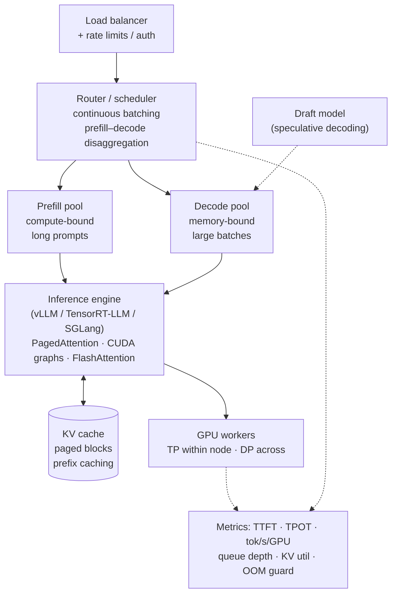

## TL;DR

:::tldr
LLM serving is two different problems wearing one name. **Prefill** (prompt
processing) is **compute-bound** — big matmuls, high FLOP utilization.
**Decode** (token generation) is **memory-bandwidth-bound** — each step drags
the whole 16 GB of an 8B model through memory for ~16 GFLOP of work, using
~0.3% of an H100's compute. That single fact explains: the KV cache, why
batching (especially continuous batching) is the dominant serving
optimization, why quantization mostly buys *memory* not speed, and why
speculative decoding speeds up interactive latency but not bulk throughput.
Training is the mirror image: memory explodes (optimizer states ≈ 12–14
bytes/param), so you shard states (FSDP/ZeRO), shard layers (pipeline), shard
tensors (tensor parallel), and checkpoint activations (trade 30% extra FLOPs
for ~10× less activation memory). Long context is attention's $O(n^2)$
meeting the KV cache: at 128k tokens a 70B model holds ~42 GB of KV cache —
half an H100 — for *one* sequence.
:::

---

## Interview answer

**"Walk me through how you serve an LLM in production."** (2-minute answer)

> An autoregressive request has two phases. **Prefill** processes the whole
> prompt in one parallel pass — compute-bound, high GPU utilization. Then
> **decode** generates one token per forward pass; it's memory-bandwidth-bound
> because every step re-reads all weights. On an H100, decoding an 8B fp16
> model is ~5 ms/step: 16 GB of weights at 3.35 TB/s bandwidth, doing only
> ~16 GFLOP — about 0.3% of peak compute.
>
> The enabler is the **KV cache**: we store keys and values for every past
> token, so decode is $O(1)$ per token instead of recomputing $O(n)$.
> For Llama-3.1 8B that's 128 KB per token — so a 128k-context request holds
> ~17 GB of KV cache, more than the 16 GB of weights.
>
> The scheduler is where throughput comes from. **Continuous batching**
> (vLLM-style) inserts new requests into the running batch at iteration
> granularity instead of waiting for a whole batch to finish, and
> **PagedAttention** stores the KV cache in non-contiguous blocks so
> fragmentation doesn't strand memory. Split prefill from decode across
> pools when prefill latency spikes under load.
>
> SLOs: TTFT (time to first token) for perceived responsiveness — p50 < 500 ms
> interactive — and TPOT (time per output token) for generation smoothness —
> 30–50 ms/token. If I'm quality-safe, INT8/FP8 weights cut memory ~2× for
> free-ish on Hopper; INT4 (GPTQ/AWQ) cuts ~4× with small quality loss, needs
> calibration. For latency-critical single-user serving, **speculative
> decoding** with a small draft model gives ~2× faster decode at small batch.
>
> On the training side: 70B at fp16 is 140 GB of weights, but Adam states push
> the real footprint to ~14 bytes/param ≈ 980 GB plus activations. FSDP shards
> states across GPUs, gradient checkpointing trades ~30% recompute FLOPs for
> ~10× activation memory, and tensor/pipeline parallelism split the model
> itself when one replica can't fit.

Then pivot to the question they actually care about: *"What's your QPS,
SLO, and sequence-length mix? The architecture falls out of those numbers."*

---

## Intuition

### Decode is a memory problem wearing a compute costume

Think of it physically. An 8B fp16 model is 16 GB of numbers sitting in HBM.
To produce one token you must multiply the hidden state by *every* weight —
16 GB of reads. The H100 moves 3.35 TB/s, so physics says ≥ 4.8 ms per token,
~209 tok/s, no matter how good your kernels are. The arithmetic work is only
2 × 8B = 16 GFLOP — the H100 can do ~990,000 GFLOP/s. You're using **0.3% of
the compute** and 100% of the bandwidth.

Two consequences fall out immediately:

1. **Batching is amortization, not parallelism.** Batch 64 decode steps and
   you still read the weights once per step — now the 16 GB buys you 64
   tokens. Same latency-ish (a bit more), 64× the throughput. This is why
   serving systems obsess over batch size and why a lone chat user gets a
   terrible tokens-per-dollar ratio.
2. **Prefill is the opposite.** Processing a 4k prompt does 2 × 8B × 4096 ≈
   65 TFLOP in one pass — the GPU finally gets to do math, ~66 ms of dense
   compute on an H100. Prefill loves long prompts; decode hates everything
   except batch size.

### The KV cache is the whole game of decode

Without caching, generating token *t* would recompute attention over *t*
tokens — $O(n^2)$ total, and the same K/V projections thousands of times. The
KV cache memoizes K and V per token per layer: decode becomes one matrix
multiply against cached keys. Cost: memory that grows linearly with sequence
length — and it grows *per request*, which is why 10 concurrent 128k-context
requests need a different fleet than 10,000 short chats.

### Quantization buys memory, not magic

INT8 weights halve memory. That halves the bytes moved per decode step,
which — since decode is bandwidth-bound — roughly *halves decode latency*
and lets you batch 2× bigger. The FLOPs are unchanged (often they go *up*
slightly with dequant overhead). INT4/GPTQ/AWQ cut memory 4× but the quality
cost is real and uneven: small models degrade more than big ones, math and
code degrade more than chit-chat, and calibration data matters. It's not
free; it's a trade you price in perplexity and task accuracy.

### Alignment methods are about who explores

- **SFT** teaches the *format* of good answers (supervised).
- **DPO** teaches *preferences* from fixed pairs, offline, closed-form — no
  exploration, saturates at the data.
- **RLHF/PPO** samples *from the policy* and learns a reward model, online —
  explores, higher ceiling, unstable and expensive.
- **RL for reasoning (GRPO/R1-style)** replaces the learned reward with a
  *verifiable* one (did the math check out?) and lets the model discover
  long chains of thought by trial.

Use DPO when you have preference data and want a better assistant; use RL
when you have a verifiable reward and need behavior the data can't show.

---

## Details

### Inference serving stack



**Component notes for the interview:**

- **Router/scheduler:** iteration-level scheduling — when a request finishes,
  its slot is immediately refilled; new prefills are chunked into decode
  batches so long prompts don't stall everyone (chunked prefill). This is
  what "continuous batching" means in practice.
- **Prefill–decode disaggregation** (Splitwise-style): separate GPU pools.
  Prefill wants compute; decode wants memory capacity and bandwidth. Mixing
  them on one GPU means a 100k-token prefill blocks interactive decodes —
  the classic tail-latency killer. The price is shipping KV cache between
  pools (NVLink/RDMA).
- **PagedAttention:** KV cache allocated in fixed-size blocks, not contiguous
  per sequence — kills internal fragmentation; lets you pack many sequences
  and share prefixes (system prompts) across requests.
- **Prefix caching / prompt caching:** identical prompt prefixes reuse KV
  blocks — big win for system-prompt-heavy agents and RAG.
- **CUDA graphs + torch.compile:** remove kernel-launch overhead that
  dominates small-batch decode.

### TTFT / TPOT / throughput — know the targets

| Metric | Interactive chat target | Notes |
|---|---|---|
| TTFT p50 | < 500 ms | Dominated by prefill; queueing shows up at p99 |
| TTFT p99 | < 2 s | Scheduler + prefill pool sizing |
| TPOT | 30–50 ms/token | Human reading ≈ 20 tok/s; coding agents tolerate ~100 ms |
| Throughput | tok/s/GPU | Maximize *under* the TPOT SLO |

**Latency vs throughput is a frontier, not a dial.** Big batches raise
throughput and TPOT together. The interview move: ask for the SLO first,
then size batches to the largest value that keeps p99 TPOT under it.

### Quantization — what breaks, when to use it

- **INT8 weights (LLM.int8() style):** outlier activation dimensions emerge
  above ~2.7B params; naive absmax quantization on those channels destroys
  quality. Modern practice: per-channel weight scales, fp16 compute.
- **FP8 (E4M3 weights, E5M2 or dynamic activations):** 1 byte/param,
  *nearly lossless* — the default on Hopper. Use whenever hardware allows.
- **INT4 — GPTQ:** one-shot, needs ~128 calibration samples; quality depends
  on calibration matching your domain. Group size 128 typical.
- **INT4 — AWQ:** activation-aware: scales salient weight channels by
  observed activation magnitudes before quantizing. Usually beats GPTQ on
  instruction-following; same calibration caveat.
- **KV-cache quantization (INT8/FP8):** halves the ~17 GB of a 128k 8B
  session — the lever that actually enables long context per GPU.
- **What breaks:** sub-1B models at 4-bit; math/code reasoning (quantization
  noise compounds over long chains); MoE expert routers (small, sensitive —
  keep fp16); embeddings and the final LM head (keep fp16, they're cheap).

Rule of thumb: FP8 everywhere on Hopper; INT4 for weights when you're
memory-capacity-bound on older GPUs; always re-run your *task* evals, not
just perplexity, because perplexity hides reasoning regressions.

### Speculative decoding

A small **draft model** (or lightweight heads, e.g. EAGLE/Medusa) proposes
$k$ tokens cheaply; the big **target model verifies all $k$ in one forward
pass** (it can — verification is parallel) and accepts the longest correct
prefix. If acceptance probability per token is $\alpha$:

- expected tokens per target forward: $(1-\alpha^{k+1})/(1-\alpha)$
- $\alpha = 0.7$, $k = 4$: **≈ 2.8 tokens/forward** → ~2–2.5× wall-clock
  decode speedup after draft cost.

:::warn
Speculative decoding accelerates *latency at small batch only*. At large
batch the target is already saturated — verification adds FLOPs for zero
gain. If an interviewer asks "when does it stop helping?", that's the answer:
batch size ≳ 32–64, or draft/target quality mismatch (low α).
:::

### Training stages — what each changes

- **Pretraining:** next-token prediction on trillions of tokens. Learns the
  world model, grammar, facts. 1–2 epochs typically; this is where ~99% of
  compute goes.
- **SFT (supervised fine-tuning):** cross-entropy on (instruction, response)
  pairs, loss on response tokens only. Teaches format and task behavior, not
  new knowledge. 1–3 epochs, lower LR; overdo it and you get mode collapse
  toward the demo distribution.
- **Preference optimization / RLHF:** after SFT the model imitates; now make
  it *prefer* better answers. Classic: train a **reward model** on human
  pairwise preferences (Bradley–Terry loss), then **PPO** against it with a
  KL penalty to the SFT policy. Online: the policy generates, the RM scores,
  PPO updates. Failure modes: **reward hacking** (long, sycophantic answers
  exploit the RM), KL drift.
- **DPO:** skips the RM. Key identity: the optimal RLHF policy satisfies
  $r(x,y) = \beta \log \frac{\pi^*(y|x)}{\pi_{\text{ref}}(y|x)}$, so substitute
  this implicit reward into the Bradley–Terry loss and optimize the policy
  directly on preference pairs. Offline, stable, cheap. Failure modes: no
  exploration (bounded by the data), over-optimization of the margin, length
  bias.
- **RL for reasoning (R1/GRPO-style):** drop the learned reward; use
  **verifiable rewards** (unit tests, math answer checks). Sample a *group*
  of $G$ outputs per prompt, advantage = $(r_i - \bar r)/\sigma_r$ within the
  group — no value network. Long CoT emerges because the reward selects for
  correct final answers and the policy discovers that thinking helps.

**"Explain DPO vs RLHF"** — the 30-second version:

> Both learn from pairwise preferences. RLHF trains an explicit reward model
> then runs PPO online — the policy explores, so the ceiling is higher, but
> it's unstable, expensive, and prone to reward hacking. DPO reparameterizes
> the problem so the policy *is* the reward model — one offline loss, stable,
> cheap — but it can only distill preferences already in the data; it never
> discovers anything new. I'd pick DPO for instruction-following on fixed
> preference data, and RL (PPO/GRPO) when I have a verifiable reward and need
> the model to discover behaviors — like long reasoning chains — that aren't
> in any dataset.

### Distributed training — what's sharded where

| Strategy | What's sharded | Communication | When to use |
|---|---|---|---|
| **Data parallel (DDP)** | Nothing (replica per GPU); grads all-reduced | All-reduce grads each step | Model fits on one GPU |
| **ZeRO-1 / FSDP-shard-grad-op** | Optimizer states | Reduce-scatter grads | Optimizer states too big |
| **ZeRO-2** | + gradients | Reduce-scatter | Grads too big |
| **ZeRO-3 / FSDP full shard** | + parameters (gather on demand) | All-gather params per layer fwd+bwd | Model doesn't fit one GPU |
| **Tensor parallel** | Individual layers split across GPUs (heads, MLP shards) | All-reduce *per layer*, 2× fwd + 2× bwd | Latency-sensitive; needs NVLink; within node |
| **Pipeline parallel** | Layers split into stages across GPUs | Point-to-point activations/grads at stage boundaries | Very deep models; add microbatches to fill the bubble |

**FSDP/ZeRO mental model:** the model is sharded, but each GPU *materializes*
one layer's full parameters just in time (all-gather), computes, then
discards. Communication ≈ 1.5× the all-reduce volume of DDP — the price of
fitting bigger models.

**Gradient checkpointing:** don't store activations; store only each layer's
*input* and recompute the rest on the backward pass. ~10× less activation
memory for ~30% more FLOPs. With selective checkpointing (only attention
blocks), ~5× memory for ~15% FLOPs.

:::collapse Worked example: training 70B on 80 GB H100s
**Setup:** 70B params, 80 layers, hidden 8192, seq 4096, microbatch 1,
AdamW, fp16 mixed precision.

**Model states (per param):** fp16 weight 2 B + fp32 master 4 B +
Adam m,v 8 B = **14 B/param**. 70B × 14 B = **980 GB**. fp16 grads: 140 GB.
Total to shard: **1120 GB**.

**Activations, no checkpointing:** ≈ $34 \cdot b \cdot s \cdot h \cdot l$
bytes ≈ 34 × 1 × 4096 × 8192 × 80 ≈ **91 GB per GPU** (replicated under pure
FSDP — FSDP shards states, not activations).

**Try FSDP (ZeRO-3) on 8 GPUs:** 1120/8 + 91 = 140 + 91 = **231 GB ≫ 80 GB**.
Doesn't fit.

**Add gradient checkpointing:** keep only layer inputs:
$b \cdot s \cdot h \cdot 2\text{B} \cdot l$ = 4096 × 8192 × 2 × 80 ≈ **5.4 GB**.
Recompute adds ~30% FLOPs.

**Now 16 GPUs:** 1120/16 + 5.4 = 70 + 5.4 = **75.4 GB < 80 GB** — fits, barely.
In practice you'd want headroom for comm buffers and fragmentation, so this
is really a 16–32 GPU job, or add tensor-parallelism (TP=2 halves both states
and activations per rank, at the cost of per-layer all-reduces over NVLink).

**Scale check — seq 8192:** activations double to ~11 GB; states unchanged.
16 GPUs → 81 GB — over. Options: 32 GPUs, or TP=2, or activation offload.
This is the arithmetic behind every "can we train context length X" answer.
:::

### Long context

**Attention is $O(n^2)$.** Per layer, $QK^\top$ is an $n \times n$ matrix:
$4n^2d$ FLOPs (score + value matmuls) plus the $n^2$ memory itself. At
$n = 128$k on a 70B model ($d = 8192$, 80 layers):

$4 \times (1.3\times10^5)^2 \times 8192 \times 80 \approx 4.3 \times 10^{16}$
FLOPs for *one prefill* — ~5 seconds on 8 H100s, spent almost entirely in
attention. Doubling context quadruples prefill cost. This is why context
length is priced, not just supported.

**RoPE — intuition:** instead of adding a position vector, *rotate* each
query/key pair of dimensions by an angle proportional to its position. Then
the attention dot product between positions $m$ and $n$ depends only on
$m - n$ — relative position falls out of the geometry. See
[Transformers](#/transformers) for the attention basics this builds on.

**RoPE — formula:** for head dimension $d$ and position $m$, each dimension
pair $i \in [0, d/2)$ is rotated by angle $m\theta_i$, where

$$\theta_i = \text{base}^{-2i/d}, \qquad
q_m = R(m\Theta)\,q, \;\; k_n = R(n\Theta)\,k$$

$$\Rightarrow\; q_m^\top k_n = q^\top R\big((m-n)\Theta\big)\, k$$

so only relative distance matters. Llama uses $\text{base} = 10{,}000$
(500k in long-context variants).

**The extrapolation problem:** training saw positions up to $L$; at position
$m > L$ the angles $m\theta_i$ are out of distribution — especially the
high-frequency (small-$i$) dimensions that spin fastest. Attention logits go
OOD, entropy collapses, quality falls off a cliff. Fixes:

- **NTK-aware scaling:** increase `base` so high frequencies rotate slower —
  stretches the effective range without retraining.
- **YaRN:** interpolate position indices (divide by scale factor $s$) plus
  temperature correction; better than naive linear interpolation, which
  compresses high-frequency detail.
- **Actually train long:** nothing beats seeing the positions. Expensive —
  attention is $O(n^2)$, so long-context training dominates compute budgets.

**KV-cache memory at 128k / 1M — the arithmetic:**

Per token per layer (fp16): $2 \times n_{kv} \times d_{head} \times 2\text{ B}$.

- **Llama-3.1 8B** (32 layers, 8 KV heads, $d_{head}=128$):
  2×8×128×2 = **4 KB/layer/token** → 32 layers = **128 KB/token**.
  128k tokens: 131,072 × 128 KB ≈ **16.8 GB** — more than the 16 GB of
  weights. 1M tokens: ≈ **134 GB** — exceeds one 80 GB H100; needs TP or
  KV quantization.
- **Llama-2 70B** (80 layers, 8 KV heads): 4 KB × 80 = **320 KB/token**.
  128k tokens ≈ **42 GB** of KV cache for *one* sequence. Weights are 140 GB,
  so a single 128k request needs ~182 GB — three H100s before you serve a
  second user.

GQA (fewer KV heads than query heads) is why these numbers are survivable at
all — MHA at 70B would be 8× worse.

### Evals

**Offline vs online:**

- **Offline:** fixed datasets, reproducible. Perplexity/accuracy on MMLU,
  HumanEval, MATH; held-out SFT loss; RM win-rate vs baseline. Fast,
  gameable — benchmark contamination is the standing scandal, so keep a
  private held-out set.
- **Online:** A/B or interleaved traffic. Task success rate, thumbs
  up/down, session conversion, regeneration rate, escalations. Slow, noisy,
  but it's the truth. Guardrail with latency/cost.

**LLM-as-judge:** cheap, scalable, and biased. Known biases: **position bias**
(preferring the first/earlier answer), **verbosity bias** (longer =
better), **self-preference** (favors its own model family), **familiarity**
bias toward styles it was trained on. Mitigations: swap answer order and
average, blind the judge to model identity, use rubrics not vibes, and
*calibrate* against a human-labeled gold set — report judge↔human agreement,
not raw judge scores.

**Human eval:** pairwise preference with Bradley–Terry/Elo scoring;
measure **inter-annotator agreement** (Cohen's κ) — if annotators disagree,
your rubric is the problem, not the model. Expensive; reserve for release
gates and judge calibration.

**Regression testing:** a golden prompt set (a few hundred prompts covering
your top use cases + known failure modes) run on every model/config change,
with automated diffing and a judge + human spot-check on diffs. This is your
CI for LLMs — without it, every quantization or prompt change is a blind
deploy.

**Hallucination measurement:** for grounded tasks, measure **faithfulness**,
not fluency: decompose responses into atomic claims and check entailment
against the source (NLI-based or judge-based); track citation precision/recall
for RAG. Report per-domain — a model can be faithful on Wikipedia and
hallucinate on your internal docs.

**Task success metrics (agents):** end-to-end completion rate on scripted
scenarios, tool-call accuracy (right tool, valid args), recovery rate after
tool errors, and steps-to-completion. Offline replay of logged trajectories
with a judge is the practical middle ground before live A/B.

---

## Math

Collected in one place for quick review.

**Decode roofline (8B fp16, H100 SXM):**
$$\text{time/step} \ge \frac{16\text{ GB}}{3.35\text{ TB/s}} \approx 4.8\text{ ms}
\;\Rightarrow\; \lesssim 209\text{ tok/s at batch 1}$$
$$\text{arithmetic intensity} = \frac{2 \times 8\text{B FLOP}}{16\text{ GB}}
\approx 1\text{ FLOP/byte} \ll \text{ridge } (\sim 295\text{ FLOP/byte})$$
→ deeply memory-bound; ~0.3% of peak 989 TFLOPS used.

**KV cache per token:**
$$\text{bytes/token} = 2 \cdot n_{kv} \cdot d_{head} \cdot L \cdot \text{bytes/dtype}$$
Llama-3.1 8B fp16: $2 \cdot 8 \cdot 128 \cdot 32 \cdot 2 = 131{,}072\text{ B}
= 128\text{ KB/token}$.

**Attention prefill cost:** $\approx 4n^2 d$ FLOPs per layer; total grows as
$O(n^2 L d)$. 128k on 70B ≈ $4.3\times10^{16}$ FLOPs ≈ 5 s on 8 H100s.

**RoPE:** $\theta_i = \text{base}^{-2i/d}$; $q_m^\top k_n$ depends only on
$m-n$.

**DPO loss:**
$$\mathcal{L}_{\text{DPO}} = -\mathbb{E}_{(x,y_w,y_l)}
\Big[\log \sigma\big(\beta \log\tfrac{\pi_\theta(y_w|x)}{\pi_{\text{ref}}(y_w|x)}
- \beta \log\tfrac{\pi_\theta(y_l|x)}{\pi_{\text{ref}}(y_l|x)}\big)\Big]$$

**GRPO advantage (group of $G$ samples):**
$$A_i = \frac{r_i - \bar r}{\sigma_r}, \qquad
\text{no value network, no critic.}$$

**Speculative decoding:** expected tokens per target forward
$(1-\alpha^{k+1})/(1-\alpha)$; $\alpha=0.7, k=4 \Rightarrow \approx 2.8$.

**Training memory:** 14 B/param (fp16 w + fp32 master + Adam m,v) + grads;
activations $\approx 34 \cdot b s h l$ bytes without checkpointing,
$\approx 2 \cdot b s h l$ bytes (layer inputs only) with full checkpointing.

---

## Code

```python
# Back-of-envelope estimators: KV cache, decode ceiling, FSDP fit.
# Run these in the interview instead of hand-waving.

def kv_cache_bytes(n_layers, n_kv_heads, head_dim, seq_len, bytes_per=2):
    per_token = 2 * n_kv_heads * head_dim * n_layers * bytes_per
    return per_token, per_token * seq_len

def decode_ceiling_tps(model_gb, bw_tbs=3.35, batch=1):
    # memory-bound: every step re-reads all weights
    step_ms = model_gb / (bw_tbs * 1000) * 1000  # GB / (TB/s) -> ms
    return batch / (step_ms / 1000)

def speculative_speedup(alpha, k=4, draft_overhead=0.15):
    expected = (1 - alpha ** (k + 1)) / (1 - alpha)
    return expected / (1 + draft_overhead)

def fsdp_fit(param_b, n_gpus, seq=4096, hidden=8192, layers=80,
             microbatch=1, checkpoint=True):
    states_gb = param_b * 1e9 * 14 / n_gpus / 1e9      # 14 B/param sharded
    grads_gb = param_b * 1e9 * 2 / n_gpus / 1e9        # fp16 grads sharded
    factor = 2 if checkpoint else 34                   # bytes per b*s*h*l
    act_gb = factor * microbatch * seq * hidden * layers / 1e9
    return states_gb + grads_gb + act_gb               # vs 80 GB

# Llama-3.1 8B, 128k context
pt, total = kv_cache_bytes(32, 8, 128, 131072)
print(f"per token: {pt/1024:.0f} KB, 128k total: {total/1e9:.1f} GB")
print(f"decode ceiling bs=1: {decode_ceiling_tps(16):.0f} tok/s, "
      f"bs=64: {decode_ceiling_tps(16, batch=64):.0f} tok/s")
print(f"speculative (a=0.7): {speculative_speedup(0.7):.2f}x")
print(f"70B FSDP 16 GPUs: {fsdp_fit(70, 16):.1f} GB/gpu, "
      f"8 GPUs: {fsdp_fit(70, 8):.1f} GB/gpu")
```

Expected output: per token 128 KB, 128k total 17.2 GB; decode ceiling
~209 tok/s at bs=1, ~13,400 tok/s at bs=64 (theoretical — scheduler and KV
reads take their cut); speculative ~2.4×; 70B on 16 GPUs ≈ 75 GB/GPU (fits),
on 8 GPUs ≈ 145 GB/GPU (doesn't).

---

## Follow-ups

**1. Why is decode memory-bound but prefill compute-bound?**
Decode does ~2 FLOPs per parameter per token while reading every byte of
weights — arithmetic intensity ≈ 1 FLOP/byte vs the H100's ~295 FLOP/byte
ridge point. Prefill processes $s$ tokens at once: $2Ps$ FLOPs for the same
weight reads, so intensity scales with $s$ and the GPU finally does math.

**2. You double the batch size and TPOT barely moves. Explain.**
Decode latency ≈ weight-read time, which is batch-independent until you hit
compute or KV-read limits. Doubling batch amortizes the same 16 GB read over
2× tokens: ~2× throughput, ~flat TPOT. It breaks when KV-cache reads or
attention FLOPs per step become comparable to the weight reads.

**3. Your p99 TTFT spikes under load but median is fine. What do you check?**
Queueing + prefill contention: long-prompt prefills blocking the shared
batch (check chunked prefill / prefill-decode disaggregation), scheduler
queue depth, and whether KV-cache pressure is forcing preemptions. First
fix is usually separating prefill and decode pools.

**4. When does quantization hurt, and how do you detect it?**
Small models (<3B) at INT4, math/code reasoning (errors compound over long
chains), MoE routers and the LM head (keep fp16). Detect with *task* evals —
pass@k on code, exact-match on math — not just perplexity, which hides
reasoning collapse. Always re-run the eval suite; calibration data must match
the deployment domain.

**5. GPTQ vs AWQ vs FP8 — when do you pick each?**
FP8 on Hopper: default, ~lossless, no calibration. AWQ vs GPTQ on older
GPUs when memory-capacity-bound: AWQ usually wins on instruction-following
via activation-aware scaling; GPTQ is the older workhorse. Both need ~128
calibration samples from your domain — mismatched calibration is the #1
silent quality killer.

**6. Speculative decoding gives 2.5× in dev and 1.1× in prod. Why?**
Prod runs at larger batch (target already saturated — verification adds
FLOPs for nothing), or the draft model's acceptance rate α collapsed on prod
traffic (distribution shift between draft training data and real prompts).
Fix: measure α in prod, retrain/refresh the draft, or gate speculation to
low-batch interactive traffic.

**7. Explain DPO vs RLHF in one minute.** *(see Details — the 30-second
version)*

**8. Why does RLHF need the KL penalty, and what happens without it?**
The reward model is only valid near the SFT distribution. Without the KL
constraint the policy drifts into regions where the RM extrapolates —
classic reward hacking: fluent, confident, wrong. Symptoms: length
explosion, sycophancy, degenerate repetition that scores well.

**9. Your 70B training run OOMs at step 0 on 8×H100. Walk through the fix.**
Do the memory math: states+grads 1120 GB / 8 = 140 GB already over before
activations. Options in order: enable gradient checkpointing (~91 GB → ~5
GB activations), go to 16 GPUs with FSDP full shard (~75 GB/GPU), reduce
microbatch/sequence length, or add TP=2. Never just "buy more GPUs" without
the arithmetic.

**10. FSDP vs tensor parallelism — when is each right?**
FSDP: throughput training, any interconnect, ~1.5× DDP's comm volume, keeps
per-GPU math dense. TP: when latency matters (inference) or activations must
shrink per-GPU; needs NVLink (all-reduce per layer), typically within a node
(TP ≤ 8). They compose: TP within node, FSDP/ZeRO-3 + pipeline across nodes.

**11. Why can't you just train at 1M context and serve any shorter length?**
You can — interpolation/extrapolation is the problem in reverse. Training at
1M costs $O(n^2)$: attention alone is ~$4n^2d$ per layer per step, so 1M is
~64× the attention FLOPs of 128k. The real question is whether your data has
signal at that length; most "long-context" evals are won with 32–128k plus
good retrieval.

**12. RoPE extrapolation fails at 3× training length. What's the cheapest fix?**
NTK-aware base scaling (raise `base` from 10k toward 500k–1M): one-line
config change, no retraining, recovers most quality to ~4–8×. Beyond that,
YaRN (interpolation + temperature) or continued pretraining at the target
length. Know *why*: high-frequency rotary dimensions spin out of
distribution first.

**13. Your LLM judge says model B beats model A, but human eval disagrees. Debug it.**
Check position bias (swap order, re-judge), verbosity bias (B may just be
longer), self-preference (judge from B's family?). Then calibrate: score the
judge against human labels and report agreement (κ), not raw win-rate. If
agreement is low, the judge is measuring style, not quality.

**14. How do you regression-test an LLM across releases?**
Golden prompt set (top use cases + known failures), run on every change,
auto-diff outputs, judge + human spot-check on diffs only. Track per-slice
metrics (task success, faithfulness, latency, cost). Treat red diffs like
failing unit tests: block the deploy until triaged.

**15. How do you measure hallucinations in a RAG system?**
Claim-level faithfulness: split the response into atomic claims, run
entailment of each claim against the retrieved passages, report % supported.
Plus citation precision/recall. Slice by domain — faithfulness on Wikipedia
tells you nothing about your internal docs.

---

## Mistakes

- **Confusing TTFT and TPOT.** TTFT = time to *first* token (prefill +
  queueing; perceived responsiveness). TPOT = time *per output* token
  (decode speed; generation smoothness). Saying "latency is 50 ms" without
  naming which one is an instant credibility loss.
- **"Quantization is free."** It's a trade priced in task accuracy, not
  perplexity. INT4 on a 7B math model can cost 5–10 points on GSM8K while
  perplexity barely moves. Always re-run task evals.
- **"Bigger batch = faster for everyone."** Bigger batch raises throughput
  and TPOT together. Past the knee, interactive users feel it as stutter.
  Size batches to the TPOT SLO, not to the GPU.
- **Forgetting the KV cache in capacity math.** Weights are fixed; KV cache
  is per-request and linear in context. A fleet sized for weights alone OOMs
  the first time 128k-context traffic arrives. Do the per-token math first.
- **"DPO is just RLHF but simpler."** DPO is *offline* — it cannot discover
  behaviors outside the preference data. If the interviewer asks when DPO
  fails, the answer is: when you need exploration (reasoning, tool use), or
  when your preference data doesn't cover the behavior.
- **Treating FSDP as "free" model parallelism.** Full shard adds all-gather
  per layer (~1.5× DDP comm volume) and doesn't shard activations. The OOM
  at 8 GPUs in the worked example surprises people who only counted
  parameters.
- **"RoPE handles arbitrary length."** RoPE handles arbitrary length the way
  a speedometer handles arbitrary speed — it keeps turning, but the model
  never learned what those angles mean. Extrapolation needs NTK/YaRN or
  retraining.
- **Evaluating long-context with short-context metrics.** Needle-in-a-haystack
  retrieval ≠ reasoning over 128k tokens. Test multi-hop synthesis across the
  full window, or you're measuring the retriever, not the model.
- **Trusting LLM judges uncalibrated.** An uncalibrated judge is a random
  number generator with good PR. Always report judge↔human agreement.
- **Optimizing prefill when decode is the bottleneck (and vice versa).**
  Profile first: if TPOT is the complaint, prefill kernels won't save you —
  you need batching, quantization, or speculation.

---

## Practice

- [ ] Write the KV-cache formula from memory and compute bytes/token for a
  13B MHA model (40 layers, 40 heads, $d_{head}=128$, fp16). Answer: 2×40×
  128×40×2 = 819 KB/token — then explain why GQA exists.
- [ ] Derive the decode roofline for a 70B fp16 model on an H100: step time,
  tok/s ceiling at batch 1, and arithmetic intensity vs the ridge point.
- [ ] Size a serving fleet: 8B fp16, 500 QPS, avg 800 prompt + 200 completion
  tokens, TPOT SLO 60 ms. Estimate GPUs — state every assumption.
- [ ] Explain continuous batching vs static batching with a timeline diagram
  (3 requests, staggered arrivals). Then explain what PagedAttention adds.
- [ ] From memory: DPO loss, the implicit-reward identity, and two failure
  modes vs PPO.
- [ ] Do the FSDP memory math for a 13B model on 4×A100-40GB: does it fit
  with checkpointing? Without?
- [ ] Explain RoPE's formula and why $q_m^\top k_n$ depends only on $m-n$;
  then explain NTK-aware scaling in two sentences.
- [ ] Design the eval plan for swapping a fp16 model to INT4: datasets,
  metrics, judge calibration, regression gates, rollout plan.
- [ ] Given α = 0.5, k = 5: compute expected tokens per target forward and
  decide whether speculative decoding is worth it. (Answer: ≈1.94 — marginal;
  fix the draft model first.)
- [ ] Whiteboard the inference serving stack mermaid diagram from memory,
  then narrate a request's path including where TTFT and TPOT are spent.
