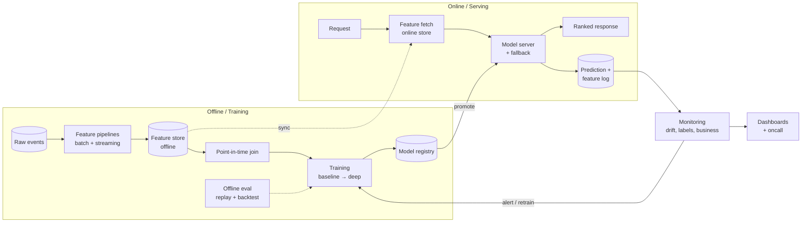

## TL;DR

Every ML system design interview is the same 18 steps, in order. In 45 minutes
you will touch all of them but go deep on **three**: the interviewer chooses
which three by their follow-ups — your job is to make each step crisp enough
that they *want* to go deep. Staff bar: every step gets a decision, a rejected
alternative, and a number.

:::tldr
The 18 steps: **1** clarify → **2** product objective → **3** ML objective →
**4** constraints → **5** metrics → **6** data → **7** labels → **8** features →
**9** model → **10** training → **11** serving → **12** storage → **13** scaling →
**14** evaluation → **15** experimentation → **16** monitoring →
**17** failure modes → **18** iteration.
:::

## The reference architecture

Draw this (or your version of it) in the first 10 minutes. Everything you say
afterwards is a zoom-in on one box.

---

## The 18 steps

### 1. Clarify

**Do (2–3 questions max):** Who uses it? What decision does the model output
drive? What's the latency budget? What scale — QPS, corpus, users?

**Staff differentiator:** Ask the question that reframes the problem: "Is this
actually a ranking problem, or a retrieval problem with a ranking veneer?" or
"What's the cost of a wrong prediction vs. a slow one?" One reframing question
is worth five clarifying ones.

**Common mistake:** 10 minutes of clarifying. Interviewers read long
clarification as stalling. Cap it at 3 minutes, state your assumptions out
loud, move on.

### 2. Product objective

**Do:** One sentence: "Increase ___ for ___ by ___." Tie it to the business:
conversion, retention, revenue, cost, safety.

**Staff differentiator:** Name the tension explicitly — "conversion vs. long-term
trust," "rider wait time vs. driver utilization." Staff candidates see the
multi-objective nature unprompted.

**Common mistake:** Jumping to the model before stating what the product needs.
If you can't state the product objective, you can't choose a metric.

### 3. ML objective

**Do:** Translate: product objective → ML formulation. Ranking? Classification?
Regression? Retrieval? State the loss family: pointwise / pairwise / listwise
for ranking; cross-entropy for classification.

**Staff differentiator:** Justify the formulation choice: "Pairwise, because we
only ever show relative order and our labels are implicit clicks — pointwise
would inherit position bias."

**Common mistake:** "I'll use a neural network" as the ML objective. The
objective is the *problem formulation*, not the model.

### 4. Constraints

**Do:** Enumerate: latency (p50/p99), QPS, training data volume, label delay,
cold start, fairness/regulatory, cost per prediction, team size.

**Staff differentiator:** Rank them. "Latency is the binding constraint; cost is
second; we can buy training data." Interviewers want to see you *trade*
constraints, not list them.

**Common mistake:** Forgetting the constraint that kills your design later
(label delay is the classic one).

### 5. Metrics

**Do:** Three tiers — offline (NDCG, AUC, recall@K), online (conversion, A/B
lift), guardrails (p99 latency, infra cost, error rate). Define the primary
decision metric and the veto metrics.

**Staff differentiator:** "The metric I'd get fired for" — name the one number
that decides ship/no-ship, and the guardrail that vetoes a win. Bonus: mention
metric gaming ("if we optimize CTR alone, we'll get clickbait").

**Common mistake:** Accuracy on imbalanced data. Or offline-only metrics with no
path to online validation.

### 6. Data

**Do:** Sources, volume, velocity, retention. What's logged today vs. what you'd
need to start logging. Sampling strategy for training.

**Staff differentiator:** Talk about the data you *don't* have: "We lack
counterfactuals for items never shown — so our training data is censored by the
current policy. That bounds what offline eval can tell us."

**Common mistake:** Assuming clean, complete data. Production data is censored,
delayed, and biased — say so.

### 7. Labels

**Do:** How positives/negatives are constructed. Clicks? Purchases? Dwell time?
Explicit ratings? Debiasing: position bias (IPS / examination hypothesis),
selection bias, delayed labels.

**Staff differentiator:** The label-delay design: "Purchases arrive in 14 days;
we train on click-with-dwell proxy now, then fine-tune on delayed purchase
labels with importance weighting." This is senior-staff territory.

**Common mistake:** "Labels come from user clicks" with no debiasing
discussion. Implicit feedback without position-bias correction is a red flag.

### 8. Features

**Do:** Query/user features, item features, cross features, contextual features.
Batch vs. streaming vs. request-time. Feature store shape (online/offline).

**Staff differentiator:** **Point-in-time correctness** — "every training join
uses feature values as of the event timestamp, enforced by the feature store."
Then freshness SLAs per feature tier: "price features < 1 min, user aggregates
< 1 hour."

**Common mistake:** Listing features without saying which are available at
serving time. That's train–serve skew by design.

### 9. Model

**Do:** Baseline first (heuristic → GBDT / logistic), then the deep model with
justification. Retrieval → ranking decomposition for search/recsys. Architecture
sketch with shapes.

**Staff differentiator:** The *rejected* alternatives: "We considered a
cross-encoder reranker over the full corpus — rejected: 40ms at our QPS costs
$X/month for +0.3% NDCG. Two-tower retrieval + GBDT ranker captures 90% of the
gain at 10% of the cost." Every model choice needs its price tag.

**Common mistake:** Leading with the fanciest model. Or no baseline — without a
baseline you can't attribute the gain.

### 10. Training

**Do:** Pipeline: data prep → training → validation. Distributed training if
scale demands (data vs. model parallel). Hyperparameter strategy, early
stopping, checkpointing.

**Staff differentiator:** Retraining cadence tied to nonstationarity: "daily
incremental retrain on a 28-day window; full retrain weekly; the cadence is set
by measured concept drift, not by habit." Plus reproducibility: pinned data
snapshots, seeds, lineage.

**Common mistake:** "We retrain daily" with no reason. Or ignoring training
cost entirely.

### 11. Serving

**Do:** Request path with a latency budget split: "20ms feature fetch, 15ms
model, 10ms post-processing, 5ms network." Batching, caching, model server
choice. **Fallback:** heuristic/cached response on timeout or model failure.

**Staff differentiator:** The fallback is a first-class design: "On p99 breach
or model-server error, we serve the last-known-good ranked list from cache —
degraded but never down. Fallback rate is a monitored metric." Also: shadow
deployments before promotion.

**Common mistake:** No fallback. A design that fails open (or fails at all) at
staff level is a fail.

### 12. Storage

**Do:** What's stored where: raw events (data lake), features (offline store +
online KV), models (registry with versions), predictions + features (logging
for retraining/eval).

**Staff differentiator:** Retention and cost policy: "Raw events 2 years, online
features 30 days, prediction logs sampled at 1% after 90 days — storage is
$X/month and the policy is reviewed quarterly." Staff candidates price their
storage.

**Common mistake:** "We'll store everything in S3" with no retention, access
pattern, or cost reasoning.

### 13. Scaling

**Do:** Bottleneck analysis: which component breaks first at 10×? Horizontal
scaling story per component, stateful vs. stateless split.

**Staff differentiator:** Name the *actual* bottleneck, not generic "we'll add
machines": "The binding constraint at 10× is the online feature store's read
QPS — we'd shard by entity key and add a request-coalescing cache layer."
Quantify: "current 20K reads/sec, headroom 3×, shard at 50K."

**Common mistake:** "It's horizontally scalable" as a complete answer.

### 14. Evaluation

**Do:** Offline: replay on logged data, backtesting, sliced eval (new users,
tail queries, segments). Sanity: does offline gain predict online gain?

**Staff differentiator:** The offline-online correlation discipline: "We track
the correlation between offline NDCG deltas and A/B outcomes per experiment;
when it drops below 0.6 we distrust offline and go to interleaving." Plus
counterfactual evaluation (IPS/DR) for policy changes.

**Common mistake:** Treating offline metrics as truth. Offline is a filter, not
a verdict.

### 15. Experimentation

**Do:** A/B design: randomization unit, primary metric, guardrails, runtime
(power analysis), segmentation. Interleaving for ranking as a cheaper
alternative.

**Staff differentiator:** Interference and network effects: "In a marketplace,
treating riders affects drivers — we'd use cluster randomization by geo or
switchback experiments." Also: holdout discipline and experiment collision
management on a shared surface.

**Common mistake:** "We'll A/B test it" with no randomization unit, no power
consideration, no guardrails.

### 16. Monitoring

**Do:** Four layers: (a) infra (latency, error rate, QPS), (b) data (feature
drift, missingness), (c) model (prediction distribution drift, calibration),
(d) business (the product metric the model serves).

**Staff differentiator:** Alert design: "Alerts fire on *prediction-behavior*
change, not just infra — a silent feature pipeline break that shifts the score
distribution is the incident that pages at 3am." And: delayed-label performance
tracking closes the loop.

**Common mistake:** Monitoring infra only. The model can be perfectly healthy
and completely wrong.

### 17. Failure modes

**Do:** Name 3, each with likelihood, blast radius, and mitigation. Cover: data
pipeline break, feature staleness, model degradation, dependency outage,
adversarial input, feedback loop amplification.

**Staff differentiator:** The *second-order* failure: "The real risk isn't the
model going down — it's the model *working* but learning from its own
outputs, collapsing diversity over 6 months. Mitigation: exploration budget +
diversity constraints + periodic human audit."

**Common mistake:** Generic "the server could crash." Failure modes must be
ML-specific.

### 18. Iteration

**Do:** Close the loop: what you ship in v1 (the smallest thing that validates
the metric), what v2/v3 look like, what you'd measure to decide.

**Staff differentiator:** Sequencing with reversibility: "v1 is heuristic +
logging — reversible in a day. v2 adds the model behind a flag. We commit to
the platform investment (feature store) only after v2 validates the metric."
Staff candidates stage bets; they don't go all-in on unvalidated assumptions.

**Common mistake:** Ending with "and then we'd improve it." Iteration needs a
decision rule, not a wishlist.

---

## Worked example 1 — Search ranking (Rui's domain)

*Prompt: "Design product search ranking for an e-commerce site with 100M items,
50K QPS, p99 < 200ms."*

**Steps 1–5 (5 min):** Product objective: conversion per search session.
ML objective: learning-to-rank, pairwise loss on (query, item+, item−) triples
from implicit feedback. Constraints: p99 200ms end-to-end, 50K QPS, labels
delayed (purchases up to 14 days). Metrics: offline NDCG@10, online conversion
per session, guardrails p99 + infra cost. The fire-me metric: conversion per
session.

**Steps 6–8 (5 min):** Data: search logs (query, shown items, clicks, purchases).
Labels: purchases as positives, clicked-not-purchased as weak positives,
position-bias corrected via IPS weights from randomization logs. Negatives:
in-batch + hard negatives from the current ranker. Features: query (rewritten +
embedded), item (price, brand, historical CTR), cross (BM25, semantic score),
context (device, time). Point-in-time joins via feature store; streaming
features for price/inventory freshness.

**Steps 9–11 (10 min):** Two-stage: (a) retrieval — two-tower (query/item)
embeddings, ANN over 100M items, recall@1000; (b) ranking — GBDT baseline, then
deep cross-encoder-ish ranker on top-200. Latency budget: retrieval 40ms,
feature fetch 60ms, ranking 60ms, post 20ms, network 20ms. Fallback: cached
popular-items ranking on timeout. Rejected: full-corpus cross-encoder (latency),
pure embedding ranking without GBDT cross features (−2% conversion in backtest).

**Steps 12–18 (10 min):** Storage: 28-day training window, sampled logs.
Scaling: ANN index sharded by category; feature store read QPS is the 10×
bottleneck. Eval: backtest on 4 weeks of logs, sliced by head/tail queries.
Experiment: interleaving first (2 days to signal), then A/B with geo-cluster
randomization. Monitoring: feature drift alerts, NDCG proxy on delayed labels,
conversion dashboard. Failure modes: (1) price-feed staleness → stale prices
ranked — mitigation: freshness SLA + auto-demote stale items; (2) feedback loop
— popular items get more clicks — mitigation: exploration bucket (5%) +
diversity penalty; (3) index corruption on deploy — mitigation: shadow traffic
+ instant rollback. Iteration: v1 = GBDT on existing features (2 weeks),
v2 = two-tower retrieval, v3 = deep ranker — each gated on the conversion
metric.

**Staff lines to drop:** "The binding constraint is feature-fetch QPS at 10×,
not model FLOPs." "We stage the bet: heuristic v1 validates the metric before
any platform investment."

## Worked example 2 — ML platform: feature store for 5,000 models

*Prompt: "Design a feature store serving thousands of models — the Core Services
version of this interview."*

**Steps 1–5:** Product objective: cut time-to-production for ML from months to
days; kill training–serving skew org-wide. ML objective: N/A — it's a platform;
the "model" is the SLA. Constraints: online p99 < 10ms reads, offline
point-in-time correctness *by construction*, 10K features, multi-tenant.
Metrics: adoption (models onboarded), skew incidents (target: zero), p99 read
latency, cost per feature. Fire-me metric: a skew incident in production.

**Steps 6–8:** Data: feature definitions as code (versioned, reviewed).
Batch features via scheduled pipelines; streaming via Flink-style jobs;
request-time via UDFs. **The key design decision:** one feature definition
compiles to both the offline (training) and online (serving) paths — parity by
construction, not by discipline.

**Steps 9–11 (platform "model" = serving):** Online store: low-latency KV
(Cassandra/Dynamo-style), keyed by entity, TTL per feature tier. Offline store:
columnar lake with event timestamps. Serving: feature vector assembly service
with batching and request coalescing; SDK for training-time joins.

**Steps 12–18:** Storage: online 30-day TTL, offline 2-year retention, lineage
metadata forever. Scaling: shard online store by entity key; backfill is the
10× bottleneck (parallelized, idempotent). Eval: "eval" = skew audits —
continuous comparison of offline vs. online feature values on sampled traffic.
Experimentation: per-feature shadow mode. Monitoring: freshness SLAs per
feature, missingness alerts, downstream model-impact attribution. Failure
modes: (1) streaming job lag → stale features served — mitigation: staleness
flag in the vector + model-side fallback; (2) bad backfill corrupts offline
store — mitigation: immutable partitions + versioned definitions;
(3) noisy-neighbor tenant saturates reads — mitigation: per-tenant quotas.
Iteration: v1 = batch-only for 3 pilot teams; v2 = streaming; v3 = self-serve
onboarding — each gated on adoption + zero skew incidents.

**Staff lines to drop:** "Parity by construction, not by discipline — one
definition compiles to both paths." "The platform's metric is other teams'
velocity; my roadmap is their top 3 pain points."

---

## Follow-ups (expect 3–5 of these)

- "Your offline metric improved but the A/B is flat — debug it." → Hypothesis
  order: (1) offline-online mismatch (censoring, leakage), (2) insufficient
  power / too short, (3) interference, (4) guardrail veto masking the primary.
- "Why not just use a heuristic?" → Price it: "The heuristic captures X; the
  model adds Y at cost Z. Here's the break-even."
- "How do you handle cold start?" → Content-based + exploration budget, blend
  schedule tied to observed behavior volume.
- "What breaks at 10× scale?" → Name the actual bottleneck with numbers.
- "How do you know the model is still good 6 months later?" → Delayed-label
  tracking, drift alerts, scheduled challenger evaluations.

## Mistakes (the staff-killers)

1. No baseline — can't attribute any gain.
2. No rejected alternatives — no judgment signal.
3. No latency budget split — hand-waving at scale.
4. No fallback — the design fails instead of degrading.
5. Offline metrics treated as truth.
6. Train–serve skew unaddressed.
7. "We'll A/B test" with no design.
8. Ending without iteration/sequencing — all-in bets read as junior.

## Practice

- [ ] Whiteboard the reference architecture from memory in under 5 minutes.
- [ ] Do worked example 1 out loud in 30 minutes, timed.
- [ ] Do worked example 2 out loud in 30 minutes, timed — this is the Core
      Services variant.
- [ ] For each: write the 3 staff lines you'd actually say.
