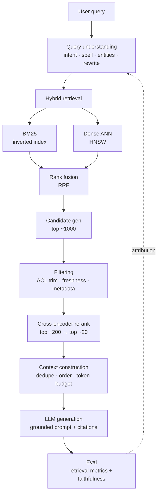

## TL;DR

Retrieval quality bounds answer quality — a generator cannot cite what was
never retrieved, and no prompt trick fixes a broken index. The staff-level
interview is won or lost on **five decisions**: hybrid (sparse + dense)
retrieval, HNSW index design, cross-encoder reranking, ACL-aware security
trimming done *before* top-K, and an attribution methodology that separates
retrieval faults from generation faults. Everything else is optimization.

:::tldr
The pipeline: **query understanding → hybrid retrieval → candidate gen →
filtering (ACL + freshness + metadata) → rerank → context construction →
grounded generation → eval**. Retrieval metrics (Recall@K, NDCG) are leading
indicators; faithfulness and citation precision are the lagging truth.
:::

---

## Interview answer

*The 60-second answer to "Design an enterprise RAG search system":*

> "Query hits a query-understanding layer first — intent classification,
> spell-correct, entity extraction, and rewriting into 2–3 search queries.
> Retrieval is hybrid: BM25 over an inverted index for exact/rare terms plus
> dense embeddings over HNSW for semantic match, fused with reciprocal rank
> fusion. Critically, we security-trim *before* top-K using synced ACLs — a
> post-filter would leak through timing and destroy recall on permissioned
> corpora. Top ~200 candidates go to a cross-encoder reranker for the final
> ordering, then context construction: dedupe near-duplicates, order by
> relevance, fit a token budget with the most relevant chunks last — recency
> bias means position in context matters. The generator gets a grounded prompt:
> answer only from context, cite chunk IDs, say 'I don't know' when the
> context is insufficient. Eval is two-layer: retrieval metrics — Recall@K,
> NDCG — on a labeled set, plus faithfulness and citation precision judged
> per answer. And we run attribution on every failure: rerun the generator on
> oracle chunks — if the answer fixes itself, retrieval was at fault."

---

## Intuition

Search and RAG share one skeleton: **retrieval is a funnel**. You start with
millions of candidates and a latency budget of tens of milliseconds, and you
spend that budget in stages of increasing cost and increasing precision —
cheap lexical match, then ANN vector search, then a heavy cross-encoder on a
few hundred, then an LLM on a few dozen chunks. Every stage trades recall for
precision; a stage that drops a relevant document can never recover it. So the
first design question is always: *where does recall die, and how do we
measure it?*

The second intuition: **lexical and semantic retrieval fail in opposite
ways.** BM25 nails exact terms, IDs, error codes, and rare jargon, but misses
paraphrase. Dense embeddings nail paraphrase but drift on exact match and can
be fooled by fluent-but-irrelevant text. Hybrid isn't a buzzword — it's
covering two complementary failure modes.

The third: **in enterprise RAG, permissions are a retrieval problem, not a
prompt problem.** Telling the LLM "don't reveal restricted docs" is security
theater. Access control must be enforced in the index path.



---

## Details

### BM25 and inverted indexes

The inverted index maps each term → a **posting list** of
`(doc_id, term_freq, positions)`. Retrieval intersects posting lists for
query terms, scores with BM25, and prunes with **WAND / MaxScore** so you
don't score every document containing a common term.

**BM25 scoring** for document $D$ and query $Q$:

- Term frequency saturates: the 10th occurrence of a word matters less than
  the 1st — controlled by $k_1$ (typically 1.2–2.0).
- Length normalization: long docs shouldn't win just for being long —
  controlled by $b$ (typically 0.75), normalized against average doc length.

**Interview depth:** know what breaks. BM25 has no notion of synonyms
("laptop" ≠ "notebook"), no semantics, and IDF computed on a skewed corpus
can overweight corpus-specific jargon. Sharding: split the index by doc for
throughput; each shard returns top-K and you merge — but IDF is then
per-shard unless you broadcast global document frequencies, a classic
distributed-search subtlety. Updates are the pain point: posting lists are
append-friendly but deletions need tombstones and segment merges (this is
what Lucene/Elasticsearch do under the hood).

### Embeddings: cosine vs dot product

Embeddings turn retrieval into nearest-neighbor search in $\mathbb{R}^d$.
The similarity function you train with must match the one you serve with —
this is the single most common embedding bug.

- **Cosine** = dot product on L2-normalized vectors. Use it when you only
  care about direction. Most off-the-shelf sentence embeddings are trained
  and evaluated with cosine.
- **Dot product** on unnormalized vectors lets magnitude carry information —
  some models learn larger norms for "confident" or high-quality docs. If you
  index unnormalized vectors but query with a cosine index (or vice versa),
  your ranking silently degrades.

:::warn
If you normalize at index time but not at query time (or the reverse), ANN
recall collapses and nothing in your metrics will tell you why — the index
"works," it just returns the wrong neighbors. Always assert the norm
distribution of indexed vectors in a health check.
:::

Training is contrastive: pull query and positive doc together, push
negatives apart (InfoNCE / sampled softmax — see [Math](#/rag-search)).
Hard negatives (near-misses mined from a previous index) matter more than
anything else for retrieval quality; random in-batch negatives saturate
quickly.

### ANN and HNSW — how it actually works

Brute-force search over 100M × 768-dim vectors is ~300 GFLOP per query —
impossible at serving latency. ANN trades a few points of recall for 1000×
speedup. **HNSW (Hierarchical Navigable Small World)** is the default choice;
know it cold.

**Construction.** Each vector becomes a node in a stack of graph layers.
Layer 0 contains all nodes; higher layers contain exponentially fewer
(random level drawn from $P(level) \propto e^{-level/m_L}$). Each node
connects to its $M$ nearest neighbors *within its layer* (typical $M$ =
16–32). Edges are bidirectional-ish: when inserting, connect to neighbors,
and prune neighbors' lists with a heuristic that favors **diverse**
directions over pure nearest (this is what keeps the graph navigable instead
of collapsing into local cliques).

**Search.** Start at the top layer's entry point, greedily walk to the
closest neighbor, repeat until no closer neighbor exists, then descend to
the next layer using the current best as the entry point. The top layers are
long-range "highways" that skip across the space; layer 0 does the fine
local search. `efSearch` controls the beam width of the layer-0 candidate
list — the main recall/latency knob at query time.

**Why it wins interviews:** you can state the complexity
($O(\log n)$ hops per layer, roughly), the tuning knobs ($M$,
$efConstruction$ at build, $efSearch$ at query), and the failure modes —
hub nodes, poor recall on out-of-distribution queries, and memory cost
($M \times$ layers edges per node plus the raw vectors; 100M × 768 fp32 is
~300 GB before quantization). Alternatives to name: **IVF-PQ** (inverted
file + product quantization — smaller memory, worse recall at high
precision, needs training of centroids) and **DiskANN** (for billion-scale
on SSD when RAM can't hold the graph).

### Vector DBs vs raw FAISS

FAISS gives you the index; a vector database gives you the *system*: sharding
and replication, filtered search (metadata predicates pushed into the ANN
traversal — "pre-filtering" beats post-filtering for selective predicates),
compaction, snapshots, multi-tenancy, and an update path. Rule of thumb:
prototype on FAISS, ship on a managed vector DB or a search engine with
dense support (Elasticsearch/OpenSearch `dense_vector` + HNSW) once you need
updates, filters, or more than one replica. The interview point: know what
you're buying beyond the algorithm.

### Hybrid retrieval

Run BM25 and dense in parallel, then fuse. Two fusion families:

1. **Score fusion** — normalize both score distributions (min-max or
   z-score per query) and take a weighted sum. Fragile: BM25 scores are
   unbounded and query-dependent; normalization is a per-query hack.
2. **Rank fusion (RRF)** — $score(d) = \sum_i \frac{1}{k + rank_i(d)}$ with
   $k = 60$. Rank-based, so no normalization needed; robust and the default
   answer in interviews.

**Staff depth:** RRF treats both retrievers as equals, which is wrong when
one is systematically better for a query class. The stronger design is
**query routing**: a lightweight classifier sends navigational/exact-term
queries to BM25 and conceptual questions to dense, with hybrid as the
fallback. Also: dense retrieval benefits from retrieving *more* (top-1000)
because its failures are ranking noise, while BM25's top-100 is usually
enough — size the two arms differently.

### Reranking with cross-encoders

Bi-encoders (query and doc embedded separately) are fast but shallow — they
compress all interaction into a dot product. A **cross-encoder** concatenates
query + document and runs full self-attention, producing one relevance
score. It's 100–1000× more expensive per pair, so it only sees the top
~200 candidates from the funnel.

Design decisions to defend:
- **Candidate count:** more candidates → higher ceiling recall, linear cost.
  200 is the common sweet spot; measure the reranker's marginal gain curve.
- **Pointwise vs pairwise:** pointwise (score each pair) is standard and
  batchable; pairwise/listwise rerankers exist but cost more and rarely
  justify it.
- **Distillation:** train the bi-encoder (or a smaller cross-encoder) on the
  big cross-encoder's scores so the early funnel inherits its judgment —
  this is how you buy back the recall the funnel loses.
- **Latency budget:** cross-encoder on 200 pairs at ~5ms/pair batched is
  ~50–100ms on GPU. If your p99 budget is 300ms end-to-end, the reranker
  owns a third of it — say so explicitly.

### Query rewriting and understanding

Bad queries are the norm, not the exception. The query-understanding layer:

- **Spell/typo correction and normalization** — especially for product
  search ("iphon case" → "iphone case").
- **Entity extraction** — brand, product type, attributes; enables
  structured filtering downstream.
- **Intent classification** — navigational vs informational vs transactional
  routes to different retrieval arms and different generation templates.
- **Query expansion** — classic RM3 (pseudo-relevance feedback: expand with
  terms from top retrieved docs) or LLM-based: **HyDE** (generate a
  hypothetical answer, embed *that*, and search with it) and multi-query
  (generate 2–4 paraphrases, fuse results).
- **Decomposition** — multi-hop questions get split into sub-queries whose
  answers are composed.

:::warn
HyDE and LLM rewriting add latency and a new failure mode: the rewrite can
hallucinate constraints the user never stated ("cheap" becomes "under $50").
Gate rewrites behind a confidence check, and always keep the original query
in the fusion — never rewrite *away* the user's words.
:::

### Chunking strategies

Chunking is where RAG systems silently lose: a perfect retriever over bad
chunks still fails.

- **Fixed-size with overlap** — simple, works for prose; overlap (10–20%)
  prevents boundary splits from orphaning context.
- **Structure-aware** — split on headings, paragraphs, code blocks; never
  split a table row or a function in half. For HTML/Markdown docs, parse the
  DOM and chunk at section boundaries.
...[truncated 20140 chars]
### Permissions and access control — the critical one

Enterprise search without ACL enforcement is a data breach waiting for a
prompt. Design decisions:

1. **ACL sync at index time.** Every chunk carries its ACL (user IDs, group
   IDs, "public"). Connectors (Drive, Slack, email) must stream permission
   changes; a doc shared to a new group must become searchable within your
   freshness SLA, and a revoked share must disappear just as fast. Stale
   ACLs are a security incident.
2. **Security trimming before top-K.** The retrieval query includes a filter:
   `acl CONTAINS user_id OR acl CONTAINS any(user_groups)`. Filtering must
   happen *inside* the ANN traversal (pre-filter) or as an index partition
   per access tier — **never** retrieve-then-filter. Post-filtering has two
   fatal flaws: it destroys recall (you asked for top-20 and filtered down
   to 3), and it leaks through timing/size side channels (an attacker learns
   a restricted doc exists by watching result counts change).
3. **Deny rules and inheritance.** Model explicit denies as overriding allows;
   resolve group nesting at sync time (expand groups into the ACL list) so
   query-time logic stays a simple set-membership check.
4. **Eval per permission level.** Your relevance labels must be judged
   *as* specific users — a doc that's relevant but inaccessible is a
   negative for that user. Report metrics sliced by access tier.
5. **The LLM never sees ACLs.** The generator only receives already-trimmed
   context. Defense in depth, not prompt instructions.

### Freshness

Stale answers are the #2 enterprise complaint after wrong answers.
- **Tiered indexing:** hot sources (Slack, tickets) indexed in near-real
  time via streaming connectors; cold sources (wikis, PDFs) on a daily
  crawl. State the SLA per tier in the interview.
- **Incremental updates:** upsert changed chunks, tombstone deleted ones;
  full rebuilds are for embedding-model swaps only (which invalidate *every*
  vector — plan a blue/green index migration).
- **Temporal signals:** index `updated_at`; boost recent docs for
  time-sensitive intents ("Q3 incident review"), and show dates in context so
  the generator can say "as of March 2026."
- **Embedding staleness:** when you retrain the embedding model, old and
  new vectors are incompatible — you must re-embed the corpus atomically or
  version the index and route by version.

### Personalization

Role, team, and past behavior are legitimate ranking signals ("oncall runbook"
means something different to SRE vs sales), but they interact with
permissions: personalization must never surface docs the user can't access,
and user-behavior features must be stored with the same care as any PII.
Keep it simple in interviews: recency of interaction, role-based priors, and
explicit feedback (thumbs up/down as training labels for the reranker).

---

## Math

### BM25

$$score(D,Q) = \sum_{i=1}^{n} IDF(q_i)\cdot\frac{f(q_i,D)\cdot(k_1+1)}{f(q_i,D)+k_1\cdot\left(1-b+b\cdot\frac{|D|}{avgdl}\right)}$$

$$IDF(q_i) = \ln\left(1 + \frac{N - n(q_i) + 0.5}{n(q_i) + 0.5}\right)$$

where $f(q_i,D)$ is term frequency in $D$, $|D|$ doc length, $avgdl$ average
doc length, $N$ corpus size, $n(q_i)$ docs containing $q_i$.

### Cosine vs dot product

$$\text{cosine}(a,b) = \frac{a\cdot b}{\|a\|\,\|b\|}, \qquad
  \text{dot}(a,b) = a\cdot b = \|a\|\,\|b\|\cos\theta$$

If vectors are L2-normalized, dot = cosine and ranking is identical. If not,
dot product lets $\|b\|$ (document norm) act as a learned prior — fine if the
model was trained that way, catastrophic if your index assumes cosine.

### Contrastive training (InfoNCE)

$$\mathcal{L} = -\log\frac{\exp(sim(q,d^+)/\tau)}{\sum_{i}\exp(sim(q,d_i)/\tau)}$$

Temperature $\tau$ controls sharpness: too high and negatives don't push;
too low and training is dominated by the hardest negative. In-batch
negatives are free but easy; mined hard negatives are what move Recall@K.

### RRF fusion

$$score(d) = \sum_{r \in\, retrievers}\frac{1}{k + rank_r(d)}, \qquad k = 60$$

### Worked NDCG example

Retrieved ranking for a query, with graded relevance $[3, 2, 3, 0, 1]$:

$$DCG_5 = \sum_{i=1}^{5}\frac{2^{rel_i}-1}{\log_2(i+1)}$$

| rank $i$ | $rel_i$ | $2^{rel_i}-1$ | $\log_2(i+1)$ | term |
|---|---|---|---|---|
| 1 | 3 | 7 | 1.000 | 7.000 |
| 2 | 2 | 3 | 1.585 | 1.893 |
| 3 | 3 | 7 | 2.000 | 3.500 |
| 4 | 0 | 0 | 2.322 | 0.000 |
| 5 | 1 | 1 | 2.585 | 0.387 |

$DCG_5 = 7.000 + 1.893 + 3.500 + 0 + 0.387 = 12.780$.

Ideal ordering is $[3, 3, 2, 1, 0]$:

$$IDCG_5 = \frac{7}{1} + \frac{7}{1.585} + \frac{3}{2} + \frac{1}{2.322} + 0
        = 7.000 + 4.416 + 1.500 + 0.431 = 13.347$$

$$NDCG_5 = \frac{12.780}{13.347} \approx 0.958$$

**What to say about it:** NDCG's $2^{rel}-1$ gain makes it top-heavy —
swapping ranks 1 and 3 costs far more than swapping ranks 8 and 10, which
matches how users consume results. Report NDCG@K alongside Recall@K: NDCG
measures *ordering quality*, Recall@K measures *coverage* — you need both
because a reranker can only reorder what retrieval covered.

**MRR** (mean reciprocal rank): average of $1/\text{rank of first relevant}$
— right for navigational / single-answer queries. **MAP**: mean of average
precision across queries — right for binary relevance with many relevant
docs. Know which one fits the query class; interviewers ask.

---

## Code

Minimal BM25 to show you know the formula, not just the name:

```python
import math
from collections import Counter, defaultdict

class BM25:
    def __init__(self, docs, k1=1.2, b=0.75):
        # docs: list of token lists
        self.k1, self.b = k1, b
        self.docs, self.N = docs, len(docs)
        self.avgdl = sum(len(d) for d in docs) / self.N
        self.df = Counter()
        self.tf = []
        for d in docs:
            c = Counter(d)
            self.tf.append(c)
            for t in c: self.df[t] += 1

    def idf(self, t):
        return math.log(1 + (self.N - self.df[t] + 0.5) / (self.df[t] + 0.5))

    def score(self, query, idx):
        s, dl = 0.0, len(self.docs[idx])
        for t in query:
            f = self.tf[idx].get(t, 0)
            if f == 0: continue
            num = f * (self.k1 + 1)
            den = f + self.k1 * (1 - self.b + self.b * dl / self.avgdl)
            s += self.idf(t) * num / den
        return s
```

RRF fusion of two rankers (dicts of doc_id → rank):

```python
def rrf(rankings, k=60):
    fused = defaultdict(float)
    for ranks in rankings:                       # one dict per retriever
        for doc, rank in ranks.items():
            fused[doc] += 1.0 / (k + rank)
    return sorted(fused, key=fused.get, reverse=True)
```

Rerank + context construction sketch (the part interviewers want to see):

```python
def build_context(query, candidates, cross_encoder, tokenizer, budget=6000):
    # candidates: list of (chunk_id, text, acl_ok) already security-trimmed
    scored = cross_encoder.rank(query, [c.text for c in candidates])  # top ~200
    top = sorted(zip(candidates, scored), key=lambda x: -x[1])[:20]
    seen, ctx, used = set(), [], 0
    for chunk, s in top:
        sig = simhash(chunk.text)
        if any(hamming(sig, o) < 3 for o in seen): continue  # near-dupe
        toks = tokenizer.encode(chunk.text)
        if used + len(toks) > budget: break
        seen.add(sig); ctx.append((chunk, s)); used += len(toks)
    # most relevant LAST: recency bias in long contexts
    ctx.sort(key=lambda x: x[1])
    return "\n\n".join(f"[{c.id}] {c.text}" for c, _ in ctx)
```

---

## Case studies

### 1. Enterprise search over 100M documents

**Architecture.** Sharded inverted index (BM25) + sharded HNSW (dense), a
query-understanding service, cross-encoder rerank fleet, ACL sync pipeline
from the identity provider, tiered freshness (streaming for hot sources).

**Key decisions to defend:**
- **Sharding by document, not by term.** Doc-sharding gives embarrassingly
  parallel fan-out and simple top-K merge; term-sharding balances load for
  Zipfian queries but complicates IDF and ACL filtering. Broadcast global DF
  to shards or accept per-shard IDF error (measure it — it's usually <1%
  NDCG).
- **ACL as pre-filter.** Partition the dense index by access tier when group
  counts are small; otherwise push the ACL predicate into HNSW traversal.
  Never post-filter (recall collapse + timing leak — see Details).
- **Latency budget, stated up front:** 40ms query understanding, 60ms hybrid
  retrieval (parallel arms), 100ms rerank of 200, 100ms generation-stream
  first token. p99, not p50.
- **Embedding model swap plan:** versioned indexes, dual-write during
  migration, A/B on Recall@K before cutover.

:::collapse Solution sketch — capacity math
100M docs × ~5 chunks × 768 dims × 4 bytes ≈ 1.5 TB of vectors — too big for
one box, so shard across ~16 nodes with replication factor 2 (32 nodes).
HNSW edges add ~30% overhead. IVF-PQ with 64-byte codes would cut this ~48×
but costs ~3–5 points of Recall@100; choose HNSW for the head tier and PQ
for the cold tier if cost forces the trade. Posting lists for BM25 are far
cheaper — disk-backed with memory-mapped segments is fine.
:::

**Follow-ups:** How do you handle a group with 10M members in the ACL
predicate? (Expand at sync time into tier partitions, not per-query.)
What breaks when the company acquires another company with its own IdP?
(ACL namespace collision — prefix all principals by tenant.)

### 2. RAG over Slack / Drive / email / internal docs

**Architecture.** Per-source connectors (Slack threads, Drive deltas, Gmail
labels, wiki crawl) → normalization (strip formatting, resolve thread
structure) → source-aware chunking → ACL tagging → hybrid index → same
retrieval funnel as above → grounded generation with per-source citation
format.

**Key decisions to defend:**
- **Chunk by source semantics:** Slack threads (not messages — a single
  message has no context), email threads with quoted-history stripped,
  Drive docs at heading boundaries, code at function boundaries. One
  chunker does not fit all.
- **Dedupe across sources:** the same decision lives in Slack, email, and
  the wiki. Near-dupe detection at index time (SimHash bands) plus a
  "canonical source" preference at context construction (wiki > email >
  Slack for durability).
- **Permission sync is the hardest part:** Slack channel membership and
  Drive share changes stream into the ACL pipeline; target <5 min
  propagation and alert on connector lag like it's an SLO — because it is.
- **Temporal grounding:** "the deploy runbook" — which quarter's? Index
  timestamps, show them in citations, and let the generator disambiguate
  with the user instead of guessing.

:::collapse Solution sketch — connector design
Each connector is an independent service emitting (doc_id, content, acl,
updated_at, source_type) events to a changelog topic. The indexer consumes
the topic idempotently (upsert by doc_id + content hash). A separate
"permission sweep" job diffs the IdP group roster against indexed ACLs
hourly to catch missed revocation events — belt and suspenders, because a
missed revoke is a breach.
:::

**Follow-ups:** A user asks about a private channel they were just removed
from — how fast is access revoked? (Bounded by ACL propagation SLA; state
the number.) How do you prevent the LLM from stitching together an answer
from fragments across permission boundaries? (You can't fully — this is why
trimming happens before generation, and why eval includes adversarial
cross-boundary probes.)

### 3. Attribution: did retrieval or generation cause this wrong answer?

**The methodology** — run this as a decision procedure on every failure:

1. **Oracle test.** Replace the retrieved context with human-verified gold
   chunks and rerun the generator. Answer fixed → **retrieval fault**.
   Still wrong → **generation fault** (prompt, grounding, or reasoning).
2. **Retrieval fault drill-down.** Was the gold chunk in the top-1000
   candidates? No → candidate-gen/recall problem (embedding gap, chunking).
   Yes but not top-20 → ranking problem (reranker, fusion weights). Yes and
   top-20 but unused → context construction (budget cut it, dedupe killed
   it) — or the generator ignored it, which is a generation fault after all.
3. **Generation fault drill-down.** Check citation precision: does each
   claim map to a chunk? If claims are cited but wrong, the chunk itself is
   stale/contradictory (freshness fault). If claims are uncited, the
   generator hallucinated past the grounding prompt (prompt/decoding fault —
   lower temperature, tighten the "say I don't know" instruction, or add a
   faithfulness critic).
4. **Counterfactual swap.** Same retrieved context, different generator
   (or same generator, ablated prompt) — isolates prompt vs model faults.

**What to say in the interview:** "I don't debug RAG end-to-end. I run the
oracle ablation first, because it bisects the system in one experiment, then
I walk the funnel stage by stage measuring where the gold chunk drops out.
Every stage gets a metric, so attribution is measurement, not vibes."

**Follow-ups:** How do you build the gold set cheaply? (Sample production
failures, have annotators mark supporting chunks — even 200 examples
bootstrap the whole methodology.) What if the answer needs multi-hop
synthesis? (Attribute per-hop: which hop's retrieval failed.)

---

## Follow-ups

- **HNSW deep dive:** "Walk me through an insert and a query." → Draw the
  layered graph, greedy descent, efSearch beam. "What does M control?" →
  graph degree: higher M = better recall, more memory, slower build.
  "When would you pick IVF-PQ over HNSW?" → memory-bound, billion-scale,
  recall@100 can absorb a few points of loss.
- **"Your Recall@100 is 0.92 but users complain."** → Recall on labeled
  data ≠ user satisfaction. Check: label staleness, permissioned docs
  excluded from labels, head-vs-tail query mix, or the generator ignoring
  good context (run the oracle test).
- **"Dense retrieval returns fluent garbage."** → Embedding trained on
  generic data, no hard negatives from your domain, or cosine/index
  mismatch. Fix: domain fine-tune with mined hard negatives, verify
  normalization.
- **"How do you evaluate without labels?"** → LLM-as-judge for faithfulness
  and answer relevance with a calibrated rubric, plus behavioral proxies
  (reformulation rate, "was this helpful" clicks, escalation to human).
  Caveat: judges favor their own style — validate judge-vs-human agreement
  on a sample before trusting it.
- **"Multi-tenant SaaS: one index or many?"** → One physical index with
  tenant+ACL predicates scales better operationally; separate indexes when
  tenants demand data residency or noisy-neighbor isolation. The predicate
  must be pre-filter either way.
- **"The CEO asks why we don't just fine-tune the LLM on all docs."** →
  Fine-tuning bakes in a snapshot: no freshness, no citations, no ACLs, and
  every doc update needs retraining. Retrieval is the update path;
  fine-tuning is for *behavior*, not *knowledge*.

---

## Mistakes

- **Post-filtering ACLs** instead of trimming before top-K — recall collapse
  plus a timing side channel. The single most expensive mistake on this page.
- **Evaluating only end-to-end.** One accuracy number can't tell you whether
  to fix the embedder, the chunker, or the prompt. Instrument every funnel
  stage.
- **Cosine/normalization mismatch** between training, indexing, and
  querying — silent recall death.
- **Chunking prose defaults for everything** — tables, code, and threads
  need structure-aware chunking.
- **Reranking too few candidates** (or none) and wondering why the LLM gets
  mediocre context — the cross-encoder is the cheapest quality-per-ms in
  the funnel.
- **HyDE / LLM rewriting without the original query in the fusion** —
  rewrites hallucinate constraints; always fuse with the raw query.
- **Ignoring freshness** — a perfect answer from 2023 is a wrong answer in
  2026. Index timestamps, show them, version embedding swaps.
- **Treating permissions as a prompt instruction** — "don't reveal
  restricted docs" is not access control.

---

## Practice

- [ ] Implement BM25 from scratch (above) and verify against `rank_bm25` on
  1,000 docs — match scores to 1e-6.
- [ ] Build a hybrid retriever on MSMARCO-mini: BM25 + sentence-transformers
  + RRF. Measure Recall@100 for each arm and the fusion; plot the marginal
  gain of the reranker as candidate count grows 50 → 500.
- [ ] Implement HNSW insert + greedy search on 10k random vectors; measure
  recall vs brute force while sweeping `efSearch` 10 → 200.
- [ ] Work the NDCG example by hand until the arithmetic is automatic; then
  do one where the ideal ranking differs (relevance `[2, 3, 0, 1]`).
- [ ] Write the 60-second enterprise-RAG answer out loud, twice, under time.
  Record it; cut every sentence that isn't a decision.
- [ ] Design the ACL-trim query for a corpus with nested groups: write the
  sync-time group expansion and the query-time predicate, then list three
  ways revocation can go stale and the mitigation for each.
- [ ] Take one real wrong answer from a RAG demo and run the full
  attribution procedure (oracle test → funnel walk). Write up which stage
  failed and the metric that proved it.
- [ ] Mock: "Design enterprise search for 100M docs" — 45 min, draw the
  funnel, state the latency budget and capacity math before the interviewer
  asks.
- [ ] Mock: "RAG over Slack/Drive/email" — lead with connectors and ACL
  sync, not the LLM. Interviewers promote candidates who start at the hard
  part.

Related: [ML System Design framework](#/ml-system-design) ·
[Recommendations](#/recsys) · [Project deep-dive](#/project-deep-dive)
