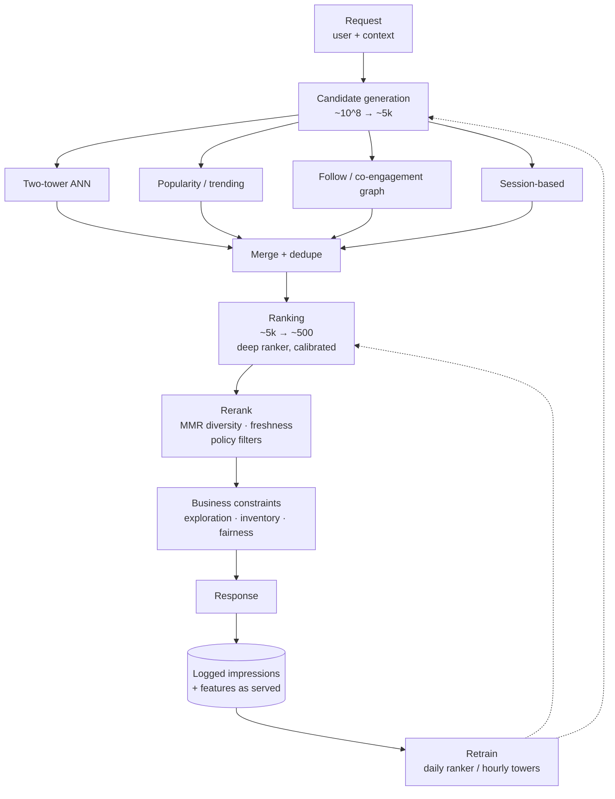

## TL;DR

Every recommender is the same funnel: **candidate generation** (millions →
thousands, recall-optimized) → **ranking** (thousands → hundreds,
precision-optimized, heavy model) → **reranking** (diversity, freshness,
business rules) → **business constraints** (policy, inventory, exploration).
The interview is won on: two-tower retrieval with hard negatives, why
ranking losses must handle position bias, cold-start strategy, and an A/B
methodology with guardrails. Offline metrics pick the model; online
experiments pick the winner.

:::tldr
Candidate gen = recall (two-tower, ANN). Ranking = precision (GBDT / deep
ranker, calibrated). Rerank = the product (MMR diversity, freshness boost,
policy filters). Experiment = the truth (A/B on the north-star, guardrails
veto). If you can't name your exploration strategy and your guardrails,
you don't have a production system.
:::

---

## Interview answer

*The 60-second answer to "Design a video feed recommender":*

> "Four stages. Candidate generation: a two-tower model embeds users and
> videos into one space, trained with in-batch plus hard negatives, served
> via HNSW ANN — that plus popularity, follow-graph, and session-based
> sources gives us ~5,000 candidates from a corpus of hundreds of millions.
> Ranking: a deep ranker — user, video, and context features through a DCN
> or transformer — trained pairwise on impressions with position-bias
> correction, calibrated so scores are probabilities. Reranking: MMR for
> diversity, a freshness boost for new videos, dedupe, and policy filters.
> Then business constraints: exploration via Thompson sampling on new items,
> and downranking borderline content. Offline we select on NDCG and
> calibration; online we A/B on watch time per user with guardrails on
> diversity, p99 latency, and report rate. Retrain the ranker daily,
> refresh two-tower embeddings hourly, and log everything with the features
> as served — point-in-time correctness or your training data is lying."

---

## Intuition

Recommendation is **ranking under uncertainty with delayed, biased labels**.
Three ideas carry the whole topic:

1. **The funnel exists because of latency arithmetic.** You can't run a
   100-feature deep model over 100M items in 200ms. So you spend model
   complexity where it matters: cheap, recall-oriented models up front
   (two-tower + ANN), expensive precision models on hundreds of candidates.
   Every stage's job is to not lose the good items — measure recall at each
   stage boundary, not just at the end.

2. **Your labels are not the truth.** Clicks and watches are confounded by
   position (top items get clicked because they're top), presentation, and
   selection (you only observe feedback on items you showed). A model
   trained naively on clicks learns "show what we already show." Debiasing
   — IPS weighting, position-as-feature, or two-tower with proper negatives
   — is what separates a demo from a system.

3. **The objective is not CTR.** Short-term engagement metrics are gameable:
   optimize pure CTR and you get clickbait; optimize watch time naively and
   you get outrage. The product decision — what "good" means — has to be
   made before the ML, and guardrails exist because the optimizer will find
   every loophole in your objective.



---

## Details

### Collaborative filtering and matrix factorization

The classical starting point: predict missing entries of the user–item
interaction matrix.

- **User-based / item-based CF:** "users who liked X also liked Y."
  Item-based is the practical one — item similarities are more stable than
  user similarities and precomputable. Cosine or Pearson over co-interaction
  vectors.
- **Matrix factorization (ALS / SVD):** learn $r_{ui} \approx p_u \cdot q_i$
  with latent factors. **ALS** (alternating least squares) parallelizes well
  for implicit feedback; **BPR** (Bayesian Personalized Ranking) replaces
  pointwise regression with a pairwise loss — rank observed above
  unobserved — which matches the actual task (see [Math](#/recsys)).
- **WALS / Hu-Koren-Volinsky:** the implicit-feedback variant — treat all
  missing entries as negatives with low confidence, observed interactions as
  positives with confidence scaling by interaction strength.

**Interview depth:** MF is a linear two-tower model. Its limits — no
features, no context, no nonlinearity — are exactly what modern two-tower
and deep rankers fix. Mention it as the baseline you'd beat, and know BPR's
pairwise loss because the same idea reappears in learning-to-rank.

### Two-tower models

The workhorse of candidate generation. A user tower $f(u)$ and an item tower
$g(i)$ embed into a shared space; score is a dot product; training is
contrastive (InfoNCE / sampled softmax); serving is ANN lookup of the user
vector.

Design decisions to defend:
- **Features per tower:** user tower gets long-term profile + recent
  sequence (last-N interacted item embeddings, pooled or via small
  transformer); item tower gets ID embedding + content features (text/image
  embeddings for cold-start generalization).
- **Negatives:** in-batch negatives are free and easy — they saturate.
  Add **hard negatives** (items the current model scores highly but the user
  skipped) via periodic ANN mining. This is the single biggest quality lever
  in two-tower training.
- **Temperature** in the softmax controls how hard the model pushes on hard
  negatives; tune it, don't leave it at 1.0.
- **Serving:** precompute item embeddings, index in HNSW; compute the user
  vector at request time (tens of ms) and ANN-search. Embedding refresh
  cadence (hourly/daily) vs staleness tradeoff — new items need a fast path
  (content-based embedding at ingestion).
- **Why dot product, not cosine, usually:** unnormalized dot product lets
  the item norm act as a learned popularity prior — often helpful, but be
  able to say so explicitly rather than by accident.

### Negative sampling

Implicit feedback has positives (clicks, watches) but no true negatives —
everything unclicked is a mix of "dislike" and "never saw." Sampling
strategy shapes the model:

- **Uniform random:** unbiased but too easy; the model learns popularity,
  not preference.
- **Popularity-biased:** sample proportional to item frequency — forces the
  model to distinguish the user's taste from global popularity. Cheap and
  effective.
- **In-batch:** other positives in the batch as negatives — free,
  popularity-skewed by construction.
- **Hard negatives:** ANN-mined near-misses — the quality lever; refresh
  periodically as the model improves (otherwise they go stale and stop
  being hard).
- **Skipped impressions:** items shown but not clicked are the highest-
  signal negatives you have — but they're selection-biased (the ranker
  chose to show them), so weight or debias accordingly.

### Ranking models

The ranker scores hundreds of candidates with full features. Loss
formulation matters more than architecture:

- **Pointwise:** predict P(click) per item (log loss). Simple, calibrated
  scores — but inherits position bias from the labels.
- **Pairwise:** for a clicked item $i$ and skipped item $j$ in the same
  impression, push $s_i > s_j$. Matches the ranking task; used by BPR and
  RankNet-style losses.
- **Listwise:** optimize the ranked list directly (ListNet, LambdaRank —
  gradients weighted by NDCG delta). Strongest offline metrics, hardest to
  calibrate.

**Architectures:** GBDT (still brutally competitive on tabular features,
fast to iterate) → Wide&Deep / DeepFM / DCN (explicit feature crossing for
sparse ID features) → transformer-based rankers over behavior sequences.
**Calibration** is non-negotiable when scores feed downstream (pricing,
blending, exploration): pointwise log-loss calibrates naturally; pairwise/
listwise need a calibration layer (Platt/isotonic) afterward.

**Position bias correction:** the standard trick is a position-aware model —
train with position as a feature, then at serving time set position to a
constant (or use IPS weighting by examination propensity). If you skip this,
your ranker learns "top position = good" and your A/B will embarrass you.

### Feature engineering

- **User:** demographics (use carefully), long-term aggregates (category
  affinities, activity level), short-term sequence (last-K interactions with
  recency decay).
- **Item:** ID embeddings, content embeddings, popularity/velocity stats,
  age, quality signals (completion rate, report rate).
- **Contextual:** time of day, device, session depth, query or surface.
- **Crosses:** user-category affinity × item-category, historically the
  highest-signal features in any ranker.

**Online vs offline features** and the **feature store**: training must see
exactly the features serving saw — *point-in-time correctness*. The feature
store's job is one thing above all: the offline join replays feature values
as of impression time, not as of today. Leakage through "current" aggregates
is the classic silent killer (your offline AUC looks amazing because the
feature contains the future). Online store serves at p99 single-digit ms;
offline store replays history for training.

### Cold start

New users and new items have no interaction history. The playbook:

- **New items:** content-based embedding at ingestion (text/image → vector)
  so the two-tower can retrieve them immediately; a **freshness boost** in
  reranking guarantees exploration impressions; allocate a fixed
  exploration budget (e.g., 5–10% of impressions).
- **New users:** onboarding (pick interests), popularity priors, then
  session-based signals within minutes — the first session is the highest-
  leverage data you'll ever get, so make early ranking adapt fast (bandit-
  style or short-window retraining).
- **Said plainly in the interview:** cold start is an exploration problem
  with a UX wrapper, not a modeling problem.

### Exploration vs exploitation

Pure exploitation collapses to the already-popular — the rich get richer and
the system never learns about new items.

- **ε-greedy:** explore with probability ε. Dumb, robust, the baseline.
- **Thompson sampling:** maintain a posterior over each item's reward,
  sample from it, pick the max — explores proportionally to uncertainty.
  The practical default for new-item exploration.
- **UCB / LinUCB:** pick the item maximizing estimated reward + uncertainty
  bonus. LinUCB extends to contextual features.
- **Where it lives:** not in the ranker — in the rerank/business-constraint
  layer, as an exploration budget with its own metrics (learning rate on
  new items, regret bounds in analysis).

### Popularity bias, freshness, and the long tail

- **Popularity bias:** the feedback loop — popular items get impressions,
  get clicks, get more popular. Mitigations: popularity-biased negatives,
  IPS debiasing, explicit long-tail objectives, and measuring catalog
  coverage / Gini of impressions, not just CTR.
- **Freshness:** recency features, time-decay on aggregates, new-item boost.
  News and social feeds need minute-level freshness; the two-tower refresh
  cadence is part of the design, not an ops detail.
- **Filter bubbles:** a diversity objective (MMR, DPP, or category caps) in
  reranking is a product decision — name it as one.

---

## Math

### BPR (pairwise ranking loss)

$$\mathcal{L}_{BPR} = -\sum_{(u,i,j)} \ln \sigma(\hat{r}_{ui} - \hat{r}_{uj})$$

where $i$ is an observed interaction, $j$ an unobserved one, and
$\sigma$ the sigmoid. Maximizes the probability that observed outranks
unobserved — the AUC-optimal pairwise surrogate.

### Sampled softmax / InfoNCE (two-tower training)

$$\mathcal{L} = -\log\frac{\exp(f(u)\cdot g(i^+)/\tau)}
{\sum_{j \in\, batch \cup\, hard}\exp(f(u)\cdot g(j)/\tau)}$$

$\tau$ (temperature) sharpens the distribution. In-batch negatives make the
denominator free; hard negatives make it useful.

### IPS debiasing for position bias

$$R_{IPS} = \frac{1}{|D|}\sum_{(u,i)} \frac{c_{ui}}{p(o_{ui}=1\mid pos)}\,
  \cdot\, rel_{ui}$$

Weight each click $c_{ui}$ by the inverse propensity of examination at its
position. Unbiased if propensities are correct — in practice estimated from
randomization or a position model, and clipped to control variance.

### MMR (maximal marginal relevance) for diversity

$$MMR = \arg\max_{d \notin S}\left[\lambda\, rel(d) -
  (1-\lambda)\max_{s \in S} sim(d,s)\right]$$

Greedy: at each step pick the item maximizing relevance minus similarity to
already-picked items. $\lambda$ trades relevance for diversity — a product
knob, expose it as one.

### UCB (exploration bonus)

$$a_t = \arg\max_a\left[\hat{\mu}_a +
  c\sqrt{\frac{\ln t}{n_a}}\right]$$

Pick the arm maximizing estimated reward plus an uncertainty bonus that
shrinks as $n_a$ (pulls of arm $a$) grows.

### Metrics

- **CTR / conversion:** online, gameable, need guardrails. Always report
  with confidence intervals, never as point estimates.
- **Recall@K / NDCG@K:** offline ranking quality — see the worked NDCG
  example on the [RAG & Search page](#/rag-search). Recall@K for candidate
  gen (did we keep the good items?), NDCG@K for ranking (did we order them?).
- **Calibration:** predicted P(click) vs observed rate by decile — matters
  whenever scores feed blending or pricing.

---

## Code

Two-tower model sketch (the shape interviewers expect):

```python
import torch, torch.nn as nn, torch.nn.functional as F

class TwoTower(nn.Module):
    def __init__(self, n_users, n_items, dim=128, temp=0.07):
        super().__init__()
        self.user_emb = nn.Embedding(n_users, dim)
        self.item_emb = nn.Embedding(n_items, dim)
        self.user_mlp = nn.Sequential(nn.Linear(dim, dim), nn.ReLU(), nn.Linear(dim, dim))
        self.item_mlp = nn.Sequential(nn.Linear(dim, dim), nn.ReLU(), nn.Linear(dim, dim))
        self.temp = temp

    def forward(self, u, i):
        # u: (B,) user ids, i: (B,) positive item ids; in-batch negatives
        uf = F.normalize(self.user_mlp(self.user_emb(u)), dim=1)
        it = F.normalize(self.item_mlp(self.item_emb(i)), dim=1)
        logits = uf @ it.T / self.temp            # (B, B): diag = positives
        labels = torch.arange(u.size(0), device=u.device)
        return F.cross_entropy(logits, labels)    # InfoNCE, in-batch negatives

    @torch.no_grad()
    def user_vector(self, u):
        return F.normalize(self.user_mlp(self.user_emb(u)), dim=1)
    # item vectors precomputed offline -> HNSW index; query with user_vector
```

MMR rerank (diversity in a dozen lines):

```python
def mmr(items, rel, sim, k=20, lam=0.7):
    # items: ids; rel: id->relevance; sim: (a,b)->similarity
    selected, pool = [], set(items)
    while pool and len(selected) < k:
        best = max(pool, key=lambda d:
                   lam * rel[d] - (1 - lam) * max(
                       (sim(d, s) for s in selected), default=0.0))
        selected.append(best); pool.remove(best)
    return selected
```

Position-bias-aware training sketch (position as feature, neutralized at
serve time):

```python
# train: score = ranker(user_f, item_f, position)
# serve: score = ranker(user_f, item_f, position=CONSTANT)
# The model learns position's effect from the feature; fixing it at serve
# time removes the bias while keeping the ranking signal. Validate by
# checking that shuffling positions in a randomized probe changes scores
# only through the position feature.
```

---

## Worked designs

### 1. YouTube / TikTok-style feed

**Architecture.** Request (user, session context) → candidate gen from four
sources: two-tower ANN (~3k), trending/popularity (~500), follow-graph
(~500), session-based "more like what you're watching" (~500) → dedupe →
deep ranker (DCN-v2 over user/item/context features, pairwise loss with
position-bias correction, calibrated) scores ~5k → top 500 → rerank: MMR
diversity, freshness boost, watch-history dedupe, policy filters →
exploration layer (Thompson sampling over new videos, ~5% budget) →
response. Log impressions with features-as-served; retrain ranker daily,
refresh item embeddings hourly.

**Key decisions to defend:**
- **Objective:** watch time per user per day as the north star, with
  *satisfaction* proxies (likes, shares, "not interested" rate, survey)
  as guardrails — because pure watch time optimizes toward outrage and
  doomscrolling. Say this unprompted; it's the staff signal.
- **Session vs user:** the user tower carries long-term taste; a
  session-level model (recent watches in the last hour) carries intent
  *right now*. Blend both — feeds live and die on session adaptation.
- **Freshness SLA:** new videos retrievable within minutes via content
  embedding at ingestion + exploration budget; otherwise the feed feels
  stale and creators churn.
- **Cold start for users:** first-session bandit — explore aggressively in
  session 1, exploit by session 3.

**Follow-ups:** How do you prevent filter bubbles? (Diversity objective in
rerank + measuring topic entropy per user; it's a product knob, not an
accident.) A creator complains their videos stopped being recommended —
how do you debug? (Check exploration impressions, score distribution shift,
policy flags, embedding staleness — instrument each stage.) How do you
handle the "skip" signal? (Strong negative for ranking, but selection-
biased — weight it, don't treat it as ground truth dislike.)

### 2. Product recommendations (e-commerce)

**Architecture.** Surfaces: homepage, product page ("related items"),
cart, post-purchase. Candidate gen: two-tower (user × product), item-item
CF ("bought together" / "viewed together" from co-occurrence — still the
highest-converting signal in e-commerce), category-constrained ANN.
Ranking: GBDT or deep ranker with price, margin, availability, and delivery-
time features — because the business objective includes profit, not just
clicks. Rerank: business rules (in-stock only, no duplicate variants,
margin floors per surface), MMR for visual/attribute diversity. Serve at
p99 < 150ms; precompute homepage candidates offline per user segment.

**Key decisions to defend:**
- **Multi-objective:** conversion × margin, not conversion alone — a 1%
  conversion lift that tanks margin is a loss. State the blended objective
  and who owns the tradeoff (product, not ML).
- **Item-item co-occurrence as a candidate source:** simple, explainable,
  and shockingly strong; the two-tower covers personalization, co-
  occurrence covers "wisdom of the crowd."
- **Price sensitivity:** price is a feature, not just a filter — the ranker
  should learn each user's price elasticity from behavior, with guardrails
  against steering vulnerable users to overpriced items.
- **Seasonality:** fashion and holiday demand shifts break stationary
  models — time features + frequent retraining + a trending source in
  candidate gen.

**Follow-ups:** How do you evaluate "related items" on a product page?
(Attach rate + downstream conversion; offline: co-purchase recall.)
A/B shows CTR up but revenue flat — what happened? (Cheap items cannibalized
expensive ones — your guardrail on revenue-per-session should have vetoed;
this is why guardrails exist.) How do you handle out-of-stock items in
training? (Exclude from candidate gen at serve time; in training they're
shown-but-unclickable — a presentation bias to correct, not a negative.)

### 3. Related-document recommendations

**Architecture.** Item is a document (article, video, paper). Candidate gen:
content-embedding ANN (title + body embeddings — cold-start-proof since new
docs embed at ingestion), co-engagement graph ("readers of X also read Y"),
topic-model constrained retrieval. Ranking: lighter than feeds — often a
two-tower score plus a small GBDT with freshness, authority, and reading-
level features. Rerank: dedupe near-duplicates aggressively (the #1
complaint in related-docs), MMR for perspective diversity, recency boost
for news.

**Key decisions to defend:**
- **Content embeddings do the heavy lifting:** unlike feeds, you have rich
  text — use it. Fine-tune the embedding on co-read pairs, not generic
  STS data.
- **Dedupe is a first-class stage:** syndicated copies of the same article
  will dominate ANN results; SimHash dedupe at index time plus MMR at
  rerank time.
- **Evaluation:** offline co-read recall is easy to game (popular docs
  co-occur with everything) — slice by tail docs, and run the online A/B
  on depth-of-read, not clicks.

**Follow-ups:** How is this different from search? (No query — the context
doc *is* the query; intent is "more like this" plus serendipity. The
candidate gen is pure similarity + co-engagement, and diversity matters
more because there's no explicit need to satisfy.) How do you avoid
recommending misinformation adjacent to news? (Authority signals as
features + policy filters in rerank — again, a product decision surfaced
as a system component.)

---

## Experimentation

**A/B design:** randomize by user (not request — session carryover
contaminates request-level randomization), run long enough for novelty
effects to burn in (1–2 weeks minimum for feeds), and pre-register the
primary metric and guardrails before launch.

**Power and sample size:** back-of-the-envelope — for a proportion metric,
$n \approx 16\sigma^2/\delta^2$ per arm for 80% power at 5% significance.
Know that small relative lifts (1–2%) on high-traffic surfaces need big
samples; don't claim wins from underpowered tests.

**Guardrails (veto metrics):** p99 latency, error rate, diversity/topic
entropy, report/block rate, revenue or margin per session, creator-side
metrics (impression distribution across creators — a consumer win that
starves creators is a long-term loss). A primary-metric win with a
guardrail breach is a **no-ship** — say this explicitly.

**Failure modes:** novelty effect (new UI gets clicked because it's new —
burn-in period), network effects / SUTVA violations (social features leak
across arms — cluster randomization or accept the bias), Simpson's paradox
(segment-level reversals — always slice by key segments), and peeking
(don't stop early on a "significant" day; use sequential testing if you
must peek).

**Interleaving** for ranking changes: blend control and treatment rankings
in one list and attribute clicks by team — far more sensitive than A/B for
small ranker tweaks, at the cost of not measuring long-term effects.

---

## Follow-ups

- **"Your two-tower's Recall@1000 is great but the ranker's NDCG is flat."**
  → Candidate gen saturated; the bottleneck moved to ranking — add harder
  features (crosses), check position bias in labels, or the ranker is
  miscalibrated for the rerank cutoff.
- **"New items never take off."** → Exploration budget too small, freshness
  boost missing, or item embeddings stale — trace a new item from ingestion
  to first impression and find where it dies.
- **"CTR is up, retention is down."** → You've optimized a gameable proxy.
  This is the clickbait trap — revisit the objective, add satisfaction
  guardrails, and consider long-term metrics (30-day retention) as the
  real primary with CTR as a leading indicator.
- **"How do you do point-in-time correctness?"** → Feature store replays
  feature values as of impression time; streaming features use event-time,
  not processing-time; a daily validation job compares served vs replayed
  features and pages on divergence.
- **"User deletes their data — now what?"** → Tombstone in the feature
  store, purge from training sets on next retrain, remove from ANN index;
  know your retraining cadence bounds the compliance SLA.
- **"GBDT or deep ranker?"** → GBDT for iteration speed and tabular
  features; deep when you have rich sequence/content signals worth
  end-to-end learning. The honest answer: try GBDT first, it's the baseline
  deep models have to beat, and many teams never beat it enough to justify
  the serving cost.

---

## Mistakes

- **Training on clicks without debiasing** — the model learns position,
  not preference. Position-as-feature or IPS, always.
- **Feature leakage through "current" aggregates** — offline AUC looks
  heroic because the feature saw the future. Point-in-time joins or nothing.
- **Evaluating candidate gen and ranking with one metric** — Recall@K for
  the funnel stages, NDCG@K for ordering; conflating them hides where
  quality dies.
- **No exploration strategy** — pure exploitation collapses to popular
  items and the system stops learning. Name the bandit, size the budget.
- **Optimizing CTR alone** — clickbait, outrage, doomscrolling. Guardrails
  aren't optional decoration; they're the objective's immune system.
- **Forgetting calibration** — pairwise/listwise scores fed raw into
  blending or pricing produce nonsense. Calibrate or stay pointwise.
- **Treating cold start as a modeling problem** — it's an exploration +
  UX problem (onboarding, content embeddings, exploration budget).
- **Peeking at A/B results and shipping on day 2** — novelty effects and
  underpowered tests manufacture false wins. Pre-register, burn in, don't
  peek.

---

## Practice

- [ ] Implement BPR matrix factorization from scratch on MovieLens-100k;
  beat a popularity baseline on Recall@50, then explain *why* BPR's loss
  matches the ranking task better than MSE.
- [ ] Train a two-tower model on MovieLens with in-batch negatives, then
  add ANN-mined hard negatives — measure the Recall@100 delta and plot it.
  Sweep temperature 0.03 → 0.3.
- [ ] Build the full funnel on MovieLens: popularity + two-tower candidate
  gen → ranker → MMR rerank. Measure Recall@1000 at candidate gen and
  NDCG@10 end-to-end; ablate the reranker.
- [ ] Work an IPS example by hand: 3 positions with examination
  propensities 1.0 / 0.6 / 0.35, clicks observed — compute the debiased
  relevance estimates and explain the variance problem.
- [ ] Write the 60-second feed-design answer out loud, twice, under time.
  Lead with the objective and guardrails, not the model.
- [ ] Design the feature store join for a streaming feature: draw the
  event-time vs processing-time timeline and show where leakage enters if
  you join on processing time.
- [ ] Mock: "Design YouTube recommendations" — 45 min. State the north
  star, the guardrails, and the exploration strategy before drawing any
  boxes.
- [ ] Mock: "Design product recommendations" — lead with the blended
  conversion × margin objective and item-item co-occurrence; defend GBDT
  vs deep ranker with numbers (iteration speed vs serving cost).
- [ ] Write a pre-registered A/B plan for a ranker change: primary metric,
  guardrails, sample size from the power formula, burn-in period, and the
  segment slices you'd check for Simpson's paradox.

Related: [RAG & Search](#/rag-search) · [ML System Design
framework](#/ml-system-design) · [Project deep-dive](#/project-deep-dive)
