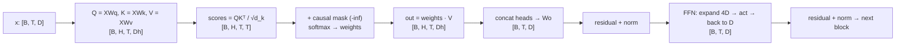

## TL;DR

:::tldr
A transformer is a stack of identical blocks, each = **masked multi-head self-attention** + **position-wise FFN**, wrapped in **residual connections** and **normalization**. Every operation is shape-preserving on the sequence: `[B, T, D] → [B, T, D]`, which is why blocks stack cleanly.

The whole architecture is one idea repeated: **token i builds a query; every token j offers a key and a value; token i pulls a weighted mixture of values**, where weights come from query–key compatibility. Scale by $\sqrt{d_k}$ or the softmax saturates and gradients die. Mask with $-\infty$ for causality. Heads let different subspaces attend to different relations in parallel. Pre-norm residuals keep gradients alive through 100+ layers. SwiGLU FFNs give the best param-efficiency known. Training is just next-token cross-entropy on every position in parallel, thanks to causal masking.

**Read the shape comments in the Code section. Then do the Practice drills until the shapes are reflex.**
:::

---

## Interview answer

*"A transformer processes a sequence of token embeddings, `[B, T, D]`. Each block first runs multi-head self-attention: every position projects its vector into a query, key, and value via learned matrices. Queries score against all keys with a scaled dot product, a softmax turns scores into weights, and the output is the weighted sum of values — so each position mixes in context from every other position, in parallel, with no recurrence. We use several heads in parallel on sliced subspaces and concatenate them back. Causal masking adds $-\infty$ to future positions so position i only sees j ≤ i, which lets us train all positions at once. Then a position-wise two-layer FFN expands the dimension and contracts it — that's where most of the parameters and 'knowledge' live. Residual connections plus layer normalization around each sublayer keep gradients flowing in deep stacks; modern LLMs use pre-norm because it stabilizes training. The final hidden states project to vocabulary logits, a softmax gives next-token probabilities, and training minimizes cross-entropy against the shifted input sequence — teacher forcing, fully parallel."*

That answer covers 80% of architecture interviews. The rest of this page is the ammunition for the follow-ups.

---

## Intuition

Forget the math for a minute. Think of attention as **a differentiable retrieval system** running at every token, every layer:

- Each token writes down three things about itself: a **query** ("what am I looking for?"), a **key** ("what do I contain / advertise?"), and a **value** ("what do I actually contribute if selected?").
- Token *i*'s query is compared against every token *j*'s key. High compatibility → high weight.
- Token *i*'s new representation = **weighted average of everyone's values**, weighted by those compatibilities.

Why separate keys and values? Because *what you match on* and *what you contribute* are different roles. A pronoun like "it" should match (via its key) on the noun it refers to, but should contribute (via its value) its own updated meaning. One projection can't serve both roles — that's the entire reason for three projections instead of one. If an interviewer asks "why Q, K, V and not just X?", this paragraph is your answer.

Why multiple heads? A single weighted average forces every token to mix context along **one** relation type. Language has many simultaneous relations — syntactic (subject↔verb), coreference (pronoun↔antecedent), positional (previous token). Heads run the same retrieval op in **parallel subspaces** (`D` split into `H` slices of `Dh = D/H`), so head 1 can track syntax while head 2 tracks coreference. Then `Wo` mixes the heads back together.

Why residuals? Attention and the FFN are both destructive — they overwrite the representation. The residual `x + Sublayer(x)` says: **keep what you had, add a refinement**. Deep stacks then learn incremental refinements instead of full rewrites, and gradients get a clean skip-path through every block. Without residuals, a 100-layer transformer doesn't train. Period.



---

## Details

### 1. Tokenization — BPE, WordPiece, Unigram (brief)

The transformer never sees characters or words — it sees **integer token IDs** from a fixed vocabulary (typically 32k–200k). Subword tokenization sits between characters (too long) and words (too many, OOV problem):

- **BPE (Byte-Pair Encoding, GPT family):** start from bytes/characters, greedily merge the most frequent adjacent pair, repeat until vocab size is hit. Encoding is greedy longest-match. Deterministic, simple, slightly suboptimal merges.
- **WordPiece (BERT family):** like BPE but merges the pair that maximizes likelihood gain (`count(pair) / (count(a)·count(b))`), not raw frequency. Slightly more principled; needs a `##` continuation convention.
- **Unigram (T5, SentencePiece):** start from a large vocab, iteratively drop the tokens whose removal hurts likelihood least. Encoding picks the max-probability segmentation — **probabilistic**, so you can sample segmentations (subword regularization).

Interview-relevant consequences: tokenizers are **not invertible across boundaries** (a space may fuse into the next token — `" hello"` vs `"hello"` are different IDs), **numbers tokenize badly** (digit-by-digit is why "128k" vocabularies and digit splitting matter for arithmetic), and **tokenizer mismatch silently breaks everything** (embeddings are indexed by ID; wrong tokenizer = garbage). When someone says "the model has a 128k context," ask *whose tokenizer* — 128k GPT-4 tokens ≠ 128k characters.

`[text]` → tokenizer → `[t₁, t₂, …, t_T]`, each `tᵢ ∈ [0, V)`. Then embedding lookup: `X = E[t]`, `E: [V, D]`.

### 2. Embeddings and positional information

Token embeddings `E: [V, D]` carry **no order information**. "Dog bites man" and "man bites dog" are the same bag without positions. Self-attention is permutation-equivariant — it *needs* position injected. Three generations:

**Sinusoidal (original Transformer).** Fixed, non-learned:

$$PE_{(pos, 2i)} = \sin\!\left(\frac{pos}{10000^{2i/D}}\right), \qquad PE_{(pos, 2i+1)} = \cos\!\left(\frac{pos}{10000^{2i/D}}\right)$$

Wavelengths grow geometrically from $2\pi$ to $2\pi \cdot 10000$. Why it works: for any fixed offset $k$, $PE_{pos+k}$ is a **linear function** of $PE_{pos}$ (angle-addition identities), so the model can learn relative offsets from absolute encodings. Extrapolates to longer sequences (with degradation). Added to embeddings: `X = E[t] + PE[:T]`, both `[T, D]` (broadcast over `B`).

**Learned absolute (GPT-2/BERT).** `P: [T_max, D]` parameter matrix, `X = E[t] + P[:T]`. Simpler, works fine within `T_max`, but cannot extrapolate and wastes parameters.

**RoPE (Rotary Position Embedding — every modern LLM).** Instead of *adding* position, RoPE **rotates** query/key vectors by an angle proportional to position. For a 2-D pair at dims `(2i, 2i+1)`:

$$R_{m,i} = \begin{pmatrix} \cos m\theta_i & -\sin m\theta_i \\ \sin m\theta_i & \cos m\theta_i \end{pmatrix}, \qquad \theta_i = 10000^{-2i/d}$$

Apply to q at position m, k at position n. Then $q_m^\top k_n$ depends only on **(m − n)** — relative position falls out of the rotation composition $R_m^\top R_n = R_{n-m}$. No additive vector, no max-length parameter, extrapolates better (with NTK/YaRN scaling tricks at inference). RoPE is applied to Q and K **before** the dot product, never to V (values don't participate in scoring). Full RoPE math, ALiBi, and length-extrapolation live on the [LLM systems page](#/llm-systems).

Shape note: embeddings `[B, T, D]`. RoPE is per-position, per-head: applied to `q, k: [B, H, T, Dh]` pairwise over the `Dh` dims.

### 3. Q, K, V — why three projections

Given `X: [B, T, D]`, learn `Wq, Wk: [D, Dk]`, `Wv: [D, Dv]` (in practice `Dk = Dv = D`, split across heads later):

$$Q = XW_q,\quad K = XW_k,\quad V = XW_v \qquad \Rightarrow \quad Q, K, V: [B, T, D]$$

Why not just use `X` directly for all three roles? Three reasons, in increasing order of interview impressiveness:

1. **Role separation.** Matching (key) vs. contributing (value) vs. seeking (query) are different linear subspaces. A token's "advertisement" of what it contains shouldn't be forced to equal the content it hands over. Learned projections let the model specialize.
2. **Asymmetric retrieval.** In cross-attention, Q comes from the decoder while K/V come from the encoder — different spaces entirely. Three projections make the mechanism general; self-attention is just the special case `Q, K, V ← same X`.
3. **Capacity without dimension growth.** Projections let each role live in its own learned geometry while keeping the residual stream width `D` fixed. The model can rotate/stretch the space differently per role.

In multi-head attention the projections are `[D, D]` and the head split happens after (equivalently: per-head `[D, Dh]` projections — same math, different reshape order).

### 4. Scaled dot-product attention

$$\mathrm{Attention}(Q, K, V) = \mathrm{softmax}\!\left(\frac{QK^\top}{\sqrt{d_k}}\right) V$$

Shapes: `Q, K: [B, T, Dk]` → `QKᵀ: [B, T, T]` (scores `s[i,j]` = compatibility of query *i* with key *j*) → softmax over the **last dim** (each query's distribution over keys) → weights `A: [B, T, T]` → `A·V: [B, T, Dv]`.

**Why divide by $\sqrt{d_k}$ — the variance argument (say this verbatim):**

Assume entries of `q, k ∈ ℝ^{d_k}` are i.i.d. with mean 0, variance 1 (reasonable at init). Then the dot product $q \cdot k = \sum_{i=1}^{d_k} q_i k_i$ has mean 0 and **variance $d_k$** — variances add for independent terms, so std is $\sqrt{d_k}$. With $d_k = 64$, raw scores have std 8: the softmax input spans tens of units, the largest score dominates, softmax saturates to ~one-hot, and **softmax gradients vanish** (softmax Jacobian entries are $p_i(\delta_{ij} - p_j) \to 0$ when one $p \to 1$). Dividing by $\sqrt{d_k}$ restores unit variance, keeps the softmax in its sensitive regime, and keeps gradients alive. The full derivation with the softmax Jacobian is in [Math](#) below.

Cost: `QKᵀ` is `[B, T, T]` — **quadratic in sequence length** in time and memory. This is *the* bottleneck behind FlashAttention, KV-caching, and every efficient-attention paper. At inference, keys/values of past tokens are cached (KV-cache) so each new token costs `O(T)` not `O(T²)`.

### 5. Self-attention vs cross-attention vs causal attention

- **Self-attention:** `Q, K, V` all from the same sequence `X`. Every position attends to every position (bidirectional) — BERT's encoder. Shape: all `[B, T, D]`.
- **Cross-attention:** `Q` from the decoder's sequence (`[B, T_dec, D]`), `K, V` from the encoder's output (`[B, T_enc, D]`). Scores `[B, T_dec, T_enc]` — rectangular, not square. Each decoder position retrieves from the *source* sequence. No causal mask needed on the cross side (the full source is visible); the decoder's *self*-attention is still causal.
- **Causal (masked) attention:** self-attention + constraint that position *i* attends only to *j ≤ i*. **How implemented:** add a mask matrix `M: [T, T]` with `M[i,j] = 0` for `j ≤ i`, `-inf` for `j > i`, *before* the softmax: `softmax(QKᵀ/√d_k + M)`. After softmax, future weights are exactly 0. Additive `-inf` (not multiplicative 0) because `softmax(-inf) = 0` cleanly, and it fuses into the score computation. In practice use a large negative like `-1e9` in fp32, but in fp16 use `-65504`-safe values (or better: a boolean mask with `masked_fill`) — `-inf` in fp16 softmax can produce NaNs if an entire row is masked (0/0). That NaN bug has bitten real training runs.

Why causality matters: it makes **training parallel**. Without the mask, predicting token `t+1` from prefix `≤ t` would leak the answer. With the mask, one forward pass computes the loss at *every* position simultaneously (teacher forcing) — the model trains on `T` predictions per sequence instead of one. This is what makes LLM pretraining feasible.

### 6. Multi-head attention

Instead of one attention op on `[B, T, D]`, run `H` in parallel on slices of width `Dh = D/H`:

1. Project: `Q, K, V: [B, T, D]` (via `[D, D]` matrices).
2. Split heads: `[B, T, D] → [B, T, H, Dh] → transpose → [B, H, T, Dh]`.
3. Per-head attention: scores `[B, H, T, T]`, out `[B, H, T, Dh]` — each head has its own softmax distribution.
4. Merge: `[B, H, T, Dh] → transpose → [B, T, H, Dh] → [B, T, D]` (concat on the last dim).
5. Output projection: `Wo: [D, D]` mixes heads: `out = concat · Wo`, `[B, T, D]`.

**Why heads help:** one head = one softmax distribution = one "relation type" the model must compress everything into. Empirically, heads specialize (induction heads copy, syntactic heads track dependencies, etc.). More importantly: with `Dh = D/H` per head, total compute is roughly the same as one big head — `H` heads of width `Dh` cost the same matmuls as one head of width `D` — so heads are **free representational diversity**. The `[D, D]` projections dominate the parameter count: 4 × `D²` per attention sublayer (Wq, Wk, Wv, Wo).

### 7. Residuals, LayerNorm/RMSNorm, pre-norm vs post-norm

**Residual connections.** `y = x + Sublayer(x)`. Two effects: (a) the sublayer learns a *residual correction* `F(x)` rather than a full transformation — easier to optimize (identity is the default, gradients flow even if `F` is badly initialized); (b) the backward pass gets a **skip path**: `∂L/∂x = ∂L/∂y · (I + ∂F/∂x)` — the identity term guarantees gradient reaches early layers unattenuated through the *depth* dimension. This is what lets 100+ layer stacks train. ResNet lesson, imported wholesale.

**LayerNorm.** Normalizes over the feature dim (per token, independently):

$$\mathrm{LN}(x) = \frac{x - \mu}{\sigma} \odot \gamma + \beta, \qquad \mu, \sigma \text{ over the } D \text{ features}$$

`x: [B, T, D]` → same shape. `γ, β: [D]` learned. Unlike BatchNorm, no batch dependence — critical for variable-length sequences and small batches. **Why it works (the real answer):** it decouples the *direction* of the representation from its *scale*. Attention logits are dot products — scale-sensitive — so unnormalized activations let a few large-magnitude features dominate all dot products. LayerNorm bounds the scale entering every dot product and every nonlinearity, which smooths the loss landscape (Santurkar et al.: it's about Lipschitz/smoothness, not just "internal covariate shift" — saying "it fixes covariate shift" is the shallow answer; the landscape-smoothing + scale-invariance story is the staff answer).

**RMSNorm** (modern default): drops the mean-centering, normalizes by RMS only: `x / RMS(x) · γ`. Cheaper, works as well or better, no `β`. LLaMA onward uses it.

**Pre-norm vs post-norm.** Original Transformer: `x + Sublayer(LN(x))`? No — original was **post-norm**: `LN(x + Sublayer(x))`. Modern LLMs use **pre-norm**: `x + Sublayer(LN(x))`.

Why pre-norm won: in post-norm, the residual stream passes *through* a LayerNorm at every block, so the clean gradient skip-path is broken — `∂/∂x` of `LN(x + F(x))` has no identity term, and gradients shrink multiplicatively with depth. In pre-norm, the path `x → x + F(LN(x)) → …` keeps an **unimpeded identity highway** from loss to embedding across all blocks; each block's contribution is a bounded perturbation. Practical consequences: pre-norm trains stably at 100+ layers without warmup heroics; post-norm often needs learning-rate warmup and careful init (the original paper's warmup schedule exists partly because of this). Trade-off: pre-norm's final representations can have growing magnitude with depth (each block adds to the stream unnormalized), so the *final* LayerNorm before the head matters.

### 8. FFN and SwiGLU

Position-wise feed-forward network, applied identically at each position (`[B, T, D] → [B, T, D]`):

$$\mathrm{FFN}(x) = W_2 \, \sigma(W_1 x + b_1) + b_2, \qquad W_1: [D, 4D],\; W_2: [4D, D]$$

The `4D` expansion is the original ratio. This is where ~2/3 of the parameters live (`8D²` vs attention's `4D²`) and, per probing/knowledge-editing literature, where most **factual knowledge is stored** (attention moves information between positions; the FFN transforms it per position).

**SwiGLU** (LLaMA, PaLM — the modern default) replaces `σ(W₁x)` with a gated product:

$$\mathrm{SwiGLU}(x) = \big(\mathrm{Swish}(xW) \odot (xV)\big) W_2, \qquad \mathrm{Swish}(z) = z \cdot \sigma(z)$$

`W, V: [D, D_ff]`, `W₂: [D_ff, D]`, with `D_ff ≈ (8/3)D` to keep parameter count matched to the `4D` ReLU FFN (three matrices instead of two). **Why it wins:** the gate `Swish(xW) ⊙ (xV)` is a *data-dependent* multiplicative interaction — the network learns which features to let through as a function of the input itself, strictly more expressive than a fixed nonlinearity on one projection. Empirically +1–2% across benchmarks at matched params; no downside except the third matrix. GELU was the intermediate step (BERT/GPT-2); SwiGLU is the current answer. If asked "which activation in a modern LLM": SwiGLU (or GEGLU variant).

### 9. Decoder-only transformer, logits, loss

A decoder-only model (GPT, LLaMA) is: token embeddings + positions → `N` × (causal MHA block + FFN block, pre-norm residuals) → final norm → **unembedding** `W_u: [D, V]` → logits `[B, T, V]` → softmax → next-token distribution.

- **Logits** `z_t ∈ ℝ^V` at position `t` score every vocabulary token as the continuation of prefix `≤ t`. Often `W_u` is **tied** to the input embedding `E` (`W_u = Eᵀ`) — halves the biggest matrix, and makes sense: scoring "how well does token v continue this context" in the same space used to embed v.
- **Next-token prediction:** sample or argmax from `softmax(z_t / τ)` (temperature `τ`).
- **Training loss:** cross-entropy against the input shifted by one, **at every position, in one forward pass**:

$$L = -\frac{1}{B \cdot T}\sum_{b,t} \log p_\theta(x^{(b)}_{t+1} \mid x^{(b)}_{\le t})$$

This is teacher forcing with the ground-truth prefix — fully parallel because the causal mask prevents position `t` from seeing `t+1`. Perplexity = `exp(L)`. Note the subtlety: the model is trained on *its own* distribution's teacher-forced prefixes but at inference feeds its own samples — **exposure bias**; scheduled sampling/RLHF-era fixes exist but pretraining just eats the bias at scale.

**Full forward shape trace** (the thing to reproduce on a whiteboard):

```
ids:            [B, T]
X = E[ids]:     [B, T, D]
+ positions:    [B, T, D]
per block:
  Q,K,V:        [B, T, D] → heads [B, H, T, Dh]
  scores:       [B, H, T, T]
  attn out:     [B, H, T, Dh] → [B, T, D]
  FFN:          [B, T, D] → [B, T, D]
logits:         [B, T, V]
loss:           scalar
```

---

## Math

### The $\sqrt{d_k}$ variance derivation

Let $q, k \in \mathbb{R}^{d_k}$ with i.i.d. entries, $\mathbb{E}[q_i] = \mathbb{E}[k_i] = 0$, $\mathrm{Var}(q_i) = \mathrm{Var}(k_i) = 1$. Then:

$$\mathrm{Var}(q^\top k) = \mathrm{Var}\!\left(\sum_{i=1}^{d_k} q_i k_i\right) = \sum_{i=1}^{d_k} \mathrm{Var}(q_i k_i) = \sum_{i=1}^{d_k} \mathbb{E}[q_i^2]\mathbb{E}[k_i^2] = d_k$$

(mean is 0 since $\mathbb{E}[q_i k_i] = 0$). So the raw dot product has **std $\sqrt{d_k}$** — it grows with head dimension. Softmax with inputs of std 8 ($d_k=64$): the max exceeds the rest by ~tens, `softmax → one-hot`. The softmax Jacobian $\frac{\partial p_i}{\partial s_j} = p_i(\delta_{ij} - p_j)$: when $p_{\text{max}} \to 1$, all entries $\to 0$ — **gradients vanish through attention**. Dividing by $\sqrt{d_k}$ restores unit-variance logits: softmax stays in its high-gradient regime, entropy stays healthy, gradients flow. That's the whole story; "keeps values small" is the bumper sticker.

### Attention is a kernel smoother

With weights $A_{ij}$, output $_i = \sum_j A_{ij} v_j$ — a Nadaraya–Watson estimator with a learned similarity kernel $k(q_i, k_j) = \exp(q_i^\top k_j / \sqrt{d_k})$. Saying "attention is differentiable dictionary lookup with a softmax kernel" signals you see the structure, not just the formula.

### Init scaling (why init matters)

Xavier/He init sets $\mathrm{Var}(W) = 1/\text{fan\_in}$ (or $2/\text{fan\_in}$ for ReLU) so that `Var(Wx) = Var(x)` — activations neither explode nor vanish at init. For transformers specifically: the residual stream *accumulates* block outputs, so per-block outputs must start small — GPT-2 scales the residual-branch init by $1/\sqrt{N}$ (N = # layers) so total residual variance stays O(1) regardless of depth. Modern practice: small init on `Wo` and `W₂` (the matrices that write *into* the residual stream), normal init elsewhere. Get this wrong and a 96-layer model diverges in the first 100 steps.

### Gradient flow through pre-norm residuals

Forward: $x_{l+1} = x_l + F_l(\mathrm{LN}(x_l))$. Backward:

$$\frac{\partial L}{\partial x_l} = \frac{\partial L}{\partial x_{l+1}} \left(I + \frac{\partial F_l}{\partial x_l}\right)$$

Unrolling over $L$ blocks, $\partial L / \partial x_0$ contains the **direct term** $\partial L/\partial x_L$ propagated through pure identity — gradients reach block 0 without passing through any nonlinearity. In post-norm, every path passes through a LayerNorm Jacobian, and the product of $L$ such Jacobians shrinks (or explodes) with depth. This is the mathematical reason pre-norm trains deeper stacks stably.

---

## Code

Complete from-scratch implementations. PyTorch, no `nn.Transformer`, no `F.scaled_dot_product_attention` in the educational versions (a flash-style fused version is noted at the end). Shape comments on every line — **read them, they're the point**.

```python
import math
import torch
import torch.nn as nn
import torch.nn.functional as F

def scaled_dot_product_attention(q, k, v, mask=None):
    # q, k, v: [B, H, T, Dh]   (single-head: H=1)
    # mask:   [T, T] or [B, H, T, T], additive (0 / -inf), broadcastable
    d_k = q.size(-1)                                    # Dh
    scores = q @ k.transpose(-2, -1) / math.sqrt(d_k)   # [B,H,T,Dh]@[B,H,Dh,T] -> [B,H,T,T]
    if mask is not None:
        scores = scores + mask                          # -inf kills future positions pre-softmax
    weights = F.softmax(scores, dim=-1)                 # [B,H,T,T], rows sum to 1
    out = weights @ v                                   # [B,H,T,T]@[B,H,T,Dh] -> [B,H,T,Dh]
    return out, weights

def causal_mask(T, device=None):
    # [T, T]: 0 on/below diagonal, -inf above -> position i sees j <= i only
    return torch.triu(torch.full((T, T), float('-inf'), device=device), diagonal=1)

def causal_attention(x, wq, wk, wv):
    # x: [B, T, D]; wq/wk/wv: [D, D]  (single head, Dk=D for clarity)
    q = x @ wq                                          # [B,T,D]
    k = x @ wk                                          # [B,T,D]
    v = x @ wv                                          # [B,T,D]
    d = x.size(-1)
    scores = q @ k.transpose(-2, -1) / math.sqrt(d)      # [B,T,T]
    scores = scores + causal_mask(x.size(1), x.device)  # [B,T,T] additive -inf mask
    w = F.softmax(scores, dim=-1)                       # [B,T,T]
    return w @ v                                        # [B,T,D]
```

```python
class MultiHeadAttention(nn.Module):
    def __init__(self, d_model, n_heads):
        super().__init__()
        assert d_model % n_heads == 0
        self.n_heads = n_heads
        self.d_head = d_model // n_heads                 # Dh
        self.wq = nn.Linear(d_model, d_model, bias=False)  # [D,D]
        self.wk = nn.Linear(d_model, d_model, bias=False)  # [D,D]
        self.wv = nn.Linear(d_model, d_model, bias=False)  # [D,D]
        self.wo = nn.Linear(d_model, d_model, bias=False)  # [D,D] mixes heads

    def _split(self, x):
        B, T, D = x.shape
        x = x.view(B, T, self.n_heads, self.d_head)      # [B,T,H,Dh]
        return x.transpose(1, 2)                          # [B,H,T,Dh]

    def forward(self, x, mask=None):
        B, T, D = x.shape                                # x: [B,T,D]
        q = self._split(self.wq(x))                       # [B,H,T,Dh]
        k = self._split(self.wk(x))                       # [B,H,T,Dh]
        v = self._split(self.wv(x))                       # [B,H,T,Dh]
        scores = q @ k.transpose(-2, -1) / math.sqrt(self.d_head)  # [B,H,T,T]
        if mask is not None:
            scores = scores + mask                        # broadcast [T,T] -> [B,H,T,T]
        w = F.softmax(scores, dim=-1)                     # [B,H,T,T]
        o = w @ v                                         # [B,H,T,Dh]
        o = o.transpose(1, 2).contiguous().view(B, T, D)  # [B,T,H,Dh] -> [B,T,D] (concat heads)
        return self.wo(o)                                 # [B,T,D]
```

```python
class RMSNorm(nn.Module):
    def __init__(self, d_model, eps=1e-6):
        super().__init__()
        self.eps = eps
        self.gamma = nn.Parameter(torch.ones(d_model))   # [D]

    def forward(self, x):                                # x: [B,T,D]
        rms = x.pow(2).mean(dim=-1, keepdim=True).sqrt()  # [B,T,1]
        return self.gamma * x / (rms + self.eps)         # [B,T,D]

class SwiGLUFFN(nn.Module):
    def __init__(self, d_model, d_ff=None):
        super().__init__()
        d_ff = d_ff or int(8 / 3 * d_model)              # match ~4D ReLU-FFN params
        self.w_gate = nn.Linear(d_model, d_ff, bias=False)  # [D,Dff]
        self.w_up   = nn.Linear(d_model, d_ff, bias=False)  # [D,Dff]
        self.w_down = nn.Linear(d_ff, d_model, bias=False)  # [Dff,D]

    def forward(self, x):                                # x: [B,T,D]
        return self.w_down(F.silu(self.w_gate(x)) * self.w_up(x))  # [B,T,Dff]->[B,T,D]
        # silu(z) = z*sigmoid(z) = Swish-1

class TransformerBlock(nn.Module):                       # pre-norm, the modern default
    def __init__(self, d_model, n_heads):
        super().__init__()
        self.attn = MultiHeadAttention(d_model, n_heads)
        self.ffn = SwiGLUFFN(d_model)
        self.n1 = RMSNorm(d_model)
        self.n2 = RMSNorm(d_model)

    def forward(self, x, mask=None):                     # x: [B,T,D]
        x = x + self.attn(self.n1(x), mask)               # [B,T,D] residual stream untouched
        x = x + self.ffn(self.n2(x))                     # [B,T,D]
        return x
```

```python
class MiniGPT(nn.Module):
    def __init__(self, vocab, d_model=512, n_heads=8, n_layers=6, t_max=1024):
        super().__init__()
        self.tok_emb = nn.Embedding(vocab, d_model)      # [V,D]
        self.pos_emb = nn.Embedding(t_max, d_model)      # [Tmax,D] learned absolute
        self.blocks = nn.ModuleList(
            [TransformerBlock(d_model, n_heads) for _ in range(n_layers)])
        self.norm = RMSNorm(d_model)
        self.head = nn.Linear(d_model, vocab, bias=False)  # [D,V] unembedding
        self.head.weight = self.tok_emb.weight            # weight tying (optional)

    def forward(self, ids):                              # ids: [B,T] token ids
        B, T = ids.shape
        x = self.tok_emb(ids) + self.pos_emb.weight[:T]  # [B,T,D] + [T,D] broadcast
        mask = causal_mask(T, ids.device)                # [T,T]
        for blk in self.blocks:
            x = blk(x, mask)                             # [B,T,D] -> [B,T,D]
        x = self.norm(x)                                 # [B,T,D]
        return self.head(x)                              # [B,T,V] logits

    def loss(self, ids):                                 # ids: [B,T]
        logits = self(ids)                               # [B,T,V]
        # next-token CE: predict ids[:,1:] from logits[:,:-1]
        return F.cross_entropy(
            logits[:, :-1].reshape(-1, logits.size(-1)), # [B*(T-1), V]
            ids[:, 1:].reshape(-1))                      # [B*(T-1)]

# Generation: feed ids, take last-position logits, sample, append, repeat.
# KV-cache (interview bonus): cache k,v per layer so each step costs O(T), not O(T^2).
```

**Production note:** real code replaces the manual `softmax(qkᵀ/√d)v` with a fused kernel (`F.scaled_dot_product_attention` → FlashAttention): same math, but it never materializes the `[B, H, T, T]` matrix — it tiles the softmax online in SRAM. That's an IO optimization, not a math change. Mention it when asked "how do you scale attention to 128k context."

---

## Follow-ups

The must-answer list. If you can't answer these cold, you're not done.

**Why does LayerNorm work?**
Shallow answer: "reduces internal covariate shift." Staff answer: attention logits are dot products, so they're **scale-sensitive** — a few large-magnitude features dominate every compatibility score. LayerNorm makes each token's representation unit-scale before every dot product and nonlinearity, which bounds the Lipschitz constant of the loss landscape (smoother optimization, larger stable learning rates) and decouples a feature's *direction* from its *magnitude*. It's also batch-independent, unlike BatchNorm — mandatory for variable-length sequences.

**Why do residuals help?**
Two mechanisms: (1) optimization — the sublayer learns a residual correction `F(x)` with identity as the default, so a badly-initialized block is approximately a no-op instead of a destructive rewrite; (2) gradient flow — `∂L/∂x = ∂L/∂y·(I + ∂F/∂x)` gives every layer a direct identity skip-path, so gradients reach layer 0 without traversing `L` nonlinearities. Without residuals, depth kills the gradient; with them, depth is nearly free.

**Why does init matter?**
At init, activations and gradients must preserve variance through every op (`Var(Wx) = fan_in · Var(W) · Var(x)` → Xavier/He set `Var(W) = 1/fan_in`). Transformers add a twist: the residual stream *sums* `N` block outputs, so each block's contribution must be scaled by `~1/√N` (GPT-2 residual init) or the stream variance grows with depth and the final LayerNorm/softmax saturates. Symptom of bad init: loss explodes or flatlines in the first few hundred steps — before any "learning" could be blamed.

**Why do gradients vanish/explode?**
Vanish: products of many Jacobians with spectral norm < 1 (saturating softmax → one-hot makes its Jacobian → 0; that's why the `√d_k` scale matters; sigmoid/tanh saturation in old RNNs). Explode: spectral norm > 1 compounded over depth/steps, or a large LR step into a sharp region. Transformers are *less* prone than RNNs (no repeated multiplication by the same matrix along time; residuals give skip paths), but deep post-norm stacks and bad init still explode. Fixes: pre-norm, gradient clipping (treats the symptom), warmup (treats the cause: early steps have the noisiest curvature), and proper init.

**Why AdamW over Adam?**
Adam's `weight_decay` as implemented in Adam is **not** L2 regularization — it's entangled with the adaptive denominator (`m̂/(√v̂+ε)`), so decay is effectively *stronger* for small-gradient parameters: the opposite of what you want. AdamW **decouples** it: `θ ← θ − lr·(m̂/(√v̂+ε)) − lr·λ·θ`. Clean, uniform shrinkage toward zero regardless of gradient history. For transformers specifically, decoupled decay regularizes the huge embedding/unembedding matrices properly and interacts correctly with the scale-sensitive attention logits. Also: AdamW + cosine schedule + warmup is the LLM default because the loss landscape is sharpest early (random init, uncalibrated norms) — warmup is a trust-region for the first steps.

**What happens during `loss.backward()`?**
Autograd walks the computation graph in reverse topological order, applying the chain rule: each op's `backward` computes vector-Jacobian products (`grad_output · J`) and accumulates into `.grad` of leaf parameters. For attention specifically: the backward through softmax needs the *output probabilities* `p` (Jacobian = `diag(p) − ppᵀ`), the backward through the matmuls needs both operands (`∂L/∂Q = (∂L/∂S)·K/√d_k`, etc.).

**What tensors are stored for backprop?**
Whatever each op's backward formula needs: linear layers stash their **input activations** (`∂L/∂W = grad_outᵀ · x`); softmax stashes its **output** `p`; LayerNorm/RMSNorm stash the **normalized input and the RMS/σ**; the attention scores matrix `[B, H, T, T]` (or recomputed in FlashAttention's backward — that's the memory/compute trade: standard attention stores O(T²), FlashAttention recomputes it). Activations dominate training memory, not parameters — hence gradient checkpointing (recompute activations in backward, trading ~30% compute for O(√N) memory). Rule of thumb: training memory ≈ params (×4–6 with Adam states in fp32/mixed) + activations (batch × seq × layers × hidden).

**More follow-ups you'll actually get:**

- *"Why not just use one big head?"* — Same FLOPs, less diversity: `H` heads of width `Dh` cost the same matmuls as one head of width `D`, but each head learns its own softmax distribution. Free representational diversity; empirically heads specialize.
- *"Where is knowledge stored — attention or FFN?"* — FFN holds ~2/3 of parameters and probing/editing work (ROME/MEMIT) localizes factual associations to FFN layers; attention *routes* information between positions. "Attention moves it, the FFN knows it."
- *"Why is inference O(T) per token with KV-cache?"* — Without cache, generating token `T+1` recomputes K/V for all `T` past tokens (O(T²) total per step). Cache stores each layer's K/V (`[layers, 2, B, H, T, Dh]`); the new token only computes its own q/k/v and attends over cached K/V: O(T) per step, O(T²) total for the sequence. Memory cost of the cache is what caps context length on a GPU.
- *"Encoder-only vs decoder-only — when?"* — Encoder (BERT): bidirectional, best for understanding/classification/embeddings where the full context is available. Decoder-only (GPT): causal, best for generation — and at scale, big enough decoders match encoders on understanding too, which is why the field converged on decoder-only.
- *"What breaks if you remove the causal mask at training?"* — The model learns to copy: position `t`'s loss is predicted with `x_{t+1}` visible in its context, loss → 0 trivially, and the model learns nothing about prediction. Silent, catastrophic, and embarrassingly common in hand-rolled code.
- *"RoPE vs ALiBi?"* — RoPE rotates q/k (relative info in the dot product, no additive vector); ALiBi adds a linear distance penalty `-m·|i−j|` to scores (no position vectors at all, extrapolates well, slightly worse at short context). Pointer: [LLM systems page](#/llm-systems).

:::warn
The single most common from-scratch bug: **softmax over the wrong dimension** (keys dim, not queries), or forgetting the transpose so scores come out `[B, T, Dh]·[B, Dh, T]` mismatched. Second most common: applying the causal mask *after* softmax (must be before, additive `-inf`). Third: head-split transpose order — `[B, T, H, Dh]` → transpose(1,2), not reshape directly to `[B, H, T, Dh]` (reshape without transpose scrambles which elements belong to which head).
:::

---

## Mistakes

- **"Attention is all you need" → "attention is all there is."** Attention is the routing; the FFN does the per-position computation and holds most parameters. A transformer with attention removed (FFN-only) still learns; with FFN removed it barely does.
- **Saying LayerNorm "fixes internal covariate shift."** That's the 2015 story. The defensible story is landscape smoothing + scale-invariance for dot-product logits. Interviewers at staff level *will* push past the bumper sticker.
- **Forgetting that softmax weights must sum over keys.** `softmax(scores, dim=-1)` where dim -1 is the *key* axis. Getting this backwards gives weights that sum over queries — every key gets total weight 1 across queries — and the model trains to garbage with no error raised.
- **Causal mask as multiplicative zero after softmax.** `weights * mask` zeroes future weights but they were already normalized *with* the future included — the distribution is wrong (doesn't sum to 1 over the allowed positions). Additive `-inf` *before* softmax is the only correct form.
- **fp16 `-inf` mask NaNs.** If an entire row is masked (can happen with padding + causal combos), `softmax` over all-`-inf` = `0/0` = NaN in fp16. Use `masked_fill` with `-1e4`-scale finites or guarantee no fully-masked rows.
- **Positional info treated as optional.** Removing positions from a transformer doesn't degrade it gracefully — self-attention is permutation-equivariant, so without positions the model is literally a bag-of-words model. It's load-bearing.
- **"More heads always better."** `Dh = D/H` shrinks per head; below ~32–64 dims per head, each head's dot products get noisy and heads stop specializing. Standard: `Dh ∈ [64, 128]`.
- **Confusing training and inference complexity.** Training: O(T²) per layer, parallel over T. Inference without KV-cache: O(T²) *per generated token*. With KV-cache: O(T) per token. Know which regime the question is about.

---

## Practice

### Shape-prediction drills

Conventions: `B` batch, `T` sequence length, `D` model dim, `H` heads, `Dh = D/H`, `V` vocab, `T_dec`/`T_enc` for cross-attention. No peeking — write the shape, then open the collapse.

- [ ] **D1.** `X: [B, T, D]`, `Wq: [D, D]`. Shape of `Q = X @ Wq`?
- [ ] **D2.** `Q, K: [B, H, T, Dh]`. Shape of `Q @ K.transpose(-2, -1)`?
- [ ] **D3.** Scores `S: [B, H, T, T]`, causal mask `M: [T, T]`. After `softmax(S / √Dh + M, dim=-1)`, shape of weights? Which dim sums to 1?
- [ ] **D4.** Weights `A: [B, H, T, T]`, `V: [B, H, T, Dh]`. Shape of `A @ V`? Then merged back to `[B, T, ?]`?
- [ ] **D5.** Cross-attention: decoder `X_dec: [B, T_dec, D]`, encoder `X_enc: [B, T_enc, D]`, `H` heads. Shapes of `Q`, `K`, `V`, and the score matrix?
- [ ] **D6.** `x: [B, T, D]` through `TransformerBlock` (pre-norm). Shape in = shape out? What are the shapes of `n1(x)`, `attn(...)`, and the FFN intermediate with SwiGLU (`d_ff = 8D/3`)?
- [ ] **D7.** `logits: [B, T, V]`, `ids: [B, T]`. For next-token loss, what slices feed `F.cross_entropy`, and what are their reshaped shapes?
- [ ] **D8.** KV-cache after generating `T` tokens, `L` layers, `H` heads: shape of the cached tensors per layer? Total elements in terms of `L, B, H, T, Dh`?
- [ ] **D9.** `Wq, Wk, Wv, Wo` each `[D, D]`, SwiGLU FFN with `d_ff = 8D/3`. Parameter count of one block's attention vs FFN (ignore norms/biases)? Which dominates?
- [ ] **D10.** RoPE applied to `q: [B, H, T, Dh]`. Which dims does the rotation act on, and does RoPE change any tensor's shape?

:::collapse D1 answer
`[B, T, D]`. `[B,T,D] @ [D,D] → [B,T,D]`. Projections preserve the model dim by convention (the head split happens after).
:::

:::collapse D2 answer
`[B, H, T, Dh] @ [B, H, Dh, T] → [B, H, T, T]`. Entry `[b,h,i,j]` = compatibility of query `i` with key `j`, head `h`.
:::

:::collapse D3 answer
`[B, H, T, T]` — softmax preserves shape. `dim=-1` is the **key** axis `j`; each row `i` (each query) sums to 1. Mask `[T, T]` broadcasts over `B, H`.
:::

:::collapse D4 answer
`[B,H,T,T] @ [B,H,T,Dh] → [B, H, T, Dh]`. Merge: transpose → `[B, T, H, Dh]` → reshape → `[B, T, H·Dh] = [B, T, D]`. Then `Wo: [D, D]` keeps `[B, T, D]`.
:::

:::collapse D5 answer
`Q: [B, H, T_dec, Dh]` (from decoder), `K, V: [B, H, T_enc, Dh]` (from encoder). Scores: `[B, H, T_dec, T_enc]` — rectangular. Each decoder position distributes weight over all `T_enc` source positions.
:::

:::collapse D6 answer
In `[B, T, D]`, out `[B, T, D]` — blocks are shape-preserving (that's why they stack). `n1(x): [B, T, D]`; `attn(n1(x)): [B, T, D]`; SwiGLU intermediate: gate and up each `[B, T, 8D/3]`, product `[B, T, 8D/3]`, down-projected back to `[B, T, D]`.
:::

:::collapse D7 answer
`logits[:, :-1]` → `[B, T-1, V]` reshaped to `[B·(T-1), V]`; targets `ids[:, 1:]` → `[B·(T-1)]`. Position `t`'s logits predict token `t+1` — the shift is the teacher forcing.
:::

:::collapse D8 answer
Per layer: K and V each `[B, H, T, Dh]` → 2 tensors. Total elements: `L · 2 · B · H · T · Dh = 2·L·B·T·D`. This linear-in-T memory per layer is what actually caps context length at inference — not compute.
:::

:::collapse D9 answer
Attention: 4 matrices × `D²` = `4D²`. FFN: 3 matrices × `D·(8D/3)` = `8D²`. FFN has **2×** the attention params — roughly 2/3 of the block. (Norms add `4D`, negligible.)
:::

:::collapse D10 answer
RoPE rotates **pairs of dims within the last axis** (`Dh`), independently per position and head. Shape unchanged: still `[B, H, T, Dh]`. It only changes values — the relative-position info lives in the rotation angles, which then surface in `QKᵀ`.
:::

### Implementation drills

- [ ] **P1.** Write `scaled_dot_product_attention` from memory with shape comments, then verify against the Code section. Include the mask branch.
- [ ] **P2.** Implement `causal_mask(T)` three ways: `triu`+`full`, `arange` broadcasting (`i < j`), and boolean `masked_fill`. Check all three agree.
- [ ] **P3.** Write `MultiHeadAttention` with per-head `[D, Dh]` projections instead of `[D, D]` + split. Prove to yourself the outputs are identical (they are — it's just reshape associativity).
- [ ] **P4.** Convert `TransformerBlock` from pre-norm to post-norm. Predict *before running*: which diverges first at 24 layers with no warmup, and why?
- [ ] **P5.** Add a KV-cache to `MiniGPT.generate`: cache per-layer `(k, v)`, append each step, verify outputs match the non-cached version exactly.
- [ ] **P6.** Derive from scratch: `Var(qᵀk) = d_k` given unit-variance i.i.d. entries. Then explain in one sentence why the scale is `√d_k` and not `d_k`.
- [ ] **P7.** Whiteboard the full forward shape trace (`ids → loss`) for `B=2, T=512, D=768, H=12, V=50257` with concrete numbers at each arrow. If any arrow hesitates, redo the drills.
- [ ] **P8.** Explain pre-norm vs post-norm gradient flow using only the equation `x_{l+1} = x_l + F_l(LN(x_l))` — no hand-waving, point at the identity term.
